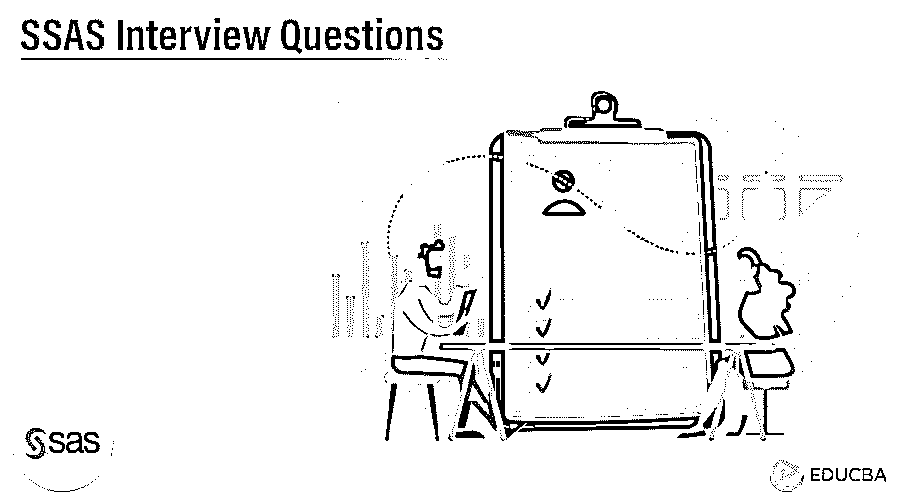

# SSAS 面试问题

> 原文：<https://www.educba.com/ssas-interview-questions/>

## SSAS 面试问答介绍

SQL Server Analysis Services (SSAS)是微软开发的数据挖掘工具，用于联机分析和事务处理，也用于微软 SQL Server 中的数据挖掘。SQL Server Analysis Services (SSAS)是微软公司商业智能部门的一项技术。这是在数据仓库领域使用的强大工具。

因此，如果你正在寻找一份与 SSAS 相关的工作，你需要准备 2022 年 SSAS 面试的问题。尽管每个 SSAS 面试都是不同的，工作范围也是不同的，但我们可以帮助你解决 SSAS 面试中的问题和答案，这将帮助你在 SSAS 面试中取得成功。牢记这一点，我们设计了最常见的 SSAS 面试问题和答案，以帮助你在面试中取得成功。

<small>Hadoop、数据科学、统计学&其他</small>

以下是 2022 年 SSAS 面试中最常被问到的问题:

#### 1.什么是 SQL Server Analysis Services (SSAS)？

**答案:**
SQL Server Analysis Services(SSAS)是 SQL Server 中的一个在线分析处理(OLAP)组件。在线分析处理(OLAP)在 Microsoft System Center 2012 Service Manager 版本中发布了一个名为多维数据集的概念。OLAP 立方体是一种用于快速分析数据的数据结构，它克服了关系数据库模型的缺点。这些立方体可以为大量数据提供有效的搜索机制，还可以汇总大量数据并检索任何数据点。
OLAP 多维数据集通常存储在 SQL Server Analysis Services (SSAS)中，在线事务处理(OLTP)允许企业将所有事务和记录存储在 OLTP 数据库中，这也是 SQL Server Analysis Services (SSAS)的一项功能。这些数据库中的记录通常一次存储一个，从而在其中维护大量记录。一个[在线分析处理](https://www.educba.com/what-is-olap/) (OLAP)立方体也称为超立方体或多维立方体。

#### 2.SQL Server Analysis Services (SSAS)有哪些功能？

**回答:**
SQL Server Analysis Services(SSAS)为创建商业智能模型提供了不同的方法和途径。不同的模型是多维的、表格的或枢纽的。不同的模型允许用户在竞争环境中满足不同的业务需求。多维模型是基于开放标准构建的最新成熟模型，支持商业智能软件的各种供应商。
在 SQL Server Analysis Services 服务器实例上开发或构建的所有模型，该实例允许不同的数据提供商和第三方供应商通过不同的数据驱动程序进行访问，并在其界面中可视化数据，或根据所需的应用程序根据其要求或目的分析数据。Excel 中支持的不同模型有表格模型、多维模型和枢纽模型。表格模型用于具有模型、表格和列的关系模型构造，而多维模型用于具有多维数据集维度和度量的 OLAP / OLTP 建模构造，而枢纽模型用于集成到 Excel 中的可视化建模。

#### 3.什么是数据源视图？

**答:**
一个数据源视图有一个 SQL Server Analysis Services (SSAS)多维模型中使用的模式的逻辑模型。多维模型由多维数据集、维度和挖掘数据结构组成。数据源视图是将以 XML 格式存储的元数据定义。数据源视图包含表示来自多个现有数据源的所需对象的元数据信息。在模式生成过程中，将使用元数据信息创建关系数据存储。
数据源视图可以建立在多个数据源上，形成多维模型和数据挖掘结构，集成来自多个数据源的数据。数据源视图可以包含不同的关系，如主键、列、对象标识符等。数据源视图是 SQL Server Analysis Services (SSAS)多维模型中必需的关键组件。数据源视图主要是在数据模型设计的初始阶段创建的。

#### 4.什么是维度表？

**答:**
维度表是 SQL Server Analysis Services (SSAS)多维模型中多维数据集的基本组件。维度表存储具有特定关系的数据，例如客户、商店、雇员、供应商、商业用户等。建立不同字段或实体对象之间的关系模型。SQL Server Analysis Services (SSAS)中的维度包含字段属性，这些属性建立的关系类似于关系模型中列的关系。维度表是称为字段属性的相关对象的集合，这些对象将用于使用多个多维数据集提供信息。多维数据集中的维度实例称为多维数据集维度。
数据维度可以在多维数据集中多次使用，并与一个或多个组形成关系。维度可以基于不同的模式设计或关系模型来形成。应该在使用或访问维度的字段或属性之前处理维度。应该在对其模型或构造进行每次更改或更新后处理维度。维度表的存储模型可以是关系型的，也可以是多维在线分析处理(OLAP)。维度表还描述了不同的属性及其层次结构。

#### 5.SSAS 支持哪些不同类型的数据源？

**答:**
多维模型中 SQL Server Analysis Services (SSAS)支持的数据源有 Access 数据库、SQL Server 关系数据库、Oracle 关系数据库、Teradata 关系数据库、Informix 关系数据库、IBM DB2 关系数据库、Sybase Adaptive Server Enterprise(ASE)关系数据库等少数关系数据库，而表格模型支持的数据源有 Access 数据库、SQL Server 关系数据库、SQL Server 并行数据仓库(PDW)、Oracle 关系数据库、Teradata 关系数据库、Informix 关系数据库、 IBM DB2 关系数据库、Sybase 关系数据库、文本文件、Microsoft Excel 文件、PowerPivot 工作簿、Analysis Services 多维数据集、不同的数据馈送和 Office 数据库连接文件。
安装 SQL Server 数据工具(SSDT)后，安装程序需要额外的驱动程序来支持不同的数据源提供程序。有些提供程序需要额外的驱动程序来支持数据源，而有些提供程序则不需要基于类型的驱动程序。SQL Server Analysis Services (SSAS)的多维模型不支持 ODBC 类型数据源。表格模型和多维模型支持的数据源因其架构模型的不同而不同，但大多数几乎是相似的。还有一些不支持的数据源，如 Access 数据库，它们已经发布到 Share Point，无法导入。

### 推荐文章

这是 SSAS 面试问答列表的指南。在这里，我们列出了最好的 5 组面试问题，以便求职者可以轻松地破解面试。您也可以阅读以下文章，了解更多信息——

1.  [行为面试问答](https://www.educba.com/behavioral-job-interview-questions-and-answers/)
2.  [常见面试问答](https://www.educba.com/common-interview-questions-answers/)
3.  [8 个最有用的大数据面试问题指南](https://www.educba.com/big-data-interview-questions/)

