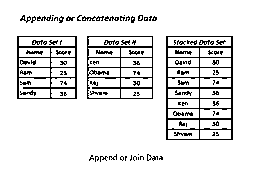
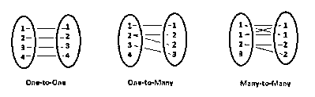
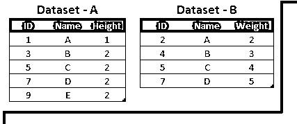
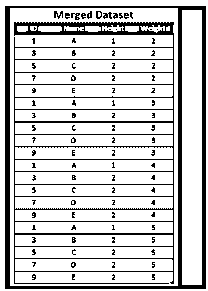
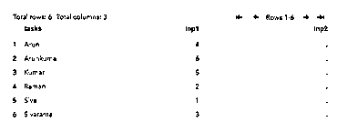
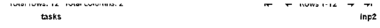
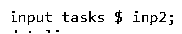

# SAS 加入

> 原文：<https://www.educba.com/sas-join/>

## SAS 加入简介

SAS join 是一种主要有助于执行查询操作或可以在关系下查看的一个或多个表的组合的操作。它可能会影响在 FROM 和 SELECT 语句中列出的 n 个表中的特定表上的数据，以便将结果从一个数据集处理到另一个数据集。

### SAS 加入概述

SAS join 操作是一种主要的查询类型，它组合了来自多个表的 n 个数据，并且主要在数据表之间进行查看。当多个表规范在关键字类上时，比如 FROM 和 SELECT，将数据结果从一种形式处理成另一种形式。如果数据存储在单独的结果集中，它将提供可能已经保存在大多数类型的连接操作中的表，并且满足用户条件。连接表的大部分被执行并存储在结果集变量上。其他 sql 如 FedSQL 数据支持将使用几种连接操作，如主要与连接、等价连接、交叉连接、限定连接和自然连接相结合。

<small>Hadoop、数据科学、统计学&其他</small>

### SAS 加入操作

通常，SAS 连接支持两种类型，如垂直和水平连接。垂直连接是一种类型，它是按照时间顺序从一个数据集附加到另一个数据集。而水平连接是将一个或多个键和变量与数据观察相结合。如果 sql 查询将被用作垂直连接，那么它将按照添加垂直连接数据的步骤进行操作。

**垂直连接:**

数据序列和时间序列提供了数据集，数据集在数据类型、长度和标签上具有某种类型的变量和属性。此处，一个数据集结合了至少一个变量，该变量应用于以观察源形式识别数据集中的数据源。如果源数据集将在日期之前恢复，如果问题是垂直兼容性，则不需要对数据集进行排序。每个数据集中更多的对应数据变量在另一个变量中的数据上具有相同的属性。我们使用了 proc 数据集，append 命令将使用带有 APPEND 语句的垂直连接实用程序 PROC 数据集。如果一个数据集将在结果数据集中创建相同的属性，则可以通过使用 FORCE 选项来覆盖垂直兼容性。

如果从一个数据组到另一个数据组的每个观察值都缺失，则在字符的数值类型中，变量的长度会有所不同。因此，数据标签不同于 PROC 数据集，附加命令也与 UNION 对应的所有变量公共数据集。

**水平连接:**

每当我们通过从多个数据集到新数据集中的单个数据观察的水平连接来组合数据集时。主要是通过横向的方式与数据集结合，了解输入数据集之间的数据关系，如一对一、一对多、多对一、多对多或其他相关数据。它与合并数据集相结合，从两个或多个数据集观察到新数据集中的单个数据观察。

匹配合并主要基于一个或多个公共变量与输入值进行合并。

**SAS 左连接:**

这是 SAS 联接的特征之一，并且只对带有两个数据集的左侧联接集执行。在 proc 中，sql 主要是作为过程 sql 来调用，帮助创建表，选择表，称为左连接。它有助于从第一个或左侧数据集的所有数据观察值中选择与键-值对组合的项目。但是它主要是通过正确数据集中匹配的键和值来观察的。

上图显示了 SAS 数据集左连接的示例。它有两个不同的数据集存储在单独的表上，每个数据集都将使用 id 或其他主标识符进行连接。

### 例子

数据第一；

输入任务$ inp1

数据线；

湿婆 01

拉曼 02

西瓦拉曼 03

阿伦 04

库马尔 05

阿伦库马尔 06

;

跑步；

数据秒；

输入任务$ inp2

数据线；

1 月 1 日

2 月 2 日

3 月 3 日

4 月 4 日

5 月 5 日

6 月 6 日

7 月 7 日

8 月 8 日

9 月 9 日

十月十日

十一月十一日

十二月十二日

;

跑步；

proc print data = first

proc 打印数据=秒；

为什么是 sql

将表格结果创建为

select * from first 作为左连接 second 作为 b

论 a . tasks = b . tasks；

退出；

过程打印数据=结果；

**样本输出:**

1.  在上面的例子中，我们使用了两个不同的数据集，比如第一个和第二个。
2.  接下来，每个数据集都有单独的行和列，以及字段和属性列。

3.接下来，数据集包含输入，如 inp1 和 inp2，以及$美元符号，用于为变量赋值。

4.  然后我们需要传递真正的输入，比如带有独立属性的字符串和整数格式。第一个数据集行将使用整数格式的名称和 rollnumbers 来实现。接下来，datasets 将操作月份格式的数据，最后它将使用 proc 和 print 语句打印数据。
5.  最后，创建新的结果表，并对 SAS 数据集执行 let join 操作。

### 结论

SAS 数据集通常使用 sql 操作以及不同的类别和数据区来执行。左连接是在庞大而正常的活动 SAS 数据集中最频繁使用的操作，用于执行复杂的用户数据操作集。它与应用程序中的统计数据集一起使用和排序。

### 推荐文章

这是一个 SAS 加入指南。这里我们分别讨论简介、概述、SAS 连接操作和示例。您也可以看看以下文章，了解更多信息–

1.  [SASS if()](https://www.educba.com/sass-if/)
2.  [SAS 视觉分析](https://www.educba.com/sas-visual-analytics/)
3.  [T SQL 连接](https://www.educba.com/t-sql-join/)
4.  [数据库管理系统加入](https://www.educba.com/dbms-join/)

