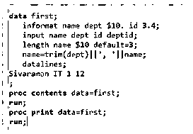
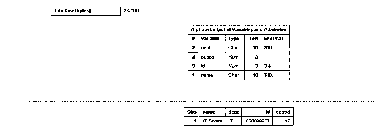
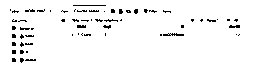
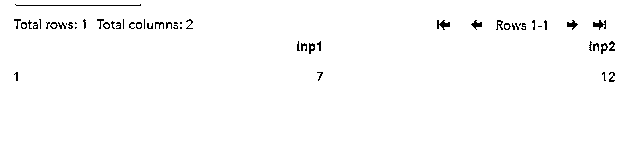
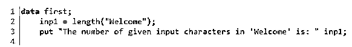
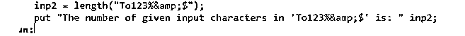

# SAS 长度

> 原文：<https://www.educba.com/sas-length/>

## SAS 长度简介

SAS 长度是一种操作，它主要用作 8 字节字符，用于存储可能包含整数值的变量中的数值集，它也将包含许多整数变量的数据集存储为少于 8 字节的字符，并指示用于将数据集大小减少 50%以上的变量。

### 什么是 SAS 长度？

SAS 长度是分配用于存储变量中的数据值的存储器的变量的数量，并且不一定在单个变量中使用相同数量的字符。它可用于减少 SAS 数据集的大小和磁盘空间，SAS 数据集存储为 8 字节字符，用于在变量和整数值中存储一组数值。它也可以在 length 函数中接受少于 8 个字节的字符来执行数据集中的操作。数据集包含许多收集数据问卷的整数变量，并指示用于将大小减少 50%以上的分配空间的变量。变量包含一组实数，应该在左边，默认长度是 8。

<small>Hadoop、数据科学、统计学&其他</small>

### 如何找到 SAS 长度？

变量的长度有助于确定数据集的大范围数据大小。如果数据长度设置正确，可能会将数据集的数据大小减少 50%。在 SAS 中，length 是帮助返回非空白字符长度的函数之一，这些字符包括字符串，但不包括前导空格和尾随空格。Length 函数有一组必需的参数和自变量，它们作为字符串名称字符，可以是变量、常量或任何表达式。正如我们提到的，length 函数有助于确定和查找 SAS 变量中创建的数据集的字符数以及一个用于设置列字符值的变量。SAS 术语中的列长度，用于存储数据集中的数据分配量，以保存列值，列值用于指定字节的长度，以指定有效长度上的一组数字列，有效长度通常设置为 3 或 8。每当通过分配列值的数据精度指定数据长度时。length 函数始终返回小于或等于 lengthc 关键字返回的值的值。该函数将返回主要代表字符位置的整数值，可能是最后一组字符串，尾随空格将被忽略，它指向函数上的两组点。首先，如果函数是常量或变量的集合数值，则 SAS 将通过使用 BEST12 格式转换为右对齐的字符串字符。

在第二组点中，需要注意的是，字符串在缺失的一组期望值处返回。我们可以使用 find 函数在新数据中搜索字符串的位置，比如子字符串。

### 创建和查找 SAS 字符长度的步骤

1.  导航到以下 URL，
2.  [https://odmid-apse 1-2 . ODA . SAS . com/sasstudio/main？locale = en _ GB&zone = GMT % 252 b 05% 253 至 30 &票= ST-127494-ifalb 730 g4xlewmgd 37-cas](https://odamid-apse1-2.oda.sas.com/SASStudio/main?locale=en_GB&zone=GMT%252B05%253A30&ticket=ST-127494-IfIALb730G4xlEwMgd37-cas)
3.  通过使用下面的代码来计算长度，
4.  数据第一；
5.  输入部门名称$10。id 3.4；
6.  输入姓名部门 id 部门 id；
7.  长度名称$10 默认值= 3；
8.  name=trim(dept)|| '，' | | name
9.  数据线；
10.  西瓦拉曼 IT 1 12
11.  ;
12.  proc 内容数据= first
13.  跑步；
14.  proc print data = first
15.  跑步；

16.我们可以得到如下输出结果，

### SAS 长度语句

SAS length 语句，它是一个返回字符串字符长度的函数，用字节格式指定。存储为字符和数字变量集或任意数量的字符，用于存储和访问 varchar 变量。变量的长度取决于数据信息，变量是数字还是字符，以及变量是如何创建的。语句的长度或 ATTRIB 语句是否出现在编码用于数据处理的程序代码的 SAS 会话中。

它还遵循了分配长度、字符和数字长度集的主体规则，这些规则被分配为 VARCHAR 变量，用于为每种类型分配内存。用户会话正在编码和声明最小为 100 字节的单字节变量类型。它接受 UTF-8 编码，字符的 SAS 会话可以占用多达 4 个字节，每个变量可能使用 400 个字节，这些变量被分配了 VARCHAR(100)或其他具有相同长度的类型。逗号、空格和其他特殊字符可用于声明和执行用户操作。

**举例:**

数据第一；

in P1 = length(" Welcome ")；

put“在‘欢迎’中给定的输入字符数是:“inp1

inp2 =长度(" to 123%&$ ")；

把“给定输入字符数在‘to 123%&$’中为:“inp2

跑步；

**样本输出:**

1.  在上面的例子中，我们使用了 length()函数的给定输入字符串。我们可以创建变量并在 length()函数中传递输入字符串。

2.并使用 put 关键字计算字符的长度，并将其赋给特定的变量，如 inp1。

3.同样的过程也适用于 inp2，这里我们还可以传递数字、特殊字符、符号等。

1.  特殊字符在后端的数据中被计算和处理，这类似于正常的字符串字符输入。
2.  通过使用 put 关键字，结果被赋给 inp2 变量。

### 结论

SAS 长度是用于声明和获取给定 SAS 程序代码的数据计数的函数、语句和关键字。它有许多默认的关键字和函数，这是计算参数以及用户输入的数据计数的基本方法。

### 推荐文章

这是 SAS 长度的指南。在这里，我们讨论了简介，什么是 SAS 长度，如何找到 SAS 长度，以及代码实现的例子。您也可以浏览我们推荐的其他文章，了解更多信息——

1.  [SASS if()](https://www.educba.com/sass-if/)
2.  [SAS 加入](https://www.educba.com/sas-join/)
3.  [SAS 视觉分析](https://www.educba.com/sas-visual-analytics/)
4.  [jQuery 长度](https://www.educba.com/jquery-length/)

