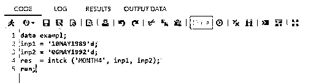
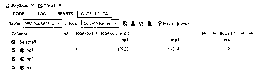
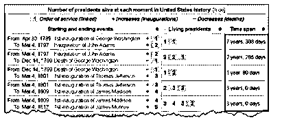
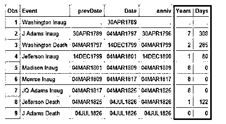
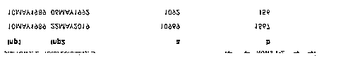
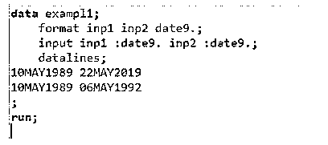

# SAS INTCK

> 原文：<https://www.educba.com/sas-intck/>


## SAS INTCK 简介

SAS INTCK 是默认功能之一。它返回两个日期或时间之间的间隔边界数。该函数的返回值是整数，即使我们在次使用了默认的离散方法。这是因为时间间隔的开始和起点是在两个重要日期和时间之间的完整间隔的第一个和第二个日期。

### 关键要点

它有一些关键点要遵循和执行 SAS 操作:

<small>Hadoop、数据科学、统计学&其他</small>

*   指定可以与区间名相同的字符常量、变量、表达式。
*   那么间隔可以是大写字符，也可以是小写字符。
*   我们可以在基本区间名称中使用乘数和移位索引来重构数据。
*   开始日期和结束日期表达式需要作为函数参数。
*   我们可以使用连续和离散等默认方法。

### 什么是 SAS INTCK？

尽管我们在 SAS 语言中使用了一些默认的离散方法，但最重要的日期函数是在 intck()中。它有助于计算它开始的次数和开始的时间间隔，并且它可能到达两个重要日期和时间之间的完整间隔的第一个和第二个日期。SAS intck 返回两个日期或时间之间的间隔边界数，并计算 datetime 特性。它总是返回函数的值可能是整数，因为计数适用于所有区域，包括日期、时间和年份。date9 格式主要是为 SAS 模块指定的，用于计算日期差异，如日、周、月和年。

### SAS 检查功能

我们知道 INTCK 是默认的日期函数，它在不同的现实场景中有帮助，比如计算个人的年龄差异。然后，我们可以使用它来执行员工在特定公司工作多年的任期。同样的组织也用于计算客户任期，这是基于将被应用到公司并与活动项目一起发布的产品。几个工作日将是主旋律，员工福利增长组织的员工也同样受益于所有大大小小的组织。

在课程部分，小时数将计算考试大纲覆盖范围和覆盖主题，以及学生和组织部门员工的载体成长。每当我们学习像课程这样的新技术时，我们都需要支付金额，所以有时，我们可以按季度、半年度和年度计算支付金额。根据课程的不同，金额会有所不同。此外，日期和时间将是部分的主要作用，以便它将跟踪软件应用程序中的数据。

### 创建 SAS INTCK 函数的步骤

下面是提到的步骤:

1.导航到下面的链接。

2.[https://odmid-apse 1-2 . ODA . SAS . com/sasstudio/main？locale = en _ us&zone = GMT % 252 b 05% 253 至 30 &票= ST-86536-a6 vbzovdq 71 v4 khdsequence-cas](https://odamid-apse1-2.oda.sas.com/SASStudio/main?locale=en_US&zone=GMT%252B05%253A30&ticket=ST-86536-a6VbzOvDq71V4KJHdlGe-cas)

3.粘贴以下代码作为执行 intck()函数的示例。

4.数据示例；

5.in P1 = ' 10 may 1989 ' d；

6.in p2 = ' 1992 年 5 月 6 日' d；

7.res = intck ('MONTH4 '，inp1，in p2)；

8.跑步；







9.在上面的代码中，使用了 intck()函数，并使用不同的参数(如 MONTH4、inp1 和 inp2)执行操作。

### SAS 检查日期和间隔

SAS intck 函数计算两个不同日期的日期和时间间隔，而 intck 函数根据时间单位而变化。它可以支持年、月、周、日等。这样我们就可以调用并引用 INTCK 作为间隔检查，每个人都知道 INTCK 函数，它有助于返回两个不同日期时间间隔内的数字的整数计数。一些操作，如改变格式以在日期变量的 SAS 中执行数据集的日期。我们可以在 INTCK 函数上使用并执行连续操作，同时在区间边界上使用相同的数据选项。

开始日期和结束日期将根据用户的请求而变化，即参数或自变量因新数据集而改变。Datepart()和 Timepart()是有助于计算结果计数、天数、事件和小时覆盖范围的附加函数。每个数据的间隔名称和值包括具有乘数和移位索引选项的日期和时间间隔处的间隔，以便对具有更复杂间隔规格的构造数据使用基本间隔。




我们还可以根据区间、倍数和移位指数等类型创建区间、乘数和其他移位区间。这三个部分用于在 SAS 上执行间隔名称操作，即，有助于表示基本间隔类型的间隔。该算法有助于计算 SAS 中两个日期之间的年数和天数。




倍数代表可选乘数，有助于设置基本区间类型，最后，移位指数有助于在特定持续时间开始指数周期。这将包括日历日期和时间间隔。

### SAS INTCK 示例

下面是提到的例子:

**代码:**

```
data exampl1;
  format inp1 inp2 date9.;
  input inp1 :date9\. inp2 :date9.;
  datalines;
 10MAY1989 22MAY2019
 10MAY1989 06MAY1992
;
run;
data exampl2;
  set exampl1;
  a = intck('day', inp1, inp2);
  b = intck('weeks', inp1, inp2);
  c = intck('months', inp1, inp2);
run;
proc print data=exampl2;
```

**输出:**




1.在上面的例子中，首先我们需要创建数据集以及所需的输入、变量和其他依赖项。




2.然后我们需要执行上述数据集的 intck()函数。在这里我可以添加不同的出生日期。

3.因此，通过使用 intck()函数，计算日、周、月和年等的差异。

### 常见问题解答

下面是提到的常见问题:

#### Q1。什么是 SAS intck？

**答案:**

它主要用于返回两个日期之间时间间隔的天数差，包括时间、日期和日期时间值。

#### Q2。如何在 SAS 中使用 intck 函数？

**答案:**

该函数用于执行两个日期之间的日期计算，例如语法:intck('YEAR，' 10MAY1989'd，' 06MAY1992'd)。

#### Q3。你如何在 SAS intck 中找到日期差异？

**答案:**

主要是我们使用了 Interval 参数，这样我们就可以在 intck(日、周、月、年、时间、..)

#### Q4。SAS intck 中的双参数方法是什么？

**答案:**

*   连续的
*   分离的

#### Q5。音程有哪些类型？

**答案:**

*   日历间隔计算
*   日期和日期时间间隔
*   零售日历间隔
*   自定义时间间隔

### 结论

SAS intck()函数有助于从不同的区域执行日期操作，就像它有助于计算日期和时间间隔一样。主要是它将计算天，周，月，年从一个以上的资源的基础上的要求，它可能会有所不同，并返回整数格式的结果。

### 推荐文章

这是 SAS INTCK 的指南。这里我们讨论介绍，创建 SAS INTCK 函数的步骤，日期和间隔，例子和常见问题。您也可以看看以下文章，了解更多信息–

1.  [SAS 视觉分析](https://www.educba.com/sas-visual-analytics/)
2.  [SASS if()](https://www.educba.com/sass-if/)
3.  [SAS 加入](https://www.educba.com/sas-join/)
4.  [SAS 长度](https://www.educba.com/sas-length/)


