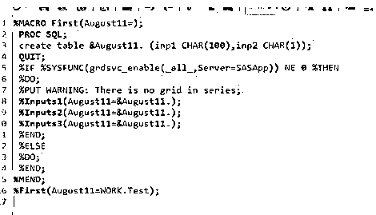
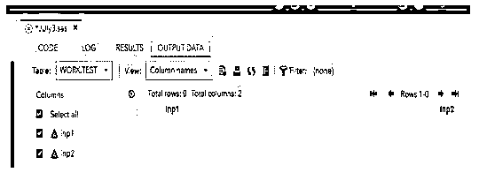
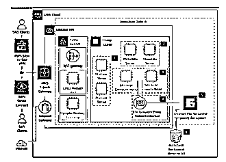
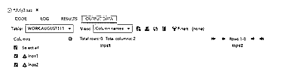

# SAS 网格

> 原文：<https://www.educba.com/sas-grid/>


## SAS 网格简介

SAS 网格是一种经理支持。它最广泛地用于通过网络连接将用户任务分布或分散到多台计算机上，从而实现工作负载平衡以加速数据处理。网格计算中的作业调度更加灵活和复杂，网格计算已经有了一个带有峰值区域的集中式环境，并且计算需要成本效率和可靠性。

### 关键要点

*   它将 n 个任务分配给同一网络上的多台计算机。
*   它使劳动力负载平衡算法能够处理加速的工作和时间表。
*   这是一种更灵活、更集中的方式。
*   在迁移后的环境中，它的数据处理速度更快。
*   增加动力，节约资金。

### 什么是 SAS 网格？

在 SAS 企业指南中，该架构主要用于通过网络共享多个计算机资源。它充当管理者的角色，所以命名为 s as 网格管理器，它提供:

<small>Hadoop、数据科学、统计学&其他</small>

*   负载均衡算法。
*   应用连接访问，如策略实施和更多资源分配。
*   优先排序在分析环境中高度可用。

它需要多种类型的机器，看起来像是跨同一个网络的集群设置，并且它有多个软件产品。使用服务器端负载平衡算法，它使用 workspace 服务器，如果网格可用，项目已配置，或者网格已配置为网格表上已运行的一组特定任务，则通过 config 在一组繁忙的节点上发送作业。

### SAS 网格计算

SAS Grid manager，它提供了适用于所有工作任务集的负载平衡算法和高可用性，与其他计算环境相比速度更快。群集是一组或一组计算机，它们在网络中具有效率和规格。工作负载也被分解到每台计算机上，通过工作负载平衡算法来共享资源池，通过加速处理来允许多个用户共享相同的数据。

网格使用户任务能够作为子任务在并行计算资源集上运行，与其他数据资源相比，并行计算资源集完成得更快。我们还可以计划用户执行的作业，或者在适当的时间使用相同的共享资源池执行日常任务。

工作负载分布有助于启用 SAS 网格的功能，如下:

*   **负载均衡:** 主要是让大于 1 个用户的 n 个用户在 SAS 环境中执行，将数据负载分配到共享资源池中。
*   **加速处理:** 它有助于分配类似于子任务子流程的任务，因此它将 SAS 单个作业拆分到一个共享资源池中。
*   **调度作业:** 作业允许用户在精确的调度时间路由共享资源池。

### SAS 网格遗产

*   网格遗产主要使计算用户能够开发共享环境，并控制处理和分析程序代码的大量数据。
*   有助于加快代码速度，实现用户动态加载数据负载资源，平衡拆分和多节点。

### 创建 SAS 网格的步骤

下面是提到的步骤:

1.导航到下面的 URL。

[https://welcome.oda.sas.com/login](https://welcome.oda.sas.com/login)

2.并粘贴下面的代码来创建网格表。

3.% MACRO First(August 11 =)；

4.为什么是 sql

5.创建表&August11。(inp1 CHAR(100)，in p2 CHAR(1))；

6.退出；

7.% IF % sys func(grd SVC _ enable(_ all _，Server = SASApp))NE 0%然后

8.% DO

9.%PUT 警告:系列中没有网格；

10.% inputs 1(8 月 11 日= & 8 月 11 日。);

11.% inputs 2(8 月 11 日= & 8 月 11 日。);

12.% inputs 3(8 月 11 日= & 8 月 11 日。);

13.% END

14.%否则

15.% DO

16.% END

17.% MEND

18.% First(8 月 11 日=工作。测试)；







19.在上面的代码中，我们使用宏进行初始化，并创建了类似&August11 的表，其中有两个输入参数。

### AWS 上的 SAS 网格

AWS 上的 SAS 是一个运行时环境，允许组织在开源或 SAS 模型中的一些其他功能上部署应用程序。我们使用数据基础架构来支持各种各样的分析，这些模式将支持 AWS devops。对于中间层架构，我们使用 Amazon EC2 或 r5 实例和类型，通过使用 SAS 需求中的两个或更多实例来加载数据共享客户端内容。除非我们在 EC2 实例类型中使用高可用性元数据服务器，这超过了 SAS 内存建议的最低要求。




上图通过网关和亚马逊 VPC[虚拟私有云]解释了 SAS 平台中的 AWS 云。

### SAS 网格示例

下面是提到的例子:

**代码:**

```
%MACRO Second(vars=, AUgust11= );
PROC SQL;
create table &AUgust11\. (inps1 CHAR(25),inps2 CHAR(3));
QUIT;
%IF %SYSFUNC(grdsvc_enable(_all_,Server=SASApp)) NE 0 %THEN
%DO;
%PUT WARNING: There is no grid table on this series;
%a(AUgust11=&AUgust11.);
%b(AUgust11=&AUgust11.);
%c(AUgust11=&AUgust11.);
%END;
%ELSE
%DO;
%PUT WARNING: Its Grid and used parallel macros;
%IF %UPCASE(&vars.) = WORK %THEN
%DO;
%PUT ERROR: Specified Work is not shared in RSUBMITs;
%GOTO Finish;
%END;
%methd(d=aug11,g=&vars.);
%methd(e=aug12,h=&vars.);
%methd(f=aug13,i=&vars.);
PROC SQL;
CREATE TABLE aug11.AUgust11 AS SELECT * FROM &AUgust11.;
CREATE TABLE aug12.AUgust11 AS SELECT * FROM &AUgust11.;
CREATE TABLE aug13.AUgust11 AS SELECT * FROM &AUgust11.;
QUIT;
%END;
%Finish:
%MEND;
LIBNAME Sandboxtesting '\\MyNetwork\';
%Second(vars=Sandboxtesting, AUgust11=WORK.August111);
```

**输出:**




**说明:**

*   在上面的例子中，我们通过使用宏和 SQL 过程创建了 SAS 网格。
*   通过使用 IF 和另一个条件语句，我们可以验证输入。
*   将使用并行宏为每个会话创建表格。
*   网络位置在方法结束时共享。

### 常见问题解答

下面是提到的常见问题:

#### Q1。什么是 SAS 网格？

**答案:**

计算任务被分成子任务，并分配给网络中的多台 PC。

#### Q2。SAS 网格是如何工作的？

**答案:**

通过使用工作负载，SAS 网格将在环境中启用和运行。

#### Q3。SAS 网格有什么优势？

**答案:**

*   负载平衡
*   政策实施
*   节约时间
*   省钱
*   有效的资源分配

#### Q4。定义网格管理器。

**答案:**

这是一个基于网络的工具，用于监控资源、用户和已经调度的作业。

#### Q5。什么是 SAS 网格服务器？

**答案:**

它充当 s as 应用程序和网格环境之间的媒介。

### 结论

SAS 网格有助于将现有代码转换为远程会话上的并行处理系统，就像一种简单的方法。通过使用 SAS 关键字，如 RSUBMIT、%SYSLPUT、INHERITLIB，并执行宏来合并数据集，而不会导致任何错误。存在更多的复杂性，SAS 网格将使用并行进程来执行独立和同步的数据操作。

### 推荐文章

这是 SAS 网格的指南。这里我们分别讨论简介、SAS 网格计算和遗产、示例和常见问题。您也可以看看以下文章，了解更多信息–

1.  [SAS 箱线图](https://www.educba.com/sas-boxplot/)
2.  [SAS INTNX](https://www.educba.com/sas-intnx/)
3.  [SAS 滞后功能](https://www.educba.com/sas-lag-function/)
4.  [SAS 同余](https://www.educba.com/sas-congruence/)


