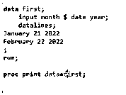
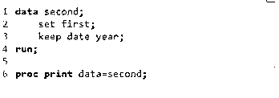
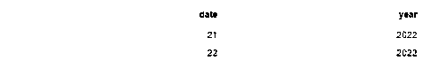
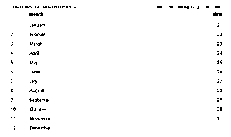

# SAS 保持

> 原文：<https://www.educba.com/sas-keep/>

## SAS KEEP 简介

SAS keep 是有助于以各种方式写入数据的语句之一，然后我们通过使用变量声明为多个 SAS 数据集创建了一个数据集，例如 **Keep** 是关键字，用于将所有这些内容应用于 SAS 数据集，并出现在 SAS 过程中包含和排除输出数据集的区域的任何位置。

### SAS KEEP 是什么？

Keep 是关键字，它充当 s as 语句来编写必须已经在多个数据集上声明的变量。它可以在 SAS 数据集中的任何地方调用，没有 keep 语句意味着所有数据集都是在包含所有变量类型的数据步骤下创建的，因此 keep 和 drop 关键字不会使用相同的数据步骤。列出可写入输出数据集中的具有指定数量和名称的变量。当我们设置 Keep=data set 选项时，数据会自动与输入数据集相关联，并且可以通过使用此选项来调用和列出。

<small>Hadoop、数据科学、统计学&其他</small>

### 如何在 Keep 中使用数据集？

一般来说，一旦声明了 keep= dataset 选项，keep 语句就不能在具有分步调用的 SAS 过程中使用。我们需要在输入和输出数据集中使用相同的变量或不同的变量来处理整个应用领域。Keep 关键字用于 anywhere 应用程序，它指定用于写入输出数据集列表的变量名。它类似于 drop 语句，在一组指定的变量上并行执行，以省略数据集输出。我们可以在变量选择层的同一点使用 Keep 和 Drop 语句来包含和排除输出数据集。IF 语句是为 Keep 语句选择数据观测值的主要视点。它将在 Retain 关键字处恢复，以保存从一个迭代点到数据步长的下一个迭代的 SAS 变量值。

Keep 语句不受变量值的影响，但它依赖于并仅指定包含输出数据集的数据变量。它可以分为以下两个不同的类别。

1.  我们可以选择将哪些列用作 Keep 语句，因为我们必须首先输入数据集，然后设置原始数据，这样它就不会与之前使用 KEEP 关键字声明的数据集不同，并声明用于执行操作的变量。
2.  然后我们可以选择要删除的列作为用于保留数据集的语句。因为现有的数据集变量值被删除并创建了新的值。

### 创建和使用的步骤

1.导航到下面的网址，
[https://welcome.oda.sas.com/login](https://welcome.oda.sas.com/login)

2.粘贴下面的代码来创建数据集，
3。数据第一；
4。输入年月日；
5。数据线；
6。2022 年 1 月 21 日
7。2022 年 2 月 22 日
8。;
9。跑步；
10。
11。proc print data = first

12.数据秒；13。先设定；
14。保留日期年份；
15。跑步；
16。
17。proc 打印数据=秒；

### SAS KEEP 语句

我们希望通过使用 KEEP =选项在指定的变量上执行选择来检索数据集变量。为了读取输入数据集，我们希望保留现有的数据变量，以便在提到的数据集上写入输出。如果我们使用 KEEP =选项，该选项应该放在变量选择的括号中，与空格分开，那么在指定的输入中至少需要一个。

我们可以根据变量选择创建临时数据集，以便从临时数据集中读取已经存储在新数据集中的 SAS 输入。

以便它们保留语句来保留所需数据集中您希望保留输入值的变量。我们可以通过使用 keep 语句来保留变量的数值集合。

### SAS 保持与丢弃

| **保持** | **下降** |
| 在 SAS 数据集中，set 语句 keep=是读取和确定输入的选项 | 在 SAS 数据集中，set 语句 drop=是读取和确定输入的选项 |
| 它排除了不读取数据向量的变量 | 与 keep for 相同，排除编程数据向量中的变量 |
| 它不能用作 SAS 程序 | 它也不在 SAS 程序中使用 |
| 它主要有助于将变量值保留在数据集中 | 这有助于删除输出数据集中的指定变量。 |
| 输出语句被命名为 Keep= dataset 选项 | 如果并行执行 drop 语句，则省略输出语句 |

**举例:**

数据第一；

输入年月日；

数据线；

2022 年 1 月 21 日

2022 年 2 月 22 日

2022 年 3 月 23 日

2022 年 4 月 24 日

2022 年 5 月 25 日

2022 年 6 月 26 日

2022 年 7 月 27 日

2022 年 8 月 28 日

2022 年 9 月 29 日

2022 年 10 月 30 日

2022 年 11 月 31 日

2022 年 1 2 月 1 日

;

跑步；

proc print data = first

数据秒；

先设定；

保留日期年份；

跑步；

**样本输出:**

在上面的例子中，我们首先创建了一个数据集，然后在 keep 语句中使用了相同的数据集变量。

这里我们为日期、月份和年份变量创建了数据集。

我们可以对日期和月份使用 keep 语句，这样值就可以从原始数据集中保留到另一个数据集中。

### 关键要点

*   它只能为一个或多个数字写入数据集中指定的变量。
*   它适用于必须在同一数据步骤中创建的所有 SAS 数据集。
*   它可以用在 SAS 编程代码的任何地方。
*   它不能用作 SAS 程序。
*   它不影响变量值，但它仅指定要包含在输出数据集中的变量。

### 常见问题

下面是提到的常见问题。

#### Q1。SAS keep 是什么？

**答:**它是 SAS 语句之一，可用于在 SAS 输出数据集上写入变量。

#### Q2。你如何在 SAS 中使用 Keep？

**答:**在 Rename=option 语句之前应用 Keep=option，以便在 Data 语句上从左到右计算输出数据集。

#### Q3。我们如何在 SAS 中只保留某些列？

**答:**通过使用 Select variables 和 Keep=-option 关键字，以等号运算符开头，最后选择想要选择的变量。

### 结论

SAS keep 类似于帮助声明和保存数据变量以及值的语句，以保持位置与原始数据集相同。当我们在输入的空白处分隔数据时，我们可以使用多个变量。

### 推荐文章

这是一份 SAS KEEP 指南。这里我们讨论一下简介，什么是 SAS keep，如何在 SAS KEEP 中使用数据集，以及代码实现的例子。您也可以看看以下文章，了解更多信息–

1.  [SAS 三角形计算器](https://www.educba.com/sas-triangle-calculator/)
2.  [什么是 SAS 网格？](https://www.educba.com/sas-grid/)
3.  [如何使用 SAS Find？](https://www.educba.com/sas-find/)
4.  [创建 SAS 箱线图的步骤](https://www.educba.com/sas-boxplot/)

