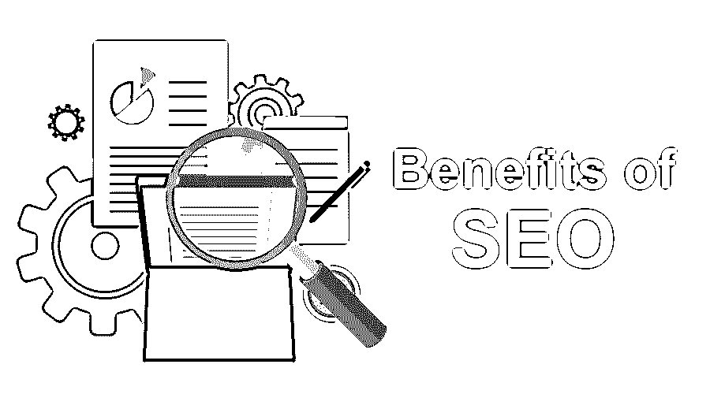

# 搜索引擎优化的好处

> 原文：<https://www.educba.com/benefits-of-seo/>

## 什么是 SEO？

SEO 的意思是搜索引擎优化。这是通过有机搜索引擎结果来提高网站流量的质量和数量的方法。它是将目标网站的流量从搜索引擎转移到另一个网站的过程或方式。

简单来说，就是通过提升你在算法搜索引擎结果中的排名来增加你网站访客的质量和数量的方式。一个网站的网页经过优化，在 Google 这样的搜索引擎的搜索结果中达到一个较高的位置。

<small>Hadoop、数据科学、统计学&其他</small>

### 搜索引擎优化的好处

以下是搜索引擎优化的主要好处，如果你使用正确的策略，你可以享受。

#### 1.SEO 增加高质量的流量

SEO 遵循集客营销策略，即当消费者需要你或想要你的信息时，他们可以找到你。它不会通过垃圾邮件或干扰性广告来分散客户的注意力，从而惹恼客户；这有助于他们在需要时更快地获取有用的信息。这增加了将营销信息转化为销售和销售线索的机会。因此，真正愿意购买的客户数量增加了，从而提高了流量质量。

#### 2.搜索引擎优化中的免费广告

一旦你的网站或页面创建完成，吸引流量到你的页面就没有持续的成本了。您可能需要在一个月或几个月内根据页面内容更新您的页面，但是一旦您创建了您的页面，您在搜索结果中的位置是安全且免费的。

#### 3.绕过竞争

现在一天搜索引擎优化已经流行起来，并被认为是任何营销策略的重要组成部分。优化的网站肯定比非优化的网站吸引更多的顾客。所以如果你正在使用 SEO，那么你已经领先你的竞争对手一步了。

#### 4.方便用户的网站

SEO 有助于轻松、流畅、快速地创建一个用户友好的网站。SEO 不仅仅是为谷歌或其他搜索引擎优化，它还改善了用户体验。嗯，结构化的网站更能吸引访问者，迫使他们停留更长时间，增加页面浏览量。

#### 5.更高的转化率

SEO 优化网站；因此，他们可以在任何设备上轻松上网、阅读和正常工作。易于导航、阅读或理解的网站会吸引更多的客户，增加他们转化为忠实客户和常客的机会。

#### 6.建立品牌意识

在搜索结果中获得更高的排名可以提高品牌知名度。当你的网站的名字出现在任何主要搜索引擎的第一页，它建立了你的品牌的信任，增加了潜在客户，提高了品牌知名度。

#### 7.更好的成本管理

SEO 有助于降低广告成本。当你的网站排名很高的时候，你就不需要为你的网站或者页面付费或者做广告了。只要客户点击你的搜索链接，你的网站链接就会保持在一个很高的位置。

#### 8.SEO 增加了用户对实体店的访问

在网上搜索你的产品后，顾客很可能会去当地的商店或实体店。因此，它也增加了实体店的销售额。

#### 9.SEO 增加品牌可信度

排名越高，客户的信任度越高。客户认为，当你的页面排名靠前时，这证明你的公司在你所在的行业中已经建立了良好的声誉，因此增加了你的客户对你的品牌的信任，从而增加了可信度。

#### 10.搜索引擎优化创造了所有在线营销活动的协同效应

所有在线营销策略都会增加网站或页面的成功。营销活动，如电子邮件、内容营销、博客、社交媒体营销、电子商务、网络管理等。，将有助于提高您在搜索引擎的搜索结果中的排名。

#### 11.搜索引擎优化增加社交媒体关注者

随着你的品牌知名度的提高，你的品牌或页面在社交媒体上的受欢迎程度也会提高，因此社交平台上的追随者也会增加，从而导致销售额和知名度的提高。

#### 12.SEO 提高网站速度

SEO 优化了你的网站，提高了你的网站速度，这使得用户交互更加容易，不那么烦人。加载时间的延迟会激怒客户，从而迫使他们提前离开你的网站。所以搜索引擎优化将减少这一点，并有助于提高客户满意度。

#### 13.一流的提供 24/7 的推广

搜索引擎优化工程 24/7。它不需要休息。你的排名不会一夜之间消失。你的排名每天都在增加。它一秒钟也没有停止。

#### 14.搜索引擎优化是一个长期的营销策略

SEO 是一个长期的过程或策略。它需要至少 6 个月来查看最佳排名。等级提升需要时间；同样，排名下移也需要时间。没有什么是一夜之间发生的。一旦你达到一个很高的位置，降低排名的可能性就很小了。

#### 15.SEO 比 PPC 获得更多的点击量

有机 SEO 收到的[点击比 PPC](https://www.educba.com/what-is-ppc/) 多。它比付费广告多获得 90%的点击量，因为客户对付费广告的信任度相对低于谷歌算法。

#### 16.SEO 是可以衡量的

SEO 是可以衡量的。可以测量转换和转换源。网站排名和有机流量也可以衡量。使用一些工具，有价值的关键字可以被识别出来，这对你的业务很重要。

#### 17.搜索引擎优化有助于打入新市场

SEO 帮助你进入新的市场。优化你的网站后，你可以瞄准另一个市场，或者轻松拓展你的市场。可以使用进入新市场所需的有价值的关键词。

### 结论

在本文中，我们讨论了 SEO 的好处。SEO 是当今营销策略的重要组成部分。它提高了你的网站流量的质量和数量。它有助于在需要时随时向您的客户提供重要信息。

### 推荐文章

这是一个 SEO 好处的指南。在这里，我们已经讨论了 SEO 的各种好处，这些好处对于增加流量和提高排名非常有用。您也可以浏览我们推荐的其他文章，了解更多信息——

1.  [SEO 技术优化网页](https://www.educba.com/seo-techniques/)
2.  [SEO 面试问题](https://www.educba.com/seo-interview-questions/)
3.  [内容营销策略和优势](https://www.educba.com/content-marketing/)
4.  [SEO 技巧](https://www.educba.com/essential-seo-techniques/)

