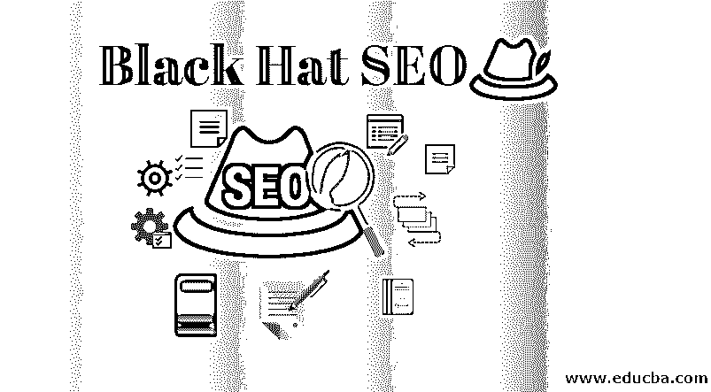

# 布莱克有 SEO

> 原文：<https://www.educba.com/black-hat-seo/>

## 什么是黑帽 SEO？

我们的大多数读者，或者很可能是大学生，在他们的生活或大学生活中都玩过电脑游戏。他们知道什么是“作弊代码”——这是玩家使用的故障技术，以更容易赢得游戏，让自己排名更高。今天的话题与球员和他们使用的技术有相似的意图。黑帽 SEO 技术也有类似的故事。

黑帽 SEO 是一套错误的做法，由玩家(或用户)执行，他们希望自己的网站在搜索引擎中排名更高。这种做法通常会导致惩罚，并最终给用户带来问题。本文将详细讨论这些技术是什么以及与它们相关的优缺点。

<small>Hadoop、数据科学、统计学&其他</small>

### 黑帽搜索引擎优化技术

就像我们前面说的，这是一种错误的促销方式；黑帽 SEO 操纵搜索引擎算法，给用户快速但不持久的结果，并经常导致搜索引擎中被完全删除。但最重要的问题是，尽管它名声不好，为什么人们还是喜欢用它？

在黑帽 SEO 技术中，有一些经过测试的方法/技术；让我们先见证他们——

请记住，在你没有被谷歌(或任何其他搜索引擎)抓住之前，这些技术是很好的。

**1。关键词填充:**有一个规定的关键词密度(一个好的实践)，但是人们操纵它们以为获得额外的利益。关键词填充就是在内容中加入不相关的关键词。这给用户留下了不好的印象，因为他们找不到任何有用的信息。

让我们看一个例子

我们进入了房地产行业。我们经营房地产。如果您想购买房地产，请联系我们的房地产顾问。房地产顾问将指导你关于房地产物业”。

上面的陈述在没有完整或相关细节的情况下过度使用了关键字。谷歌(我们普遍使用)将很容易发现这种行为，这似乎更像是一个破纪录。你可以专注于一个有相关细节的话题，而不是填充不健康的内容。

**2。隐形:**它意味着一种对两种不同媒介的双重行为。对于媒体，我们指的是搜索引擎机器人和用户。在这种情况下，网站试图向用户显示一条信息内容，而向搜索引擎机器人显示不同的内容。网站所有者这样做是为了让内容对各种术语进行排名，这是不相关的。最佳实践是将搜索引擎机器人视为具有相似内容的用户。

**3。偷偷摸摸的重定向:**让我们举个例子来更好的理解这种虚假的 SEO 技术。让我们看看这个链接——www。公司名称-关于我们。作为一个用户，如果我们试图点击这个链接来了解公司的身份，我们发现自己在一些内容中着陆，这就是重定向试图做的事情？黑帽 SEO 用户的内容之外的重定向。他们会将搜索引擎爬虫重定向到某个其他目的地，而将用户重定向到某个其他目的地。这违反了搜索引擎准则。

**4。劣质内容:**该话题下构建了不同的场景；让我们看看。

1.  从其他网站复制内容。
2.  隐形关键词。
3.  一个黑帽 SEO 实践用户将创建与网站页面背景颜色相似的关键字颜色的内容。这里发生的是，该网站正在为这些隐藏的关键字上市。尽管如此，用户还是找不到任何有价值的信息，因为单词颜色与背景颜色相似。
4.  一旦你为某个关键词对你的页面进行了排名，之后，你会用一些其他的内容来改变内容。

所有这些做法都会对用户产生负面影响，因为他们没有得到他们想要的东西。

**5。链接农场:**这个名字给人一点这种做法是怎么回事的想法。在这里，他们将一组网站相互链接。一个网站提供了一个链接到它的对手，这都是相互联系的。这是违反谷歌规定的规则的(总的来说)。一旦他们被发现，这些网站将被处以低分。

### 优势

当使用[黑帽 SEO 技术](https://www.educba.com/black-hat-seo-techniques/)时，我们想说一个人根本不应该练习它们。支持我们说法的原因是由于搜索引擎算法的进步。就像一个黑帽子，SEO 的家伙愿意用虚假的策略做生意。同样，谷歌人也在做他们的生意，这些技术妨碍了他们的生意。

正如我们所说，搜索引擎算法在最近几天真的变得非常先进(随着熊猫、蜂鸟和其他的到来)。最后，在优点部分补充一下，你只需要练习这些技巧，直到你不被抓住。处罚会导致你排名很差，黑听，彻底消灭搜索结果。

### 黑帽搜索引擎优化的问题

作为一个企业，你肯定会寻找短期的成功。使用这种技术的问题并不多，但是真正的问题会让你大吃一惊。后果真是灾难性的。

让我们见证他们——

*   不会持续太久
*   不是真正的技术
*   一旦被抓就要受罚。

### 结论

黑帽 SEO 技术并不违法，但仍然违反了搜索引擎的规则。如果仍然，你希望用它来获得更少的利润和短期的成功，那么准备好迟早被惩罚吧。后果将是令人讨厌的，你将最终在一个贫穷的商业比率，这不是你的意图之前，你开始实践回帽 SEO 技术。

搜索引擎每天都在变得越来越好，你不应该这样做，因为你没有给用户和搜索引擎任何价值。但是，我们将在结束我们的讨论时说，就像每个硬币都有两面——正面/好的 v/s 负面/坏的，这些都将无缘无故地留在市场上。

### 推荐文章

这是一个黑帽搜索引擎优化指南。在这里，我们也讨论了黑帽 SEO 技术，优势，以及同样的问题。您也可以浏览我们推荐的其他文章，了解更多信息——

1.  [SEO 中有害的黑帽技术](https://www.educba.com/black-hat-techniques-in-seo/)
2.  [SEO 趋势](https://www.educba.com/seo-trends-and-their-influence-in-marketing/)
3.  [SEO 培训课程](https://www.educba.com/data-science/courses/seo-training-course/)
4.  [SEO 面试问题](https://www.educba.com/seo-interview-questions/)

