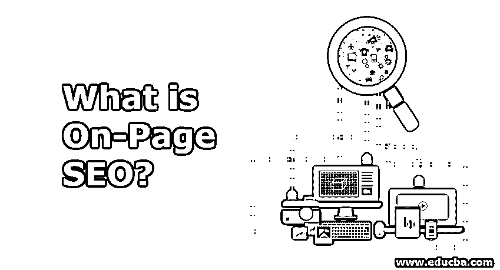

# 什么是页面搜索引擎优化？

> 原文：<https://www.educba.com/what-is-on-page-seo-question/>

## 页面搜索引擎优化简介

页面搜索引擎优化是一种让你的网站搜索引擎自动化的方式，遵循谷歌的指导原则，排名为零。反过来，这将引导你获得更好的流量，并帮助你实现你想要的转化，无论是让人们了解你的品牌/公司，注册电子邮件更新，使他们能够购买你的服务/产品等。为了获得最好和最持久的结果，页面搜索引擎优化策略应该与高级搜索引擎优化和页面外搜索引擎优化策略一起执行。一些常见的 SEO 页面技术包括内部、URL、meta 标签和少量更新内容。

### 什么是页面搜索引擎优化？

有句话叫‘内容为王’；页面搜索引擎优化技术正是基于这一原理。页面搜索引擎优化技术更强调页面元素优化，以获得更好的排名和搜索引擎更相关的流量。

<small>Hadoop、数据科学、统计学&其他</small>

从上面的例子可以清楚地看出，网页的潜在元素是什么。继续讨论，我们想说的是，页面搜索引擎优化技术不仅仅是帮助搜索引擎找到和解释网页。

除此之外，一个合适的好的页面 SEO 会给出以下细节:

*   用户对页面内容的正确理解
*   这一页是关于什么的
*   页面是否包含用户查询的解决方案，以及
*   最后，如果用户访问了网页，他们会看到什么。

### 页面搜索引擎优化是如何让工作变得如此简单的？

本文的这一部分将讨论在页面策略下应该遵循的技术。这将让我们更好地理解页面如何对几乎所有类型的业务如此有效

#### 短 URL

首先，让我们看一个例子。较短的网址在搜索引擎中排名较高(比如谷歌)。大多数情况下都是这样。根据研究，少于 18 个字符的网址比长的网址效果更好。相反，我们想说的是，将所有现有的 URL 改为短 URL 是一个好的做法。

短 URL–domain.com/short-url

长 URL-domain.com/this-is-a-long-url-which-should-not-be-this-long

#### 在你的 URL 中使用你的主要关键字

让我们再考虑一个例子

如果有一篇文章是关于数字营销最佳实践的，那么 URL 应该是这样的。

domain.com/digital-marketing-best-practices

这种技术没有好处，但它是一种完美的实践，因为我们已经看到了 URL 的结构化。这将有助于你的链接被分享。

让我们看看下面的场景

domain.com/digital-290196

*   在标题中使用关键词
*   向权威网站添加外部链接
*   创建有深度的文章:内容长度是 SEO 营销的一些核心技术。讨论题目必须详尽，并有完整的解释。这一类别下没有完美的计数；相反，我们会说内容应该是精心制作的。看看下面提到的两种情况——

**案例**——DSLR 手工摄影

**场景 1**–拿一台 DSLR，调整到手动设置，开始点击图像。

**场景 2**–我们将涵盖手动摄影的所有细节+讨论气候因素+适合不同气候的镜头类型+增强手动摄影所需的其他小工具。

#### 修饰语的使用

这些可以被认为是增强基本关键词的词。让我们看看一些最佳、热门、购买、年度、最近等。让我们看一个场景

2019 年最佳 DSLR

顶级尼康镜头

#### 避免缓慢加载页面

页面速度是算法下考虑的排名因素之一，尤其是移动设备和大屏幕上的网页。它直接关系到用户体验；更快的加载速度会保持用户的兴趣；相反，他们搬出去是为了其他选择。

#### 使用 CDN

随着业务的增长做好准备。用户将在地理上发生变化。拥有一个 CDN 来减少用户和服务器之间的时间总是一个好的做法。

#### 通过增强用户界面来提高你的 UX

让你的页面与任何用户相关，以检索他们正在寻找的信息，并附有详细的解释。

### 页面搜索引擎优化的优势

作为一个企业主，你肯定会寻找一个有成本效益的解决方案，有影响，证明是一个永久的解决方案，节省时间，并注重结果。随着搜索引擎算法的进步，提供高质量内容的网站是那些优化良好的网站，在搜索引擎中有更好的排名。

页面搜索引擎优化技术给他们的从业者带来了所有这些好处——让我们看看是如何做到的

#### 1.性价比高

这个不用付费(指不像广告)。根据 Google algorithms (Panda to Fred ),仅页面搜索引擎优化就占了全部搜索引擎优化技术的 35%,而且这一比例在不久的将来还会增加。你有完全的控制权，不像离页搜索引擎优化，有外部合作伙伴的参与。

#### 2.影响

约 35%的贡献价值，页面搜索引擎优化技术极大地影响了你的数字市场。有了明确定义的关键词、页面结构，从业者就能有机地获得更好的排名，更多的网站流量。

#### 3.永久解决方案

付费促销只能持续一段时间，一个企业不能完全依赖它们。另一方面，页面是面向目标的，有固定的期限。它们可以根据场景进行定制(即处理不同的关键字)。

#### 4.更好的回报

这种优化技术在 SEO 中占据首要位置；这是一个完整和正确的解决方案来增加你的网页流量。

#### 5.节省时间的

不像离页搜索引擎优化，用户不必投入时间和人力。页面搜索引擎优化技术很容易控制，花费的时间有利于你的内容，这反过来也是一种有价值的贡献。

#### 6.面向结果

对于这一点，我们想请我们的读者想到这一说法，然后我们将讨论它。

"最后，网页在搜索引擎上排名靠前."

现在让我们讨论一下这是如何发生在页面搜索引擎优化技术上的。作为一名用户，我更合理地更改了网页结构(即标题)(如

# 、

## 、

### ……等等)，我在我的网页上使用谷歌地图集成向用户提供了我的地址，我提供了元标签，我构建了我的 URL，我处理了我的关键字密度、图像文件的 Alt 标签、内部链接等等。

上面提到的和其他几个技术是为页面上的用户准备的，不像离页，离页主要依赖于反向链接，这也是一个严格的任务，不太注重结果。

### 为什么要使用页面搜索引擎优化？

*   商业:对任何商业来说，使用页面搜索引擎优化的主要原因是为其业务获得动力。这是获得更好排名和结果的最好的技术之一。
*   网页结构:展示是一门艺术，作为一个企业，你肯定不想错过这项技能。网站的结构和排序必须通过消除复杂性和花费的时间来吸引用户。如果你使用的是页面搜索引擎优化，你肯定会重新设计你的网页，或者说你会优先考虑页面内容和结构。
*   主要选项:你没有任何其他有效的以结果为导向的方法。

### 结论

众所周知，商业存在于人类过着游牧生活的早期。商业从简单地用好的物品交换好的物品到现代的旅程已经有了很大的改变。当今企业的成功秘诀是，与客户同在，或者更简单地说，“持续关注目标客户”。页面上有广泛的适用性和不同的可用性。它的定制行为(因为我们可以改变我们的策略)比其他营销技术更具优势。

我们相信我们的读者会认真对待这个职业，并把它作为他们的职业。最后，我们想说的是，它在世界和印度市场的需求不断增长，有着良好的待遇，自由职业者的工作，如果你知道这种技术，可以促进你自己的生意。

### 推荐文章

这是一个什么是页面搜索引擎优化的指南？.在这里，我们讨论介绍，如何在网页上搜索引擎优化使工作变得如此容易，及其优势。您也可以浏览我们推荐的其他文章，了解更多信息——

1.  [什么是离页 SEO？](https://www.educba.com/what-is-off-page-seo/)
2.  [SEO 工具](https://www.educba.com/seo-tools/)
3.  [SEO 性能工具](https://www.educba.com/seo-performance-tools/)
4.  [白帽 SEO](https://www.educba.com/white-hat-seo/)

