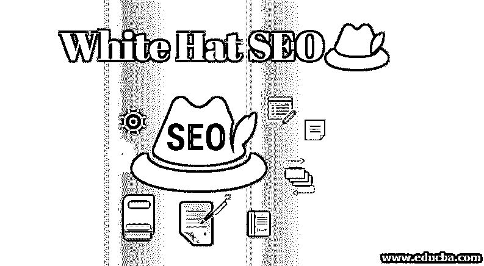

# 白帽搜索引擎优化

> 原文：<https://www.educba.com/white-hat-seo/>

## 什么是白帽 SEO？

白帽搜索引擎优化意味着搜索引擎优化策略，遵循和工作根据搜索引擎的条款和条件，如谷歌。这基本上是一种提高在 SERP ( [搜索引擎结果页面](https://www.educba.com/what-is-serp/))上的搜索排名的方法，同时确保网站的完整性，并遵循搜索引擎的条款和条件。也叫道德 SEO。这是通过有机链接建设，即通过自然链接到其他网站。

它的目标是建立一个高质量的网站，保持网站的观众优先或兴趣点。白帽 SEO 遵守各大搜索引擎的所有规则和政策。它阻止站长欺骗观众，提供不可信的信息。白帽 SEO 旨在提供网站上的相关信息，并诚实地呈现出来。

<small>Hadoop、数据科学、统计学&其他</small>

### 白帽搜索引擎优化技术

下面是一些提到的白帽 SEO 技术:

#### 1.好内容

独特的、格式良好的、写得好的内容使网站对访问者和搜索引擎来说更有价值、更值得信赖。它优化网站以获得搜索引擎搜索列表中的高位置，因为搜索引擎将最合适的网站提供给客户和访问者进行搜索。

#### 2.关键词、元标签和标题的正确使用

HTML 代码信息称为元数据。它为爬虫提供关于站点的信息用于索引目的和分类。因此，应该将适当的关键字、元数据和关键字添加到元数据中。

#### 3.易于导航

搜索引擎也考虑导航的便利性。同时，网站的有用性被评估，所以普遍认可的链接必须被使用，而不是不相关的链接。这对用户和爬虫来说都很重要。

#### 4.现场性能

为了评估网站，网站和网页的表现也被考虑在内。搜索引擎的爬虫不索引不可用的页面和不可用的站点。一个页面或网站的不可用甚至一天或一周都会严重影响网站的流量。因此，网站加载速度更快、随时都可以轻松访问是非常重要的。

#### 5.高质量的入站链接

搜索引擎经常评估相关目的的反向链接，所以网站应该有高质量的入站链接。如果搜索引擎发现这些网站包含不相关的反向链接，就会对其进行处罚或打折。

#### 6.有短网址

几项研究表明，较短的 URL(统一资源定位符)比较大或较长的 URL 排名更高。这是完美的把一些关键字放入网址，使爬虫帮助你的网站排名更高。简而言之，你的网站的网址必须干净简短，并夹杂一些关键词。如果您喜欢使用连字符“-”作为单词的分隔符，将会有所帮助。

#### 7.优化图像

图像优化意味着使用图像来帮助您的网站提高排名。记得用图片说明一些项目，这样它们就能符合谷歌的标准和政策。在使用图片时，你必须记住图片必须是压缩的和清晰的，这样它才不会影响你的网站的性能和速度。试着用关键词来命名你的图片，这样谷歌就可以很容易地理解图片。

#### 8.使用谷歌搜索控制台

Google search console 帮助您告诉 Google 您希望网站搜索结果显示的方式，以及您喜欢使用的网站版本。谷歌将帮助你了解人们是如何找到这个网站的，以及最常用的关键词是什么。它还会提醒您网站的问题，需要您紧急关注或进行更改。这个控制台还将帮助您了解黑客是否对您的网站做了什么，以及是否有任何处罚影响到您的网站。

#### 9.向谷歌提交一个网站地图

上面提到的搜索控制台允许你向谷歌提交网站地图，这将有助于它知道你的网页的位置。它也给谷歌提供了网站每个页面的路线图，有助于提升页面的重要性。

#### 10.鼓励社交分享和评论

谷歌认为你页面的分享和评论是一个参与因素。如果评论份额非常高，谷歌会通过提升排名来奖励页面或文章。

### 白帽 SEO 的优势

下面是提到的优点:

*   它保护你的企业声誉。
*   白帽搜索引擎优化的结果缓慢而稳定。
*   更好的投资回报率。
*   它向用户提供高质量的信息。
*   它有助于从用户那里获得积极的反馈，这有助于提升你的排名。
*   没有来自用户和搜索引擎的秘密。
*   免于处罚。
*   性价比高。
*   这有助于建立更牢固的关系。

### 问题

*   白帽 SEO 的主要问题是范围有限。页面优化是可以做到的，但可能性是微薄和有限的，除非你想在做页面外优化时，最终在一个灰色的帽子或黑色的帽子 SEO。
*   谷歌在网站管理员指南中提到不要使用不自然的链接建设，比如垃圾邮件方法。
*   白帽 SEO 面临的另一个问题是竞争。仅仅通过白帽 SEO 来取代高度优化的网站并不容易。[然而，其他 SEO](https://www.educba.com/career-in-seo/) ，如黑色或灰色，会导致处罚。

### 结论

在本文中，我们详细讨论了白帽 SEO。这是优化你的网站和遵循搜索引擎的所有条款和条件的最干净的方法。它有助于增加或合法地提高你的网站的排名，而不会受到惩罚和降低你的声誉。

### 推荐文章

这是一个白帽搜索引擎优化指南。这里我们讨论白帽 SEO 的基本概念、技术、优势和问题。您也可以浏览我们推荐的其他文章，了解更多信息——

1.  [SEO 趋势](https://www.educba.com/seo-trends-and-their-influence-in-marketing/)
2.  [SEO 的好处](https://www.educba.com/benefits-of-seo/)
3.  [SEO 面试问题](https://www.educba.com/seo-interview-questions/)
4.  [SEO 中的反向链接是什么？](https://www.educba.com/what-is-backlink-in-seo/)

