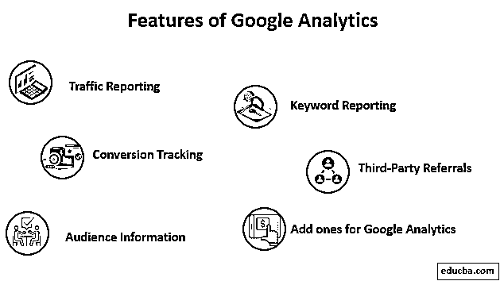

# 什么是谷歌分析？

> 原文：<https://www.educba.com/what-is-google-analytics/>

## 谷歌分析概述

如今，数字营销非常重要。没有大量的金钱和时间的投入，就不可能有大的工业；有必要了解和衡量所做工作的结果和效果。在数字营销中，这是通过使用分析工具实现的。除了现有的大量工具，谷歌还开发了一个基于网络的工具，叫做谷歌分析。这篇文章将讨论它是什么，它是如何工作的，以及为什么你应该关心它。

### 什么是谷歌分析？

简单来说，谷歌分析(Google Analytics)是一种分析工具，可以用来跟踪和分析网站上的行为，如访客数量、页面浏览量和网站的跳出率。任何网站管理员都可以免费使用。然而，有一个付费版本——我应该补充一点，对小企业和出版商来说有点贵——有一些高级功能。

<small>Hadoop、数据科学、统计学&其他</small>

虽然所有数据都是匿名的，但你可以很容易地了解用户行为和网站的流量以及流量来源，从而了解你的网站的访问者来自哪里。

它使 Android 和 iOS 应用程序都可以随时查看报告，谷歌分析是市场上少数几个可以报告网站实时访客的工具之一。你甚至可以看到游客来自哪个城市。

### 它是如何工作的？

谷歌分析的核心技术是 Cookies 和跟踪代码。就像大多数现代分析工具一样，它使用跟踪代码来查看和衡量网络性能。注册服务后，你必须创建一个新的属性。一旦你这样做了，网络界面会为你提供一个代码。这个小小的 JavaScript 代码片段必须添加到您想要跟踪的网站的每个页面中。

现在，对于一个有几千个页面的站点来说，这听起来是一个可怕的任务，但是在大多数 CMS 中，你可以找到插件来添加代码，或者在许多情况下，将代码添加到站点的公共头文件中来完成这项工作。

一旦你做了这个，你应该很好做。接下来，您可以在 Google Analytics Web 界面上创建自定义仪表板，以查看和监控您关心的统计数据。一开始可能会有点混乱，但是您会很容易创建自定义仪表板，并在适当的时候导出自定义报告。

除了跟踪页面浏览量和跳出率， [Google Analytics](https://www.educba.com/how-to-use-google-analytics/) 还支持事件跟踪。例如，您可以使用它来查看有多少人点击了注册按钮。

### 谷歌分析的特点

以下是下面解释的特征。

#### 1.交通报告

这些谷歌分析功能都是关于测量你的网站的流量和流量。这包括会话持续时间，测量跳出率，测量新访客和经常访问你的网站的人；它还能够显示你的访问者是如何访问网站的，以及他们使用什么手机或互联网连接来访问网站。

#### 2.转换跟踪

这是所有关于跟踪网站的转换。例如，对于一个电子商务网站，您可以创建一个漏斗来衡量有多少用户放弃了购物车，或者有多少用户在购物车中添加了一件商品。

#### 3.关键词报告

除了告诉你哪些电话或操作系统，你的访问者曾经来过你的网站，你还可以看到哪个关键字被访问者用来找到你。这可以用来在你的网站上创建搜索引擎优化的内容，为你的网站带来更多的流量。

#### 4.第三方推荐

一个数字营销者必须明白他的网站的流量来自哪里。它有一个源部分，可以显示流量的来源。来源可以是特定的网站、搜索引擎或社交媒体网站。

#### 5.受众信息

它也能给你关于你的听众的信息；在设置中，您可以启用选项来衡量受众的年龄、性别和其他详细信息。当然，它跟踪语言、国家等。，也是默认的访客数据。

#### 6.为谷歌分析添加一个

世界上没有一个分析工具可以做任何事情；为了解决这个问题，谷歌分析支持插件。这些插件可用于扩展 Google Analytics 的功能集，并根据需要定制和修改体验。安装附加组件也没那么难；有一个基于网络的系统，所以你根本不需要下载和上传任何东西。

### 优势

使用良好的分析软件是当今任何数字标记的必备条件；在其竞争对手中，谷歌的产品因其准确性和大量功能集而享有盛誉。因此，让我们来看看今天使用谷歌分析的一些优势:

#### 它是免费使用的

如果你愿意，可以使用付费版本的谷歌分析，免费版本的功能足以击败大多数付费分析工具。有了像谷歌这样的互联网巨头的支持，谷歌分析不会在一夜之间消失，这有助于提高其可靠性。

#### 仪表板中的访问者细分

谷歌分析最有用的优势之一是，我们可以轻松地创建受众细分，以确定并专注于一种类型的流量，从而更好地分析它。这些细分可以是搜索流量、移动流量或地理流量，以专注于特定的地图区域。

#### 在谷歌分析中查看交通流量

它能够在其仪表板中吸引观众。这些流可以被定制以显示不同的来源和类型，它们可以帮助理解人们如何在站点中导航。

#### 与其他谷歌工具的集成

它支持许多谷歌运营的营销产品，如谷歌广告和谷歌 AdSense。将它们与 Google Analytics 集成在一起，可以轻松理解和查看活动数据、访问者和行动，以微调目标和受众，从而提高效率。

#### 比较特征

比较两个不同时间段的网站性能只需点击一下鼠标。这使得理解站点的表现变得容易，并且理解增长趋势也变得容易得多。

#### 查看历史数据

它的措施从第一天起就保留了所有与网站相关的数据，即使多年后也不会删除；这使得查看和导出历史数据很快。除了查看过去的数据，你还可以像在 Google Analytics 上处理最近的数据一样分离和处理它。

#### 查看热门或常用页面

这是很容易在网站上看到最佳表现内容的主要优势之一。只需点击一下，你就可以看到在跳出率、页面浏览量、访问者频率等方面表现最好或最差的页面。利用这一点，内容可以围绕表现最好的关键词进行规划，以利用排名文章，并在网站上保持更多的观众。

#### 用于处理的数据导出

如果你想更深入地挖掘数据，找到谷歌分析无法做到的模式，你可以导出谷歌分析捕捉的所有数据，并将其导入到你选择的数据处理工具中。任何支持 excel 导入数据的工具都将支持 Google Analytics 导出的数据。

#### 团队成员并提供对成员的访问

甚至免费版本的 Google Analytics 也支持用户管理。您可以邀请他人来查看和使用您的网站资产。为了防止任何人对网站进行任何不可逆的更改，您可以限制他们的访问。

### 谷歌分析在数字营销人员职业生涯中的价值

它是数字标记器中最重要的武器之一。没有它，就没有好的方法来理解数字营销者制定的策略是否有效。更好的是，在一些经验之后，你将通过使用 [Google Analytics](https://www.educba.com/how-to-use-google-analytics/) 并提高投资回报率来了解你的战略中的薄弱环节。

营销中的许多指定仅仅是关于使用分析工具；对于这些职位中的任何一个，它最有可能是交易工具，如果你想要一个好的职业生涯，精通将是必须的。

对于博主或社交媒体有影响力的人来说，这也很有价值。他们可以使用该工具来跟踪点击量和点击率，以查看和跟踪他们社交媒体帖子链接中发生的任何行为。

### 结论

正如我们今天所看到的，它是市场上最重要的分析工具之一。因为分析在行业中起着重要的作用，所以精通它对你的职业发展是有益的。

### 推荐文章

这是一个什么是谷歌分析的指南？.在这里，我们已经简要地讨论了谷歌分析的工作，不同的功能和优势。您也可以阅读以下文章，了解更多信息——

1.  [数据科学工具](https://www.educba.com/data-science-tools/)
2.  [什么是 DSS？](https://www.educba.com/what-is-dss/)
3.  [大数据分析](https://www.educba.com/big-data-analytics/)
4.  [手机应用分析工具](https://www.educba.com/mobile-app-analytics-tools/)

