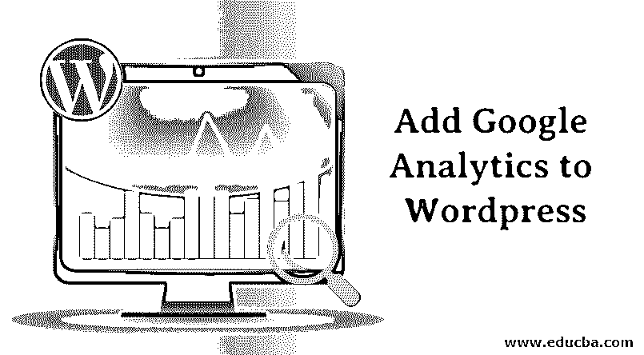
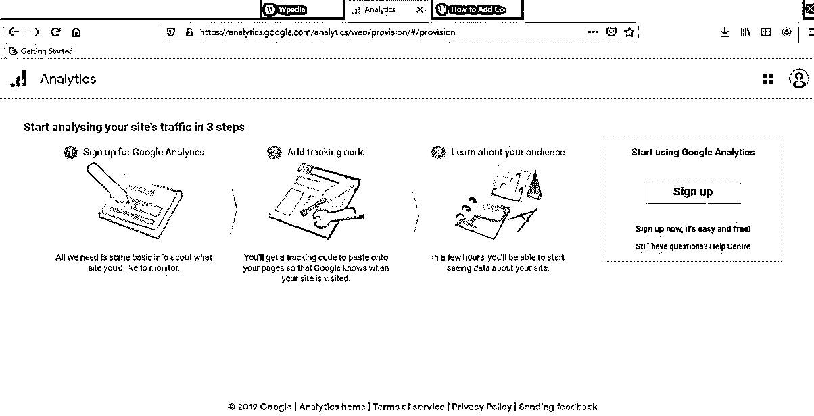
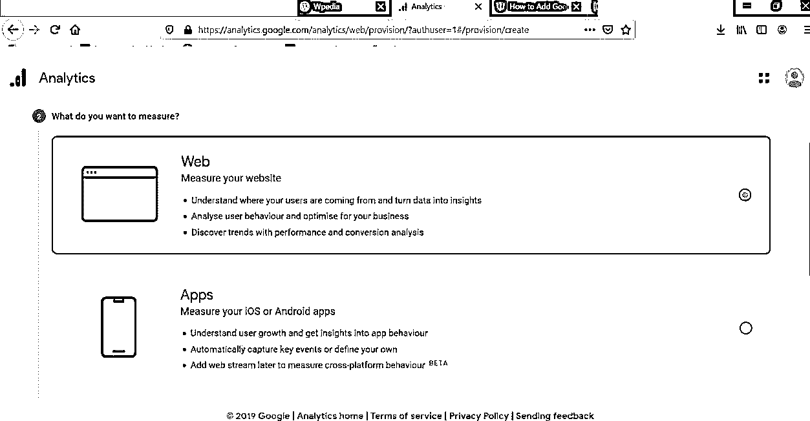
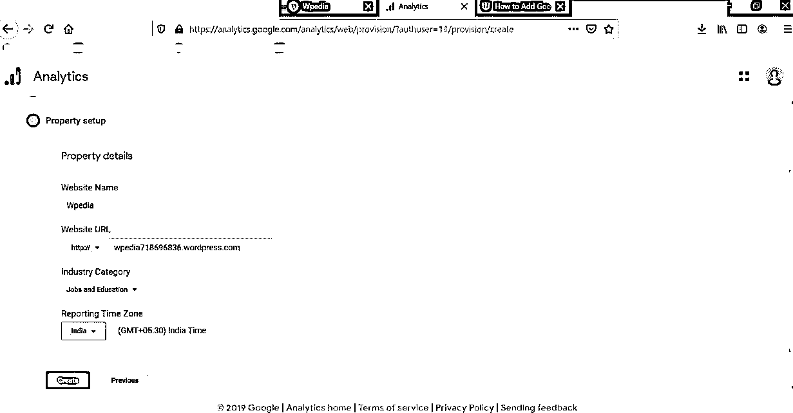
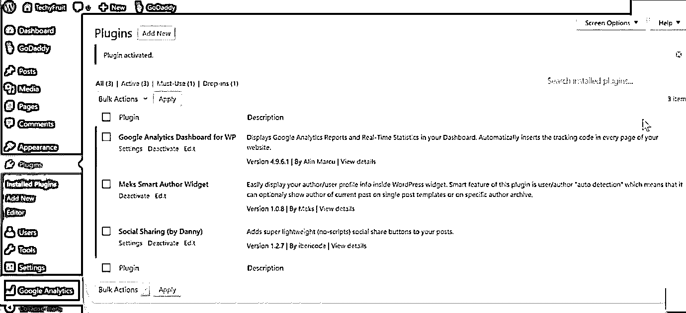
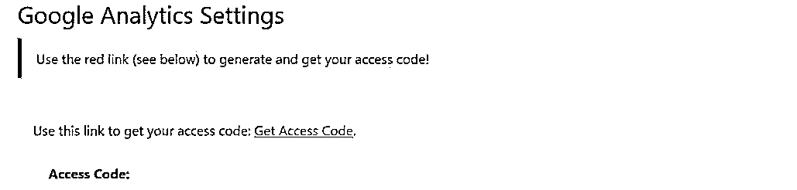
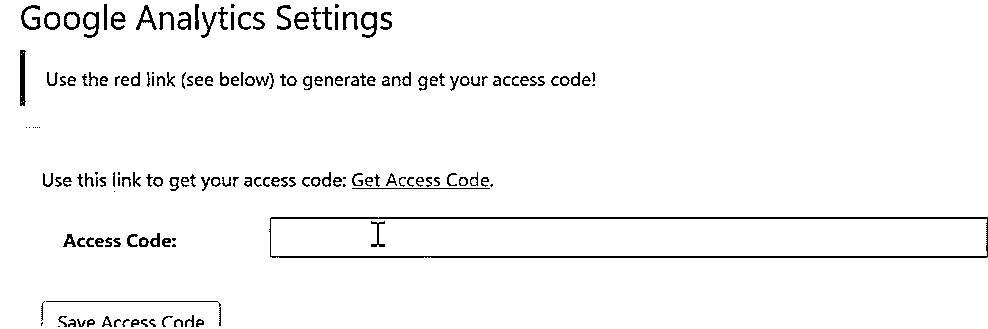
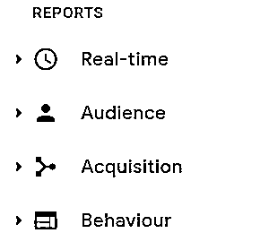

# 将谷歌分析添加到 WordPress

> 原文：<https://www.educba.com/add-google-analytics-to-wordpress/>

## 将谷歌分析添加到 WordPress 的介绍

在这篇文章中，我们将学习如何将谷歌分析添加到 WordPress。WordPress 是一个基于 PHP(服务器端脚本语言)和 MySQL(数据库服务器)平台的内容管理系统。它在 WordPress 主题中为网站提供插件和架构。这两种语言很容易学。WordPress 将为一个具有一些高级功能的网站提供一些计划。

Google Analytics 是 Google 提供的[网络分析工具](https://www.educba.com/web-analytics/)，用于查看网站的流量，并提供关于网站的正面或负面信息。它将为用户提供观看网站如何吸引或表现。这个工具可以免费使用。用户应该已经在谷歌分析平台上创建了一个帐户，或者需要在谷歌分析平台上创建一个帐户才能使用该工具。

<small>Hadoop、数据科学、统计学&其他</small>

### 如何在 WordPress 中添加 Google Analytics？

1.用户可以在 WordPress 上创建一个网站，[https://wordpress.com/pricing/](https://wordpress.com/pricing/)

2.进入谷歌分析主页[https://analytics . Google . com/analytics/web/provision/#/provision](https://analytics.google.com/analytics/web/provision/#/provision)

3.用 id 登录或注册创建一个帐户。

4.提供帐户名。

5.根据您的选择选择措施。

*   网
*   应用程序
*   应用和网络

6.我们选择了度量作为一个网络。

7.如下创建网站设置，

8.接受数据处理术语。

9.跟踪代码将可用。

10.转到 WordPress 仪表盘。

11.点击插件->点击添加新的。

12.搜索插件是谷歌分析仪表板。

13.点击立即安装。

14.点击激活。

将插件链接到分析帐户；一旦插件被安装，谷歌分析项目将被添加到 WordPress 仪表盘。

15.进入谷歌分析->点击常规设置。

16.点击授权插件。

17.点击获取访问代码。

谷歌将要求用户进行身份验证。

18.点击允许。

19.将显示代码。

20.复制代码->粘贴到访问代码框->点击保存访问代码。

21.现在，下图将显示该网站连接到谷歌分析。

22.点击保存更改。

谷歌分析将开始跟踪网站的流量。

如果你想看到访问者的数量，去 WordPress 仪表板->新的部分是谷歌分析仪表板生成的名称。

### 它是如何工作的？

去谷歌分析帐户，我们可以看到网站的流量，访问人数，网站性能。

*   **实时:**它将显示网站的实时统计数据，如用户访问的百分比，他们使用的设备，如手机和桌面。
*   **受众:**显示受众(用户)已连接或正在浏览网站。
*   **获取:**用户来自哪里，比如脸书、Instagram 或其他社交网站。
*   **行为:**它将显示用户在访问网站时花费的时间或他们访问的频率。

[谷歌分析工具](https://www.educba.com/google-analytics-tools/)将收集这些信息，并在谷歌分析账户中以统计数据的形式呈现给用户。统计数据将显示关于用户的地理或位置信息、用户最常访问的页面(这将有助于了解用户喜欢或不喜欢的页面)、用户喜欢搜索网站的时间(如日、月或年)、用户从哪里找到关于网站的信息以及最重要的与网站所有者的转换，例如，如果用户需要查询任何数据。

一旦你理解了这些数据，就意味着你理解了受众，也就了解了网站的表现。如果网站表现不佳，你会看到如何在技术细节方面提高表现，通过改变句子结构或改变内容策略使网站内容更具吸引力，开始做营销，以便人们更多地了解网站。你可以在脸书、Instagram、LinkedIn 等社交媒体平台上向用户推广你的网站。试着和观众交流。

如果你的网站的某些部分在所有这些努力后表现不佳，开始改进哪里出错了，如何改变。

### 结论

谷歌分析是了解受众和改善业务的最佳工具。根据工具提供的数据和事实做出推动变革的决策。你会理解观众的需求，会在市场上表现得更好。工具使用方便，安装过程简单。通过在每个社交媒体平台上营销网站来提高流量来源。

### 推荐文章

这是一个将谷歌分析添加到 WordPress 的指南。在这里，我们讨论将 google analytics 添加到 WordPress 的步骤及其工作方式。您也可以阅读以下文章，了解更多信息——

1.  [12 大谷歌分析工具](https://www.educba.com/google-analytics-tools/)
2.  [谷歌分析插件(利弊)](https://www.educba.com/google-analytics-plugin/)
3.  [SEO 的好处](https://www.educba.com/benefits-of-seo/)
4.  [谷歌分析替代方案](https://www.educba.com/google-analytics-alternatives/)

