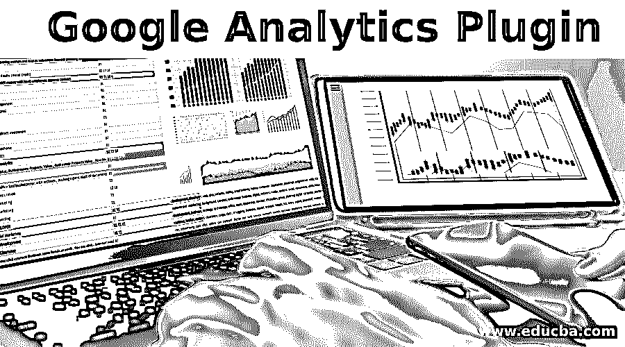

# 谷歌分析插件

> 原文：<https://www.educba.com/google-analytics-plugin/>

## 谷歌分析插件简介

谷歌分析插件在世界各地都被使用。要解决任何问题，都需要理解周围的数据，并根据数据的行为得出解决方案。它变得越来越受欢迎了。哪里有数据，哪里就有分析。它帮助企业以更好的方式发展和服务，提高客户满意度和绩效。许多 IT 巨头提供不同类型的分析引擎来帮助企业和人们更好地了解他们的客户。谷歌提供的一个这样的分析引擎是“用于网络服务分析的谷歌分析”。它跟踪并报告网站流量。它有助于跟踪用户在网站上的活动，如会话、页面持续时间、点击、停留、跳出率等。这有助于提供商了解用户的好恶。

<small>Hadoop、数据科学、统计学&其他</small>

谷歌分析插件是一个简单而强大的程序，有助于更好地洞察数据。一旦安装，它将帮助用户从 WordPress 仪表盘上的 Google Analytics 获得重要的报告和仪表盘。它会将谷歌分析跟踪代码附加到 WordPress 上。因此，用户可以获得所有与流量相关的细节，如哪个页面被访问得更多，哪个页面包含用户最喜欢的内容，网页上的客户端行为等。它帮助用户获得正确的报告，并显示网站的每一页的分析。

### 什么是谷歌分析插件？

要发展你的业务，了解你的客户是必要的。如果你能弄清楚他们喜欢哪些内容，他们对哪些信息感兴趣，网站的流量是从哪里来的。这样你就可以引入正确的流量，并产生正确的影响。

谷歌分析插件是一个轻量级的程序，可以帮助你在 WordPress 上附加一个谷歌分析账户，并查看重要的报告。这个插件可以帮助你简化这个过程。它可以让你在 WordPress 上看到报告，并为更高级的跟踪提供额外的选项。它为您提供了重要指标的快速摘要，并将其与过去的数据进行了比较。所以，你可以分析任何新增加的内容是否对网站的流量有帮助。易于安装；不需要训练有素的开发人员来编写插件。它让你看到什么是真正重要的。

#### 1.观众报告

这份报告有助于你了解你的客户。客户的地理位置、年龄组、性别、兴趣、访问网站的设备等信息。了解了这些，就可以根据受众来设计内容了。

#### 2.内容报告

它显示了网站内容的统计数据。图片和视频比简单的文字更能吸引顾客。它显示了网站上哪些内容最常被访问/喜欢。用户倾向于播放视频，而不仅仅是阅读简单的文本。基于报告提供的分析，你可以为你的网站设计更好的内容。

#### 3.电子商务报告

这份报告显示了与收入、订单、跳出率、转换率、推荐来源等相关的统计数据。您可以了解哪种产品最受欢迎，购买最多或添加到购物车中。该插件还显示了在哪个地理区域哪个产品的购买量更大。

#### 4.搜索控制台报告

这份报告显示了你的网站的受欢迎程度，谷歌排名。在此基础上，你可以改善你的内容，以获得更多的客户和更好的谷歌排名。

#### 5.表单跟踪

它让您分析用户如何与网站上的表单交互。

#### 6.自定义维度报表

这有助于您分析登录的用户。鉴于所有这些报告，谷歌分析插件维护隐私。它不跟踪任何身份证或卡的细节。

### 致力于谷歌分析插件

要使用谷歌分析，你需要先有一个谷歌分析帐户。获得谷歌分析账户后，你可以进入 WordPress 仪表盘，在仪表盘上安装谷歌分析插件。激活插件，在您的网站上使用谷歌分析。你必须将插件与你的谷歌分析账户链接，授权，然后你就可以开始了。在你的 WordPress 仪表盘上，你还可以[看到谷歌分析仪表盘](https://www.educba.com/google-analytics-dashboards/)。一旦插件附加到网站上，你就可以去谷歌分析，看到实时报告和仪表板。您也可以从 Google Analytics 定制您的报告。

### 利弊

凡事都有利弊。这取决于选项应该选择的要求和资源。

#### 优点:

*   插件简单易用。你不需要开发人员编写额外的代码。
*   它速度更快，重量更轻。
*   插件根据谷歌分析主动管理和改变。
*   保持更新不是问题。
*   它具有管理隐私、登录用户流量排除和链接跟踪等功能。
*   它显示集成在仪表板上的报告。

#### 缺点:

*   它会增加性能开销。
*   插件可以使用过时的跟踪代码。
*   插件错误也会导致网站出现问题。
*   需要维护。

### 结论

尽管有利有弊，谷歌分析插件还是用户的首选。它提供了交互式有用的报告和仪表板，这无疑有助于改进业务决策。对于那些想要了解客户并提高网站流量的人来说，谷歌分析是一个很好的方法。添加一个插件可以很容易地连接到 Google Analytics 并有效地使用它。为了更好地了解你的业务，你应该在自己的网站上安装谷歌分析和插件。

### 推荐文章

这是谷歌分析插件指南。在这里，我们讨论了概念，工作，利弊，以便更好地理解。您也可以浏览我们推荐的其他文章，了解更多信息——

1.  [什么是 NoSQL 数据库](https://www.educba.com/what-is-nosql-database/)
2.  [什么是数据分析师？](https://www.educba.com/what-is-data-analyst/)
3.  [什么是大数据分析？](https://www.educba.com/what-is-big-data-analytics/)
4.  [如何使用 Google Analytics？](https://www.educba.com/how-to-use-google-analytics/)

