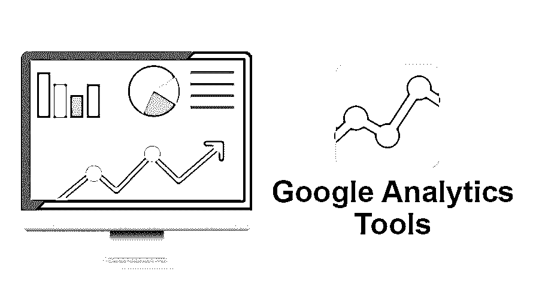
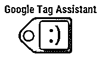
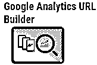
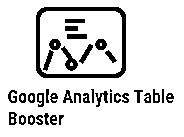
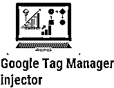
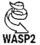
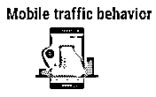
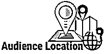

# 谷歌分析工具

> 原文：<https://www.educba.com/google-analytics-tools/>

## 谷歌分析工具简介

谷歌分析工具是一个分析工具，用于网络流量监测和分析。它是一个稳定的产品，谷歌提供免费版和高级版。谷歌分析工具的一些功能是跟踪特定网站在特定时间段内的访问量、排名最高的页面和排名最低或没有排名的页面、网站访问者的位置、每个访问者在网站上花费的时间。Google analytics 支持多种工具，如 Google Tag Assistant、RegExr、Google Analytics URL Builder 和实时报告、移动流量行为和受众定位，以实现高效分析。

### 谷歌分析的不同工具

以下是谷歌分析工具列表，它可以帮助你提高数据质量，增加网站流量:

<small>Hadoop、数据科学、统计学&其他</small>

**1。谷歌标签助手:**谷歌标签助手是一款调试工具。这是一个 chrome 扩展，用于检查谷歌分析、奖励转换跟踪、谷歌标签管理器和其他工具是否正常工作。使用谷歌标签助手工具，您可以快速解决任何谷歌分析问题，并立即修复它们。标签助手很容易使用。它给出了你正在访问的网页上的所有标签。这个工具自动给出解决问题的建议。谷歌标签助手帮助你找到无效的事件，丢失的标签，过滤器等。

**2。RegExr:****Google analytics 支持 13 种正则表达式。[可以使用正则表达式](https://www.educba.com/regular-expressions-in-java/)来应用报告过滤器、设置段和管理过滤器以及定义 ng 漏斗步骤。
google analytics 支持的 13 个 Google 表达式有管道(|)、点(。)、星号(*)、点星号(。*)、反斜杠(\)、caret(^)、美元符号($)、问号(？)、括号()、方括号([ ])、破折号(-)、加号(+)和花括号({})。**

 **

**Google Analytics URL Builder:**Google Analytics URL Builder 允许您基于当前 URL 创建活动 URL，然后使用自动报告工具自动跟踪 URL 的进度。活动 URL 可用于跟踪哪些促销活动为网站带来流量。

**4。实时报告:**实时报告工具允许组织实时监控网站活动，提供有关用户对您的网页的反应、他们在每个页面上花费的时间、他们通过链接访问了多少网页、用户的物理位置等信息。借助这个工具，组织还可以分析用户对电子邮件活动的反应。

**5。Google Analytics Table Booster:**Google Analytics Table Booster 是一个 chrome 扩展，用于增强 Google Analytics 的数据网格。为了增强数据网格，它提供了三种类型的可视化。每一行可以使用不同类型的可视化，或者它们可以组合三种类型。这是评估数据性能的最佳方式。

**6。GA 调试器:** GA 调试器是 google analytics 调试器。这是一个 chrome 扩展，用于调试谷歌分析跟踪代码。它允许用户调试他们的网站，并允许他们看到其他网站如何实现谷歌分析跟踪。它很容易使用。在 chrome 上添加 GA 调试器后，必须打开它；之后对于一个打开的控制台，你要按 ctrl+ Shift + i，它会自动开始调试。

**

** 

**7。Google Tag manager 注入器:** Google Tag manager 注入器是一个开源的 Chrome 扩展，用于将 Google Tag Manager 容器标签注入到网页中。使用这个工具的优点是它不需要添加任何 JavaScript 代码来预览 [GTM，即谷歌标签管理器](https://www.educba.com/what-is-gtm/)容器。

**

** 

**8。WASP2:** WASP 代表 Web Analytics Solution Profiler。它用于调试谷歌分析跟踪问题。它还允许用户调试其他跟踪问题。在 WASP.crawler 的帮助下，您可以获得网站上标签的详细信息。WASP 可以审计网站上的任何内容或标签。

**9.Mobile traffic behaviour:** Mobile Internet search nearly doubled between 2012 and 2013 to maximize your possibilities by developing a mobile website and measuring its traffic conduct. This metric shows how the mobile market affects your association’s website traffic and will be an indicator of your site’s customer experience.

10。受众位置:受众位置可以让你知道受众的物理位置，从而改进营销和业务。它帮助你确定用户感兴趣的领域，获得高收益。受众定位帮助你分析你是否接触到正确的受众，网站的流量，为营销制定最佳策略等。

**

** 

**11。事件:**这是实时记录用户在网页上活动的最重要的工具。它记录了用户的信息，比如用户如何滚动网页，如何导航网站的其他网页，花了多少时间等等。这些活动帮助您分析网站速度、行为和响应时间，并通过解决问题来改进网站。

**

** 

**12。超级矩阵插件:谷歌分析工具广泛使用超级矩阵**。它提供不同的产品。然而，Supermetrics 主要用于 Google Sheets。它允许从不同的工具收集所有数据到谷歌表。之后，用户可以创建自己的仪表板，或者将 google sheet 与其他应用程序连接起来。它有免费版和付费版。

在付费版本中，您将获得以下附加功能，这些功能将有助于提高性能。

*   连接没有限制，这意味着你可以连接到谷歌分析和其他工具集。
*   用户可以自动刷新数据和发送电子邮件。
*   它提供了防止采样的功能。
*   对查询或查询中的行数没有限制。

### 结论

在这篇文章中，我们看到了什么是谷歌分析和它的工具。您可以根据自己的需求使用这些工具。希望对你有帮助。

### 推荐文章

这是谷歌分析工具的指南。在这里，我们讨论了谷歌分析工具列表，这些工具将帮助您提高数据质量和网站流量。您也可以浏览我们推荐的其他文章，了解更多信息——

1.  [谷歌数字营销](https://www.educba.com/google-digital-marketing/)
2.  [网站 SEO 工具](https://www.educba.com/seo-tools-for-websites/)
3.  什么是商业分析？
4.  [如何使用 Google Analytics？](https://www.educba.com/how-to-use-google-analytics/)

**