# 每位博主 19 款安卓谷歌应用

> 原文：<https://www.educba.com/android-google-apps-for-every-blogger/>

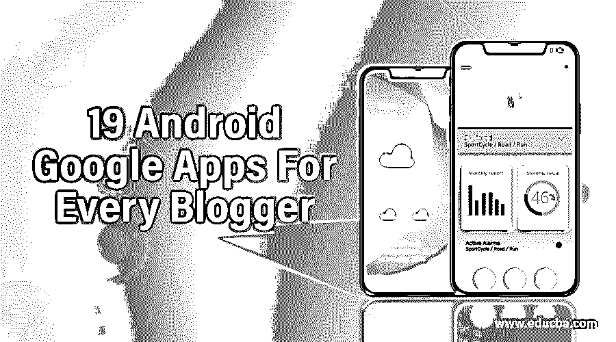

**Android Google Apps For Every Blogger—**博客可以被视为发泄你对任何问题或主题的情感的最重要和最有效的工具之一。你可以很容易地在互联网上分享你的感受，只要简单地写一篇博客，并把它发布在一个给定的平台上。随着智能手机和其他小工具几乎成为生活中不可或缺的一部分，博客在最近变得非常流行。如果你精通互联网，并且花很多时间在电脑屏幕前，你应该保持一个博客。同样，如果你对创意写作感兴趣，喜欢表达自己的想法，那就一定要定期写博客。然而，写博客需要时间，也需要奉献。你甚至可以用智能手机写博客；如果你的智能手机上安装了博客应用程序，你就不必特意打开你的笔记本电脑或电脑。

如今，你会遇到几个操作系统，如 Android、Windows 或苹果 iOS，它们有助于运行你的设备。随着智能手机和平板电脑数量的增加，Android 操作系统已经变得越来越出名。当你访问 Android 操作系统的谷歌 Play 商店时，你会得到几个应用程序，包括博客应用程序。可能会预先安装一些 android 谷歌应用程序，但如果没有，则从 Play Store 下载并相应安装。所以，知道哪些是有用的，哪些是重要的 app 是至关重要的。这里列出了 15 个最好的 Android 谷歌应用，对每个博客来说都是必不可少的。

<small>Hadoop、数据科学、统计学&其他</small>

## 面向所有博客作者的安卓谷歌应用

1.  ### WordPress

[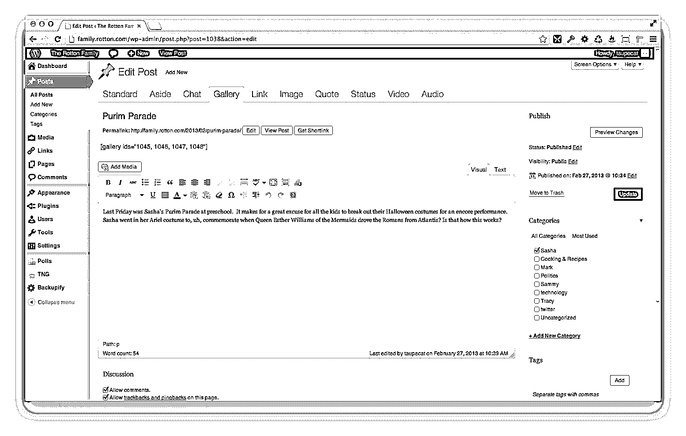

](https://cdn.educba.com/academy/wp-content/uploads/2016/02/android-google.png) 

毫无疑问，在各种博客平台中，WordPress 是最值得信赖和最受欢迎的平台。这是一个最佳的 Android 和谷歌应用程序，可以轻松地编写和编辑博客。不仅如此，你还可以确定你的博客的统计数据，并留意访问你的博客的访问者的数量，他们的评论和反馈。除此之外，你还可以直接从智能手机上传图片或视频。其实 WordPress 的效用并没有到此为止。它也被视为开发网站的重要工具之一。

**推荐课程**

*   [Android 开发者认证课程](https://www.educba.com/software-development/courses/android-developer-course/)
*   [安卓应用高级培训包](https://www.educba.com/course/android-training/)

2.  ### People who write logs (blogs)

[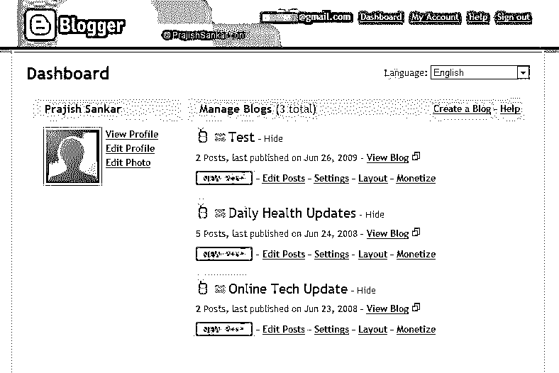

](https://cdn.educba.com/academy/wp-content/uploads/2016/02/blogger.jpg) 

如果你用的是安卓操作系统的智能手机，这个博客平台会像谷歌自己提供的那样安装在手机上。 [Blogger](https://www.blogger.com/about/?r=2 "Blogger ") 是一个广泛使用的内容管理系统(CMS)。它提供了与 WordPress 相同的功能，比如你可以撰写你的博客，附上照片或视频，编辑它，或者如果你不想以后发布它，可以将其保存为草稿。然而，关于哪个博客平台更好，一直存在争议。为了更清楚地了解图片，你可以先阅读 WordPress 和 Blogger 之间的比较，并了解其优缺点。

3.  ### Tumblr

[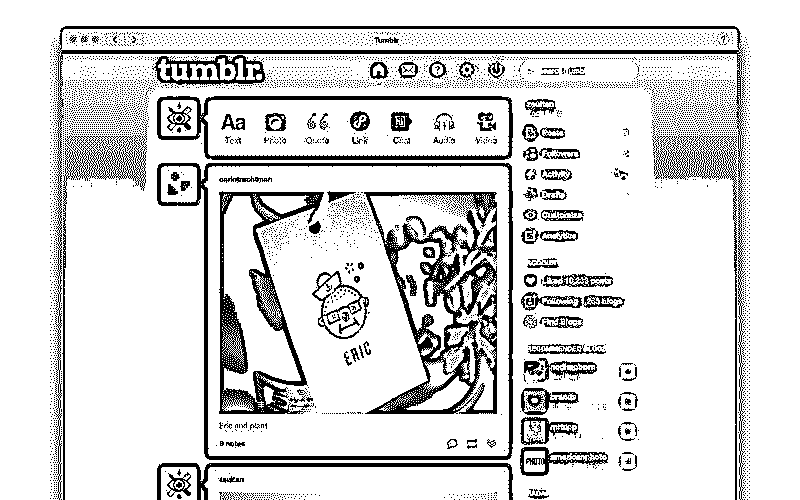

](https://cdn.educba.com/academy/wp-content/uploads/2016/02/Tumblr.jpeg) 

如果你对内容管理系统有所了解，你一定知道 Tumblr 的功能与 Blogger 和 WordPress 应用程序相当相似。 [Tumblr](https://www.tumblr.com/ "Tumblr") 也是几个博客维护者最喜欢的平台。它也被称为微博，因为它不是一个完整的博客，不像其他两个平台。它可以被证明是一个方便的应用程序，尤其是如果你想发布一些简短的评论、引用、视频，甚至是图像。你可以为读者写简短而吸引人的内容。此外，它还允许您回复评论或消息，甚至管理多个 Tumblr 博客。此外，您还可以查看添加到您的联系人列表中的其他作者的 Tumblr 博客。

4.  ### Creative writer

[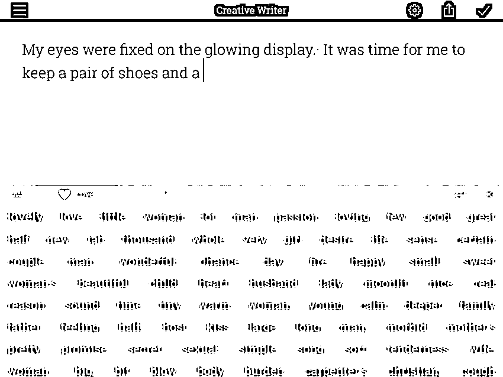

](https://cdn.educba.com/academy/wp-content/uploads/2016/02/creative-writer.png) 

你经常写博客吗？写博客时你会分心或遇到问题吗？如果是，那么 creative writer 应用程序是解决所有这些问题的最佳解决方案，因为它为您提供了一个不受任何阻碍的自由写作空间。许多博客作者抱怨说，在撰写博客时，收到的通知确实会造成很多问题，分散他们的注意力。所以，从谷歌 Play 商店下载这个应用程序，全神贯注，安心写作吧。这不是结局。在这个文字处理器的帮助下，你甚至可以写笔记、故事和小说，无论你喜欢什么。事实上，它已经得到了许多用户的积极响应。

5.  ### 谷歌驱动

[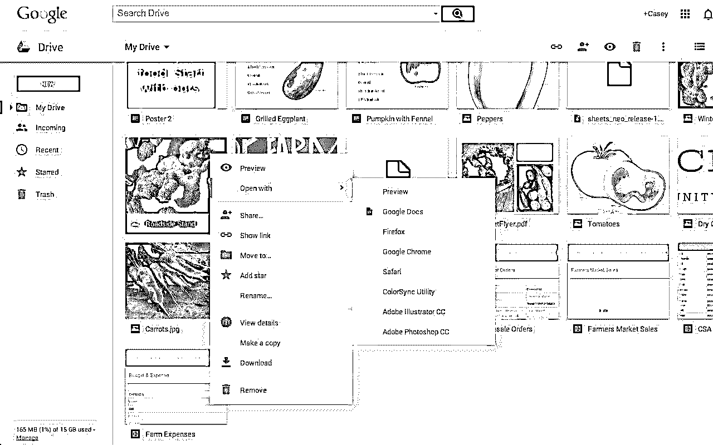

](https://cdn.educba.com/academy/wp-content/uploads/2016/02/Google-drive.jpg) 

所有智能手机或平板电脑用户都必须拥有的最重要的 android 谷歌应用之一是 Google Drive。它被认为是一款存储应用。它是一个可以存储所有文档的地方，包括 word 文档、excel 表格、包含音频、视频、图像等的文件。安装该应用程序的主要好处之一是，它允许您将所有重要信息存储在一个位置，并在多个设备上同步这些文档或文件。这样做的好处是你可以在任何地方查看这些文档。即使你在笔记本电脑或平板电脑上开始工作，你也可以在智能手机上完成未完成的博客。

6.  ### Google Analytics

 

如果你是一个专业的博客作者，那么这个谷歌分析 Android 谷歌应用变得更加重要。这是一个工具，通过它您可以监控所有的分析数据和静态。你可以完全依赖谷歌公司开发的这个应用程序。它为你提供实时数据、访问你的博客的读者的评论、高搜索关键词和跳出率的信息。

7.  ### Analysis

[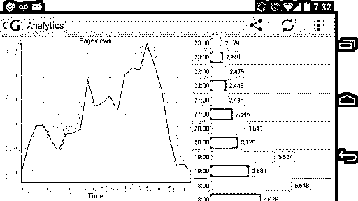

](https://cdn.educba.com/academy/wp-content/uploads/2016/02/ganalytics.jpg) 

分析可以被视为一个轻量级的主题，其功能与谷歌分析相比非常相似，因为移动版本是相同的。这个应用程序特别有助于确定你的博客的网络流量统计。简而言之，你可以直接从你的智能手机上监控你的博客的表现，而不需要使用笔记本电脑或电脑。对于那些通过为各种网站写博客赚钱的博客作者来说，这是一个额外的优势。所以，别再担心流量了，自由写作吧。

8.  ### Dictionary.com

[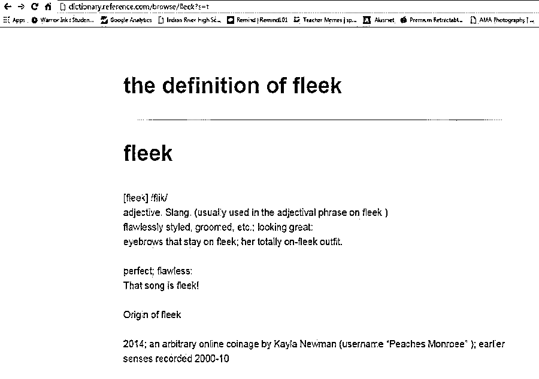

](https://cdn.educba.com/academy/wp-content/uploads/2016/02/fleek.jpg) 

如果你是博客写手，你必须意识到你博客中的每一个字都很重要。如果你想让你的博客更吸引眼球，增加浏览人数，那么选词就变得至关重要。它必须是有意义的和适当的。然而，有时，当博客们不知该说什么或忘记了什么时，他们会发现自己处于一个困难的境地。在这种情况下，Dictionary.com 可以帮助您找到您正在寻找的确切单词。这个应用程序是那些不能正确说英语的人的福音。它有无数的定义和同义词。它还有各种其他功能，如语音搜索、单词历史等。这款应用的无广告版售价约为 2.99 美元。

9.  ### Keyboard

[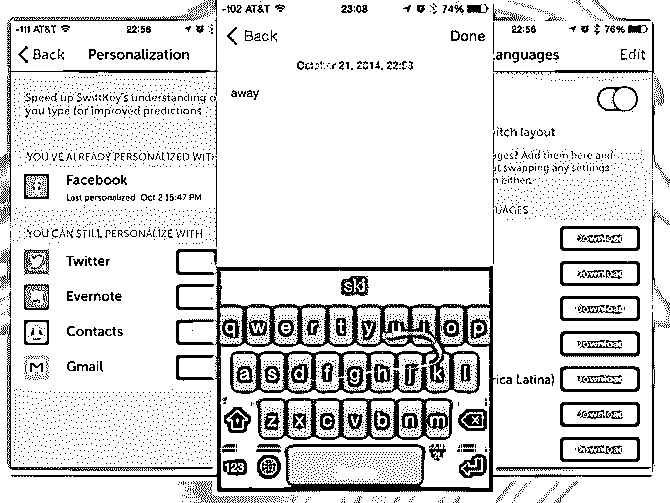

](https://cdn.educba.com/academy/wp-content/uploads/2016/02/Swiftkey-keyboard.jpg) 
现在你可以轻松摆脱智能手机上所有的小键盘按键。快速键键盘具有激动人心的功能，使打字工作变得极其容易。一些功能包括下一个单词预测、800 个表情符号等等。此外，它将有助于自动纠正错别字，你也可以在脸书、Twitter 或你的博客上发表博客时选择单词。该应用程序支持 60 种语言，并提供 30 种彩色布局。你也可以称它为默认键盘。

10.  ### Evernote

[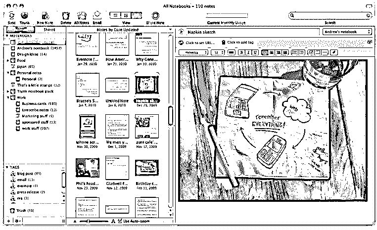

](https://cdn.educba.com/academy/wp-content/uploads/2016/02/evernote.png) 

大多数作家的思想总是自发产生的。我们偶尔会有好的想法。并不是说你总是随身带着笔和纸。然而，如果你的智能手机装有 Evernote 应用程序，你可以本能地记下它，然后在写博客时使用它。除此之外，你还可以收集网络文章、写文章、画草图、预约、保存书签等等。一旦它被同步，你就可以从任何地方访问文档。这确实是一个方便的应用程序，可以在 Android 和其他操作系统上使用。

11.  ### Photo editor

[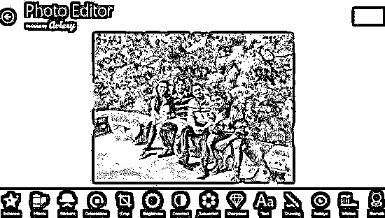

](https://cdn.educba.com/academy/wp-content/uploads/2016/02/photo-editor.jpg) 

有人说得好，图片比语言更有说服力。作为一个博客作者，你应该总是用一些图片来支持你的文章或事实，这些图片会给你的博客增加一个新的维度，使它更有吸引力。因为你有一部智能手机，你可以点击照片或上传图片。您可以立即添加照片，也可以稍后添加。但是，如果你觉得需要编辑照片，例如增加或减少其大小，或者添加效果或文本，你可以使用照片编辑器 App。

12.  ### Disks

[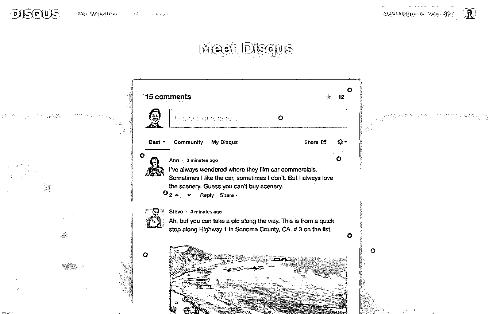

](https://cdn.educba.com/academy/wp-content/uploads/2016/02/disqus.jpg) 

这是 Android 操作系统上又一个现成的独特应用。它也可以被称为评论管理平台。有了这个应用程序，你实际上可以与你的读者建立联系。你可以阅读他们的评论和反馈，也可以回复。如果读者有任何疑问，你可以回答。这将有助于为你的博客带来更多的流量，因为越来越多的读者会访问这个网站来阅读你的博客。

13.  ### Facebook Page Manager

[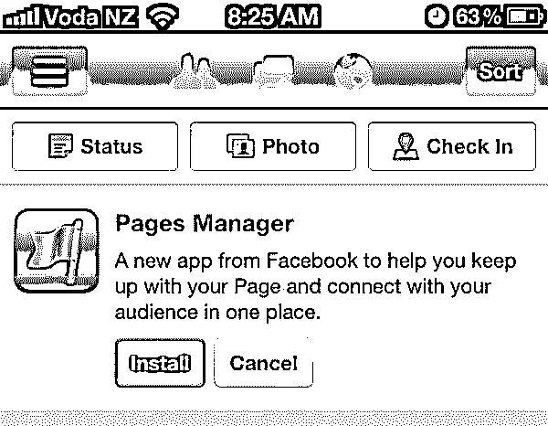

](https://cdn.educba.com/academy/wp-content/uploads/2016/02/facebook-pages-manager.jpg) 

毫无疑问，脸书已经成为全球最受欢迎、使用最广泛的社交媒体网站之一。几乎所有的博客作者都有脸书页面来发布他们最新的博客、文章和其他写作材料。然而，如果你有脸书网页管理器，回复会变得容易得多。你可以回复在你的脸书页面上收到的评论，更新你的状态，查看喜欢的数量，了解分享你的博客的人数，等等。你可以管理你的页面并与你的读者联系。

14.  ### squeaking

[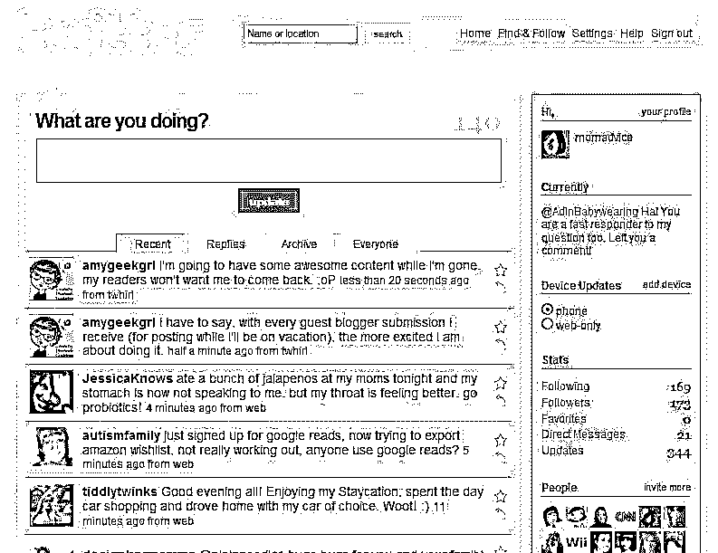

](https://cdn.educba.com/academy/wp-content/uploads/2016/02/twitter.jpg) 

Twitter 是全球第二大受欢迎和受关注的社交媒体网站。随着时间的推移，使用 Twitter 的人数惊人地增加了。这是另一个最佳平台，你可以在这里发布你的博客，甚至推广它。你可以在 Twitter 上关注一些著名的博客作者，在阅读他们的博客时增加你的知识。另一方面，也可以查看关注你的人数。所以，下载 Twitter 的 app，这是 Twitter 的更轻版本。

15.  ### pocket

你可能经常在网站或任何其他来源上看到非常有趣或信息丰富的内容。你当然想读它，但不幸的是，由于时间不够或日程繁忙，你无法通读。这时候口袋应用程序就会来救你了。在这款应用的帮助下，你实际上可以保存链接，稍后在业余时间阅读内容。文章或内容会以极简版本下载，可以离线阅读。

除了这 15 个有用且重要的安卓谷歌应用，还有一些其他的安卓谷歌应用对智能手机或平板电脑用户也很有帮助。这些包括-

16.  ### Pingdom

[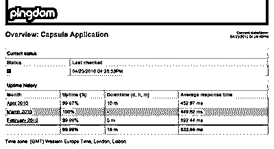

](https://cdn.educba.com/academy/wp-content/uploads/2016/02/pingdom.png) 

如果你有一个发布博客和其他写作材料的网站，这个应用程序会很有帮助。Pingdom 应用程序的作用是监视网站的正常运行时间和停机时间。一旦你下载并安装这个应用程序，你将免费获得正常运行时间的结果。简而言之，你可以不时地检查你的站点的状态。

17.  ### page turning plate

[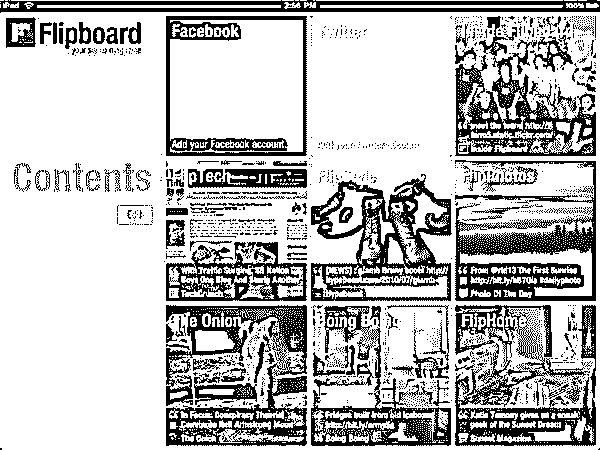

](https://cdn.educba.com/academy/wp-content/uploads/2016/02/flipboard.jpg) 

Flipboard 的 Android 应用程序于近日推出。在这个应用程序的帮助下，你可以了解最新的文章、博客、新闻以及新的视频和图像。它也有助于连接像脸书、推特和谷歌+这样的社交媒体网站。它将为你的博客写作提供新的思路。

18.  ### Google Plus

[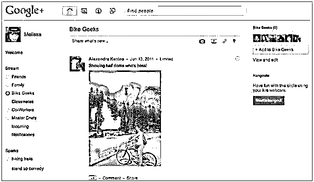

](https://cdn.educba.com/academy/wp-content/uploads/2016/02/google-plus.jpg) 

如果你想最有效地推广你的博客，那么 Google Plus 可以证明是一个方便的工具。你只要在这个平台上分享你的博客，就可以给你的博客带来高流量。你会发现这个应用程序预装在安卓手机上。总的来说，它有助于提高你的网站在搜索引擎上的排名。

19.  ### Buffer application

[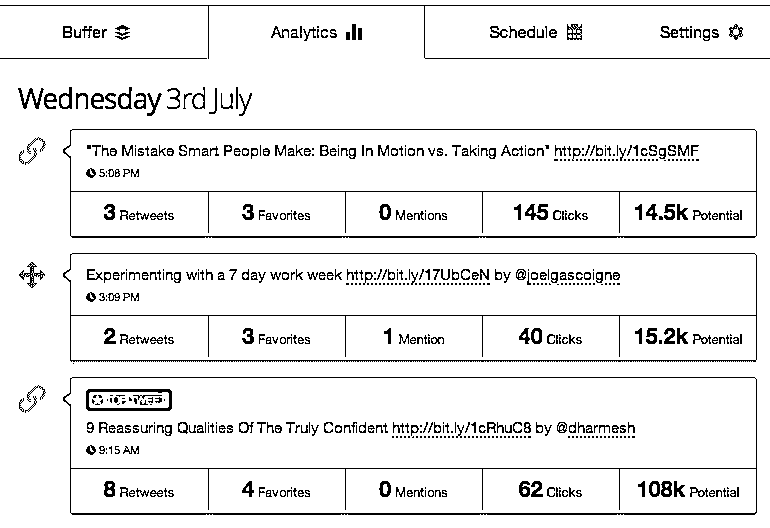

](https://cdn.educba.com/academy/wp-content/uploads/2016/02/buffer.png) 

Buffer 是一个重要的应用程序，可以帮助你在脸书、Twitter 或 LinkedIn 等各种社交媒体网站上分享你的博客或消息。

20.  ### Dropbox

[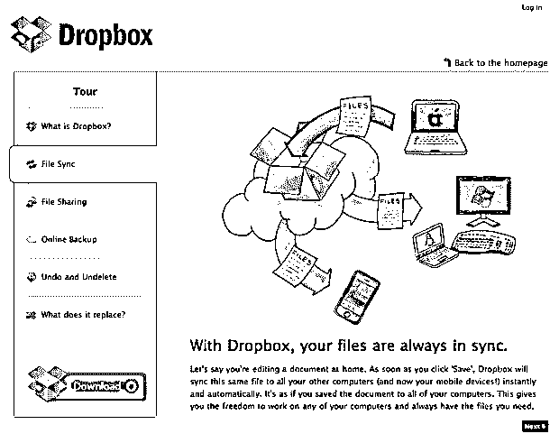

](https://cdn.educba.com/academy/wp-content/uploads/2016/02/dropbox.png) 

这是另一个重要的应用程序，有助于同步您的文件和文档。它为您的文件提供了安全性，您可以随时获取它们。你可以得到一个 2GB 的免费存储设备，更重要的是，你可以在这里存储你的网站备份。

### 结论——Android Google apps

所有提到的 Android 谷歌应用程序对于博客平台都是必不可少的。它们减少了人力，因为你不必到处携带电脑或笔记本电脑来撰写和发布博客。借助这些便携式安卓谷歌应用程序，你可以随时随地轻松做到这一点。你也可以了解博客或内容写作领域的最新发展。所以，用这些强烈推荐的 Android 应用程序来写这篇文章，发表你的博客和文章。

### 推荐文章

因此，这里有一些相关的文章，将帮助您获得更多关于 Android 手机应用程序的细节，所以请浏览下面给出的链接

1.  [每个苹果粉丝都应该知道的 iOS 8 最重要的 5 个小技巧](https://www.educba.com/5-tips-of-ios-8-every-apple-fan-should-know/)
2.  [WordPress 和 Joomla 最佳指南](https://www.educba.com/wordpress-vs-joomla/)
3.  [每位博主 19 款安卓谷歌应用](https://www.educba.com/android-google-apps-for-every-blogger/)
4.  [最佳免费项目管理应用](https://www.educba.com/best-project-management-apps-free/)
5.  [Android 开发职业](https://www.educba.com/careers-in-android-development/)
6.  [12 Adobe Photoshop Elements 最佳指南 14](https://www.educba.com/adobe-photoshop-element-tools/)

