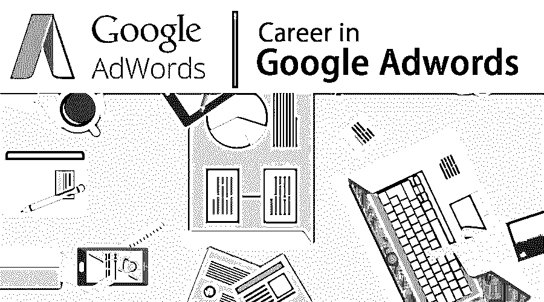

# 谷歌 Adwords 的职业生涯

> 原文：<https://www.educba.com/career-in-google-adwords/>

## 谷歌 Adwords 职业介绍

它是由 Google 开发的流行环境之一，对于任何愿意为他们的产品做广告的广告行业都非常有用，他们通常提供不同种类的服务，任何视频内容或移动应用程序都可以很容易地安装在 Google AdWords 中，供任何网络用户使用。一个广告客户应该需要提供一些 cookies 或关键字值的谷歌 AdWords，使谷歌可以突出那些基于相关主题的广告。

### 谷歌 Adwords 职业所需的教育

学习 AdWords 通常需要扎实的英语知识或更好的多国语言知识。候选人应该对写作技巧有信心，特别是英语或其他世界流行的语言，所以根据组织的业务搜索关键字写作将非常容易做到。假设一个组织主要从事金属或一些硬件产品。在这种情况下，AdWords 作者应该知道如何写一些流行的关键字，这可以是买方或客户的常见搜索。这些特定的关键词将帮助 google adwords 在特定的搜索中向全世界突出显示相同的内容。

<small>Hadoop、数据科学、统计学&其他</small>

### Google Adwords 中的职业道路

Google adwords 再次成为有经验的新人的热门职业机会之一。通常，面试官希望应聘者具备出色的沟通和写作能力。该组织的招聘将非常强调某一特定领域的专门知识。如果你真的想在谷歌 adwords 中建立自己的事业，那么候选人应该开始学习多种全球语言，并且必须熟悉英语写作技巧。

通过谷歌提供的一些关键认证(这是最受欢迎的),候选人在这个特定的职业生涯中将获得一些额外的优势。其中一些如下:

*   Google adwords 课程:由 Google 直接提供，培训和认证都由他们提供，所以自动地，它会为候选人的简历增加一个完美的羽毛。在你注册这个课程和认证之后，Google 已经提供了很多学习资源。那些由谷歌自动提供的基于世界的学习资源让[了解 adwords](https://www.educba.com/use-google-adwords/) 。这些课程涵盖了各种主题，并提供了三个层次的经验教训。但是这个课程对初学者来说非常有用，但是对于经验来说，如果他们很长时间没有接触这个领域，它可以作为一个复习。
*   **AdWords stream PPC 大学 AdWords 课程**:该课程是 Google 目前最好的课程之一，专门针对 AdWords 经验考生。大一的考生也可以选修这门课，但这将是他们理解一切的一大障碍。它将提供一个清晰的理解率一次点击通过，每一个行动的成本，在多种语言的转化率优化。它还会提供额外的具体或合适的文本，写作质量分数等信息。

### Google Adwords 中的工作职位或职业应用领域

Google adwords 对于普通的大学毕业生来说一直是一个备受关注的职业。对多种语言的专门写作技能有足够了解的候选人可以很容易地申请 Adwords 的工作。有各种各样的工作在市场上提供，特别是在谷歌 adwords 上。通常两种工作都是一样的，候选人需要根据他们目前的知识和真正的兴趣来选择他们将要从事的职业。

*   **广告行业**:全世界有不同类型的行业，他们的期望和产品总是与众不同，最重要的是不同组织之间对同一行业的竞争总是非常突出。所有这些行业都在寻找在当前的 adwords 中创造一个美丽的广告。与其他组织相比，广告 cookies 价值或关键字价值在宣传其产品时总是起着关键作用。他们总是愿意向顾客强调他们的产品。候选人应该需要写在理解组织期望的基础上适当的关键字，以便谷歌 adwords 可以理解相同的和突出要求的人。
*   **Google Adwords directly** :如果某个候选人真的在寻找参与 Adwords 管理的具体开发，那么 Google Adwords 公司就是其中一个关键机会。

### 薪水

任何人都可以开始谷歌 Adwords 工作，尤其是在英语、中文、日语、西班牙语或其他流行语言方面。搜索可以通过谷歌搜索引擎来完成，因为它不需要任何具体的反手学位，工资也没有其他工作经验丰厚。但是，与收入相比，没有什么是金钱的最佳选择。对于求职者来说，这是学习和获得一点点容易的工作之一。根据目前的组织传言，工资从 5 万美元到 9 万美元不等。根据经验或关键词交付的数量，工资可以改变。它通常不会给候选人任何固定的薪水；他们的薪水是基于你为他们的组织所写的关键词，这些关键词可能是有用的或者是完美整合的。

### Google Adwords 中的职业前景

谷歌 Adwords 是一个快速就业机会，尤其对该领域的应届毕业生有吸引力，他们在多种语言方面有出色的写作技巧。有经验的应聘者也在 google adwords 找这个职业。尽管如此，如果有人的目标是直接在 Google 中切换，以开发管理 Google Adwords 中关键字的特定规则，这对每个人来说都是美好的。

### 结论

Google Adwords 目前更名为 Google Ads，目前正在为多个组织开放其 API。谷歌搜索是每个人的普遍习惯。因此，企业真的加大了投资，在谷歌上为客户的相关搜索做广告。这一特定领域的专家候选人的价值与日俱增，因此招聘和工作机会都有望在未来得到改善。毫无疑问，对于任何职业的快速发展，谷歌 Adwords 将是一个很好的选择。

### 推荐文章

这是谷歌 Adwords 的职业指南。这里我们讨论了 Google Adwords 中的简介、学历、所需技能、工作职位、薪资、职业前景。您也可以阅读以下文章，了解更多信息——

1.  [统计职业](https://www.educba.com/careers-in-statistics/)
2.  [Linux 管理职业](https://www.educba.com/careers-in-linux-administration/)
3.  [SAS 职业生涯](https://www.educba.com/career-in-sas/)
4.  [PL/SQL 职业](https://www.educba.com/careers-in-pl-sql/)

