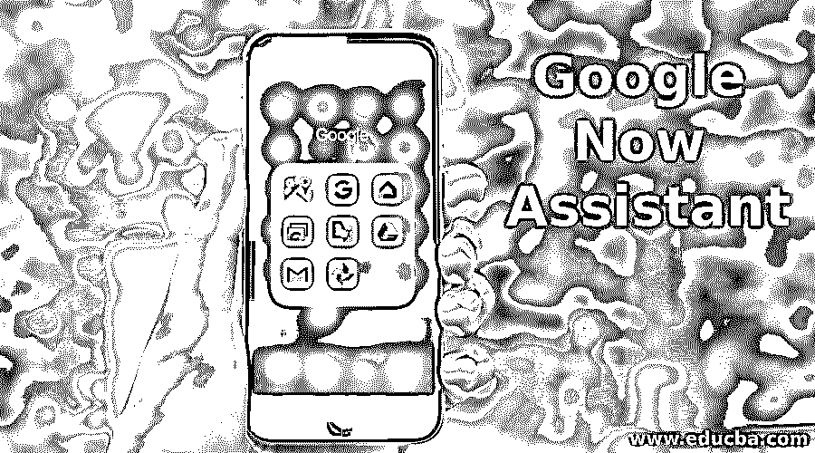
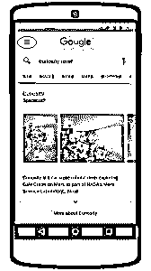
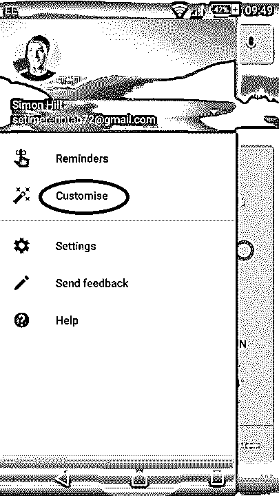
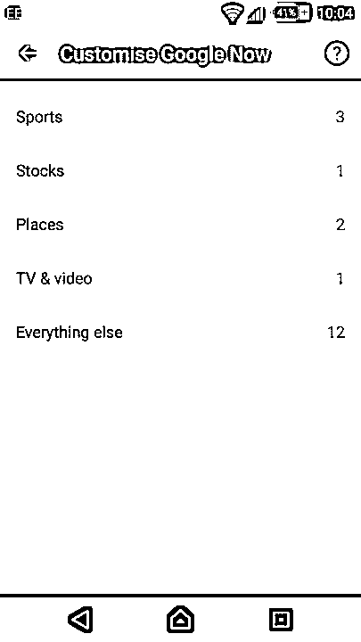
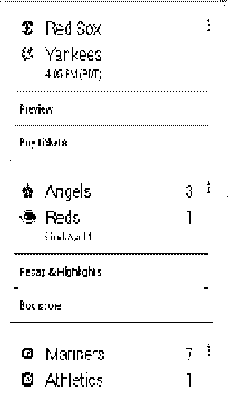
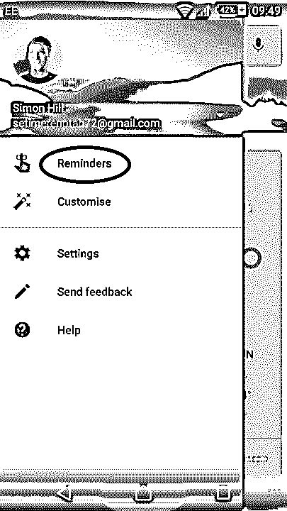
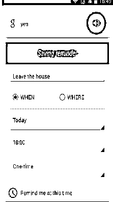
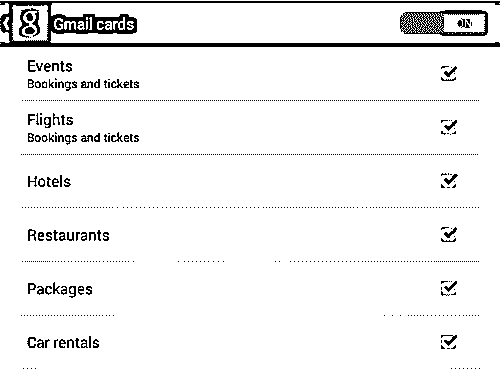
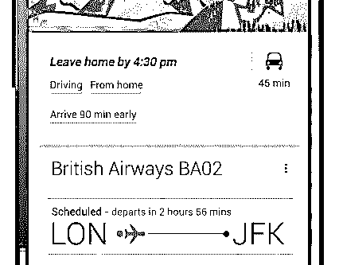
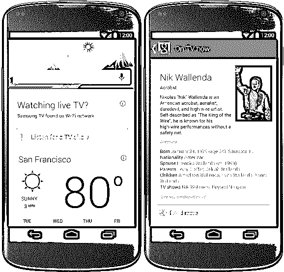

# Google Now 助手

> 原文：<https://www.educba.com/google-now-assistant/>

## Google Now 助手简介

Google Now 比人们所知的要聪明得多，它的能力也远远超出了它通常的用途。当然，你可以用它来问随机问题、设置提醒、预订等等。但我们大多数人不知道的是，一旦它了解了你的需求和习惯，它就会显示出对你有用或感兴趣的信息，甚至在你提出要求或认为你可能需要它之前。给出的信息以卡片的形式出现在你的手机屏幕上，如果不需要的话，你可以把卡片刷掉，或者轻触一下获取更多信息。

我将带你了解谷歌现在在 android 上可以证明对你有用的无数方法。请继续阅读！

<small>Hadoop、数据科学、统计学&其他</small>

### 完成 Google Now 助手的设置和定制

为了充分利用 Google now google assistant 的所有功能，必须完成设置并进行自定义设置。

为了获得最佳结果，请向 Google Now Assistant 提供它要求的所有信息。这也包括启用某些设置，也会占用你一些宝贵的时间。

要自定义设置，请点击 Google Now 助手主屏幕左上方的三条水平线，然后从菜单中选择“**自定义**”。

在这里，通过选择您的偏好来完成各个类别。你会觉得谷歌是想通过这些问题更好的了解你。你可以设置你的家和工作地点，分享你如何通勤上班，告诉谷歌你最喜欢的运动，你感兴趣的股票，天气预报等。此外，在选项“**Everything others**”下，你可以选择接收网站更新，设置首选温度单位和其他类似的事情。

您可以通过点击每张卡右上角的菜单图标来进一步个性化您的设置，并回答下面的问题。

因此，Google Now Assistant 对你了解得越多，它对你的价值就越大。

#### #1.Google Now 助手——您的个人助理

Google now google assistant 很可能是最聪明的个人助理。通过语音命令和一系列新添加的功能，它可以确保您的工作和个人生活得到良好的管理、组织，并且没有压力。

它会根据你的电子邮件、相关搜索和其他应用程序中的活动向你发出提醒。例如，酒店预订、航班信息、旅行细节、会议等。，都以 google now google assistant 卡片的形式展示。

*   你也可以设置提醒，谷歌会在事件临近前提醒你并给你发邮件。
*   要设置提醒，请打开 Google Now 主屏幕上的菜单，并从菜单中选择**‘提醒’**。
*   在这里，你可以添加新的事件，甚至可以选择一个你希望被谷歌提醒的时间或地点。

#### #2.智能研究

当我们习惯性地在谷歌搜索框中输入搜索时，这是例行公事，但在 Android 上使用语音命令在谷歌中搜索确实是一种非凡的体验。它打开了许多其他研究课题的大门。

您的搜索以基于您的搜索的精炼研究主题的形式呈现，并且您点击链接。您的搜索结果将与其他相关文章一起显示。它排列在各种不同的类别中，如新鲜内容、论坛、评论、视频、音乐、人物、电视节目和网页。

在 Android 上激活 Google Now，对着手机说“**OK Google”**。现在大声说出你希望进行搜索的问题或关键词。

例如，你在 Google Now 上搜索一个体育明星。了解到你对特定运动的喜爱，Android 上的 Google now 会建议**“提醒你有比赛**？”在搜索卡的底部。如果你点击它，只要电视上有相同的比赛，Android 上的 Google Now 就会自动提醒你。

#### #3.位置和通勤共享

Android 版 Google Now 中的定位服务如果打开，可以帮助您执行以下操作:

我们的大部分工作都是通过开车到处跑来完成的。我们开车去上班，去购物中心，拜访家人和朋友。一旦你设置了你的位置或目的地，Android 上的 Google Now 会根据交通状况给你估计的驾驶时间。它还记得你把车停在哪里，以防你是健忘的那个！如果你坐火车旅行，它会给你火车时刻表。

您可以通过启用**位置共享**功能与您的朋友或家人共享您的位置。这将有助于他们知道你的确切位置。在启用**位置历史**时，Android 上的 Google Now 通过在每个位置登录来评估你步行或骑车的总距离，并每月显示一次谷歌卡。

如果你有至亲至爱的人在等你回家，你可以启用**通勤共享**让他们跟踪你的行踪。想象一下，如果你的未成年孩子独自通勤，而你很担心，这一功能会有多有用，只要在他的手机上启用这一功能，你就可以随时了解他的最新情况。

要激活这项功能，请遵循以下步骤:**菜单>设置>Android 上的 Google Now>流量。**现在启用“**让他们看到你的通勤更新”**

#### #4.使用 Google Chrome 在桌面上安装 Google Now 助手

如果你在桌面上使用安卓手机和谷歌浏览器，强烈建议你在浏览器上登录你的谷歌账户。因此，当你在桌面上浏览时，谷歌会在你的手机上显示与你在桌面上的搜索相关的卡片。

要将桌面上的 Google Chrome 浏览器连接到手机，请按照以下步骤操作:

*   在你桌面的 Chrome 浏览器中，点击右上角的菜单按钮，用三条水平线表示。
*   选择选项-“**登录 Chrome。”**
*   现在，使用您的 Google 帐户登录。

完成此操作后，重新启动浏览器。您将收到一则通知，询问您是否希望启用 Google Now Cards。单击是。

#### #5.Gmail 贺卡和预订

就像我们可以将 chrome 搜索与 Google now 应用同步一样，Gmail 也可以与 Google Now Apk 同步，您可以获得 Gmail 卡片。当你收到旅行确认时，如机票预订、酒店预订、餐厅预订等，这是很有用的。，在您的 Gmail 中。您还会收到信用卡付款提醒和其他账单支付提醒。

要启用 Gmail 卡片，请遵循以下简单步骤:打开 Google Now 菜单>进入设置> Gmail 卡片。

#### #6.语音命令

在本文前面，您已经了解了如何使用语音命令在 Google Now Apk 上进行搜索。但是谷歌语音还有更多功能。您可以向手机发出命令来执行各种功能，例如向特定联系人拨打电话、打开或关闭应用程序或播放音乐。

就说，'**好吧，谷歌'**。你会听到一声轻微的哔哔声，同时屏幕会显示谷歌已经准备好接受你的命令；大声说出你的命令。比如“打电话给约翰”或者“打开 Truecaller”。哇哦！命令执行了！

当你向谷歌提问时，它会以人声回答。

你可能需要训练谷歌理解你的口音。

#### #7.你的旅行指南

现在 Google Now Apk 给你前所未有的无压力旅行体验。根据你的旅行预订(请记住，谷歌是通过 Gmail 跟踪了解的)，它会让你随时了解航班时刻的任何延误，提醒你及时离开家去机场，并安排预先登机。此外，根据你要去的目的地，它会推荐酒店、租车服务、餐馆、观光和名胜。此外，对于您的国际旅行，Google Now Apk 提供了翻译、货币兑换和天气预报卡。

对于拥有众多目的地和不断变化的时区的大型 ternaries，您很容易感到困惑。从一趟航班跳到另一趟列车，再从另一趟列车上跳下来，驾驶室会让任何人困惑。Apk 可以快速管理这些重要的信息，并且通过在需要时提供所需的路线信息，成为管理这些细节的一个不可思议的工具。

让我们来看看这个例子:在你要赶飞机的前几天拿到一张提醒卡。在任务完成之前不断收到提醒。获取可以帮助您办理电子值机和登机牌的卡片。在你到达酒店之前，准备好印有酒店名称、图片、电话链接或地图的卡片。

#### #8.即时跟踪股票和体育比分

正如本文前面提到的，Google Now Apk 以 Google cards 的形式让您了解自己感兴趣的股票和感兴趣的体育赛事的比分。

再也没有，一次次打开浏览器了解最新的比赛比分或者股票更新。信息就在你的手中！通过这种方式，你可以将 Google Now Apk 变成你的全天候体育网络，跟踪你的球队，轻松获得比分或当天发生的事情。

尝试以下命令获取最新的体育动态:

*   键入或使用语音搜索说出你的球队的名字，并获得比赛进行中的分数或球队即将到来的时间表。
*   向下滚动页面，阅读关于该团队的相关新闻。
*   您会在卡片的末尾找到“实时更新”或“详细播放”链接。点击它打开联盟的网站进行实时更新。

财务人员和股票交易商可以设置谷歌获得股票卡，以跟踪股票价格。

*   通过以下方式获取股票卡以启用设置:**打开 Google Now 菜单**，进入**设置< Now 卡<股票。**
*   **到**将你的股票添加到列表中，**打开 Google Now 菜单**，进入**定制<股票(点击+(添加)按钮**，输入你感兴趣的股票名称。

您也可以类似地删除股票。

#### #9.使用 Google Now 助手娱乐–电视卡

对于所有的电视迷来说，在你的新智能电视上使用 Google Now 电视卡，可以获得关于你最喜欢的节目的无限趣闻和琐事。如果你的 Android 设备与你的智能电视连接在同一个 Wi-Fi 连接上，命令 Google Now**--“听电视**”。它会听一小段时间，并显示节目的所有相关信息，如制作、导演、演员阵容和其他细节。

同样，你可以命令它播放你选择的曲目，创建一个播放列表，当你发出命令时，它会显示所有的琐事，如歌手，甚至在歌曲播放时显示歌词。如果阅读是你的爱好，那么也有适合你的东西！谷歌会研究你以前对书籍的搜索，并根据你的喜好，推荐你要读的书。

#### #10.获取 Google Now 助手的最新消息

通过 google now google assistant 卡获取最新的新闻故事。点击卡片阅读完整故事、电影八卦、相关图片和视频。永远与你周围发生的事情保持同步。

如果你不断得到你不感兴趣的新闻，你甚至可以阻止谷歌显示这个话题的新闻。每张卡上的三点按钮显示了过滤内容的备选列表。

因此，我们看到大多数有价值的功能都是通过与 google now google assistant 同步的应用程序来使用的。随着时间的推移，谷歌增加了可以插入它的应用程序的数量。

因此，你可以有无限的方式来使用谷歌助手。你越是在日常生活中使用和定制它，它就越有价值。所以，如果到目前为止你还没有充分利用它的潜力，那么今天就开始使用它吧。

### 推荐文章

这是谷歌助手的指南。在这里，我们讨论了一个简短的概述，有 10 种方法可以顺利完成 Google Now 助手的设置和定制。您可以阅读以下文章了解更多信息——

1.  [使用谷歌 Adwords](https://www.educba.com/use-google-adwords/)
2.  [面向每个博客作者的安卓谷歌应用](https://www.educba.com/android-google-apps-for-every-blogger/)
3.  [通用分析 vs 谷歌分析](https://www.educba.com/universal-analytics-vs-google-analytics/)
4.  [谷歌地图替代品](https://www.educba.com/google-maps-alternatives/)

