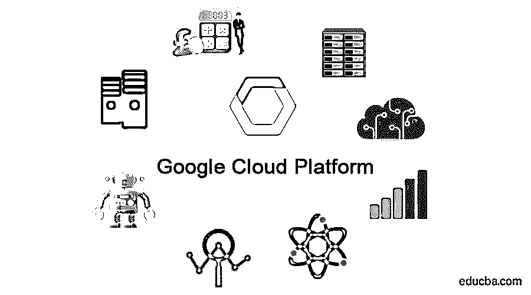
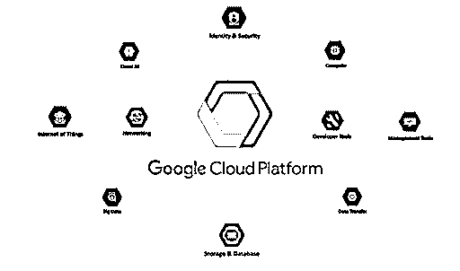

# 谷歌云平台

> 原文：<https://www.educba.com/google-cloud-platform/>

## 谷歌云平台简介

谷歌云平台(GCP)是由谷歌于 2008 年 4 月 7 日推出的云计算服务集合。GCP 与谷歌的产品运行在相同的基础设施上，如谷歌搜索引擎、YouTube 等。GCP 提供各种工具和服务，帮助管理基础设施、供应服务器和配置网络。除此之外，GCP 还提供广泛的模块化云服务，包括计算、应用开发、机器学习、数据分析和数据存储。开发人员、云管理员和其他 IT 专业人员可以通过公共或专用网络访问 GCP。

### 为什么 GCP 很重要？

GCP 被认为是继亚马逊的 AWS 和微软 Azure 之后的第三大云服务提供商。

<small>Hadoop、数据科学、统计学&其他</small>

选择 GDP 而非其他 CSP 的主要原因如下:

**1。可伸缩性:**云计算的一个主要缺点是向下伸缩。但是 GCP 在放大和缩小尺度上提供了极大的便利。

**2。定价:**与竞争对手相比，谷歌在云市场以最优惠的价格提供 GCP 服务。谷歌在其定价理念中提供了 4 个主要的关键因素。

*   **分钟计费:**仅对特定的请求时间计费。例如，与其他电信运营商不同，GCP 不会像其他电信运营商那样，在半小时内请求服务。而是只计费半小时。
*   **持续使用折扣**:如果我们将它用于持续使用计算资源，而不是用于临时目的，谷歌会给予 25%的递增折扣。
*   **定制机器类型:** GCP 可以让你拨入你的应用程序所需的 CPU 能力和内存的确切数量，并相应地收取费用。这种方法可以节省高达 15%的成本。
*   **可抢占实例:**如果系统被构建为具有容错能力，那么它可以真正启用其他系统，从而降低成本。

**3。综合服务:**可以同时使用各种 API、AI 和 ML、IoT、计算引擎、数据库、大数据分析、开发者工具、安全、存储。

**4。快速协作:** GCP 允许所有用户快速协作。多个用户可以同时访问和编辑项目。

**5。无服务器计算:**是 CSP 运行服务器，动态管理资源分配的云计算执行模式。因此，定价将基于应用程序消耗的实际资源量，而不是预先购买的资源量。

### 谷歌云服务

GCP 提供广泛的产品和服务。他们提供的服务从基本的[云服务](https://www.educba.com/cloud-computing-services/)到复杂的云服务，如 ML、IoT 等。

*   机器学习
*   物联网

#### 1.机器学习

AI 和 ML 由三个部分组成。

##### 我是说...。敬赫伯

*   它由一个托管的即插即用人工智能组件库组成。
*   它提供了企业级的共享能力，让一个组织在用户和开发者之间私有地托管 AI 内容。
*   它可以让你轻松地部署独特的谷歌云人工智能和人工智能技术，用于实验和生产。

##### 二。人工智能积木

它由一些组件组成，开发人员可以在他们的应用程序中添加风景、语言、结构化数据和对话。

**视线:**

*   **Vision AI:** 它可以让你分析云中或边缘的图像。
*   **视频 AI:** 它提供精确的视频分析——精确到帧。

**语言:**

*   **自然语言:**包括多媒体和语言处理。
*   翻译:它提供不同语言之间的快速、动态翻译。

**对话:**

*   **云语音转文本 API:** 提供超过 120 种语言的语音识别。
*   **云文本语音 API:** 它提供了类似人类的文本语音交互。

**结构化数据:**

*   **AutoML 表:**这让您可以轻松地在结构化数据上构建最先进的 ML 模型。
*   **BigQuery ML:** 这让您可以使用熟悉的 SQL 语言构建和操作定制的 ML 模型。

**云汽车:**

一套 ML 产品使 ML 知识有限的开发者能够利用 Google 的神经架构搜索技术训练出高质量的模型。

##### 三。人工智能平台

基于代码的数据科学开发环境，使开发人员能够快速将项目从构思到部署。

#### 2.物联网

它提供所有设备管理和连接服务。

*   云物联网核心让您拥有安全的设备连接和管理。
*   边缘 TPU(测试版)是一个专门构建的 ASIC，旨在边缘运行推理。

### 计算服务

GCP 提供广泛的计算服务，例如:

*   Google Compute Engine 提供了在 Google 创新数据中心和全球光纤网络中运行的高性能和高度可扩展的虚拟机，可快速启动，并提供高性能持久和本地磁盘选项。
*   Google App Engine 作为一个平台，用于构建可扩展的 web 应用程序和物联网后端。
*   谷歌 Kubernetes 引擎是一个强大的集群管理器和运行 Docker 容器的比例系统。
*   Google Cloud Container Registry 是一个私有的 Docker 存储库，与流行的连续交付系统一起工作。
*   云函数允许你构建完全无服务器模型的应用程序。

### 大数据服务

*   BigQuery 是一个全面管理、低成本、无服务器的数据仓库，可以根据您的存储和计算能力需求进行扩展。
*   云数据流是一种完全托管的服务，用于转换和丰富数据。
*   Cloud Dataproc 是一个快速、完全托管的 Apache Spark 和 Hadoop 服务，更简单、更具成本效益。
*   Cloud Pub/Sub 是一种无服务器、大规模、可靠的实时消息服务，让您可以在独立的应用程序之间进行通信。
*   Cloud Datalab 是一款基于 [Jupyter](https://jupyter.org/) 的交互式笔记本，旨在探索、分析、转换和可视化数据，并构建机器学习模型。

### 网络服务

网络是最重要和最基本的谷歌云平台服务之一，由最先进的网络服务提供。

*   虚拟私有云 (VPC)让你可以使用谷歌全球网络连接和管理各种 GCP 资源，并通过 VPC 将它们相互隔离。
*   Google Cloud Load Balancing 允许您根据自己的需求在计算引擎上快速扩展应用程序。
*   云内容交付网络(CDN)使用谷歌的全球分布式边缘缓存加速网站和应用程序的内容交付。
*   云域名系统(DNS)是一个可扩展、可靠、可编程、可管理的权威 DNS 服务，运行在与 Google 相同的基础设施上。这是向用户提供应用程序和服务的一种经济有效的方式。
*   云网络地址转换(NAT)使您能够在没有公共 IP 地址的情况下供应应用程序实例，同时还允许以受控和高效的方式访问互联网。

### 存储和数据库服务

*   云存储是一种低成本的安全且高度可用的[对象存储](https://www.educba.com/what-is-object-storage/)系统。
*   持久磁盘是一种适用于虚拟机和容器的高性能块存储系统。它提供了无与伦比的性价比**。**
*   Cloud SQL 是一个完全托管的数据库服务，让您可以轻松地在云中设置、维护、管理关系型 MySQL 和 [PostgreSQL 数据库](https://www.educba.com/postgresql-database/)。
*   Cloud Bigtable 是一种可扩展的 NoSQL 数据库服务，适用于低延迟、高可靠性和高吞吐量的工作负载。
*   Cloud Memorystore 是 Redis 的一个完全托管的内存数据存储服务，构建在可扩展、更安全和高度可用的基础设施上。
*   云数据存储为您提供了一个弹性的、高度可用的面向文档的数据库服务。

### 安全和身份服务

这是最重要的谷歌云服务之一，其中你的数据是高度安全和加密的。

*   Google Cloud Identity & Access Management(IAM)允许管理员决定谁可以访问和管理某些资源，让您可以完全控制和查看集中管理的云资源。
*   云安全扫描器是一款针对 App Engine 应用中常见漏洞的 web 安全自动扫描器。
*   二进制授权只在 Kubernetes 引擎上部署受信任的容器。
*   资源管理器以分层的方式管理 GCP 上的资源。

### 管理和开发工具

它用于监控服务、查找错误、调试和跟踪服务。

*   Stackdriver 在整个 GCP 提供实时监控、故障排除和日志记录，包括各种诊断工具。
*   云部署管理器允许您指定应用程序所需的所有资源。
*   Stackdriver Debugger 是 GCP 的一个特性，它提供了详细的性能洞察和分析。
*   云平台市场提供现成的解决方案，可通过 Anthos 快速发布到 GCP 和其他环境。

### 谷歌云平台的优势

以下是谷歌云平台的优势:

1.  通过高效地交付更新和快速的功能交付，快速获得创新，从而获得高生产率。
2.  当用户采用新功能时，通过连续交付可管理的改进，减少中断。
3.  快速协作，GCP 允许所有用户快速协作。多个用户可以同时访问和编辑项目。
4.  稳定的客户可获得最佳定价方案。
5.  实时迁移的好处是允许用户迁移他们的机器。
6.  专用网络，由于专用网络，客户可以获得最大的时间和效率。
7.  冗余备份设施可用于未使用的数据。
8.  员工可以在任何地方工作，在数据存储在云中的同时，可以跨设备全面访问信息。
9.  客户受到谷歌安全投资的保护，并受益于谷歌基于流程和物理安全的投资。
10.  为用户提供对技术和数据的完全控制和灵活性。

### 结论——谷歌云平台

当您组合服务来完成工作时，您已经构建了一个解决方案。云平台上解决方案的可能性是无限的。你可以在谷歌的解决方案库中寻找想法和指导。到目前为止，我们已经详细了解了 GCP 及其所有主要产品和服务。

### 推荐文章

这是谷歌云平台指南。在这里，我们讨论了谷歌云平台、人工智能和机器学习的重要性，以及服务和 10 个好处。您也可以浏览我们的其他相关文章，了解更多信息——

1.  [云计算的类型](https://www.educba.com/types-of-cloud-computing/)
2.  [数据科学平台](https://www.educba.com/data-science-platform/)
3.  [云计算的优势](https://www.educba.com/benefits-of-cloud-computing/)
4.  [什么是云计算？](https://www.educba.com/what-is-cloud-computing/)

