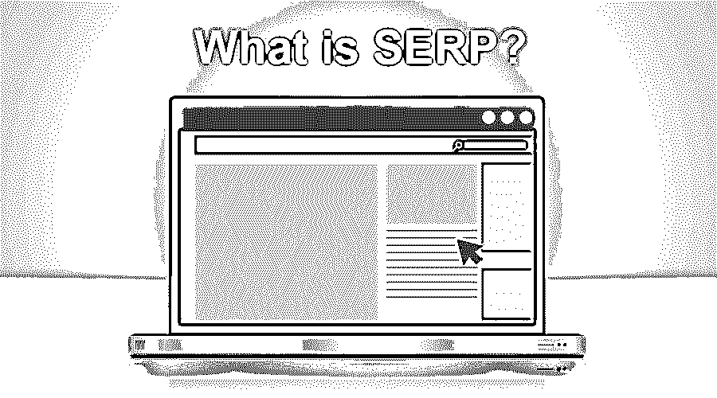
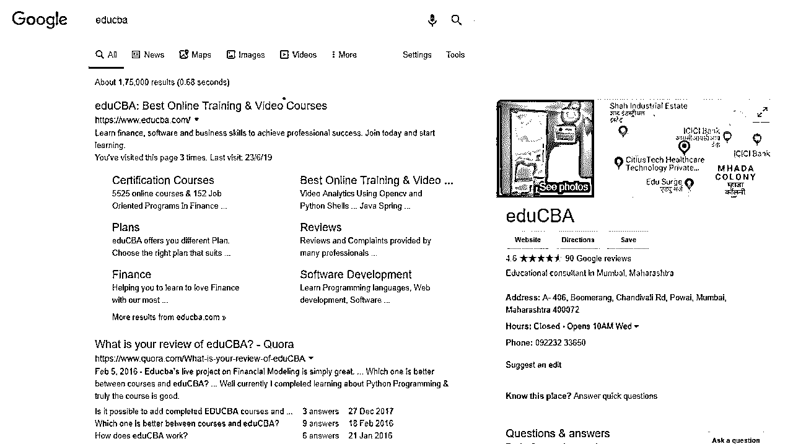
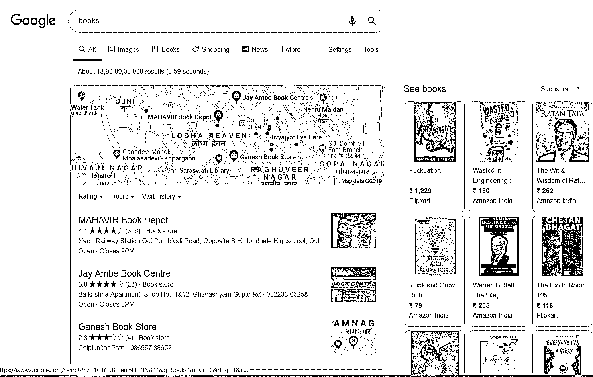

# SERP 是什么？

> 原文：<https://www.educba.com/what-is-serp/>

## SERP 简介

SERP 代表搜索引擎结果页面。SERP 的主要作用是列出一组基于关键词研究的网页。换句话说，当你打开浏览器，通过搜索引擎在互联网上搜索信息时，就会出现网页列表。这些结果不过是 SERPs。

SERP 结果可以是有机搜索结果，也可以是付费广告。有机搜索结果比付费广告更重要，因为很多时候用户会忽略付费广告。网页在 SERP 上的排名就是页面排名。高网页排名有助于组织获得更多的网站访问者，并增加印象数。

<small>Hadoop、数据科学、统计学&其他</small>

根据统计，75%的用户不会在第一页或第二页后导航。所以重要的是要排在最上面的位置，也就是第一页。

### SERP 是如何工作的？

正如我们已经讨论过的，当用户使用搜索引擎搜索一个特定的关键词时，他们将得到的网页。用户输入关键字，即他想知道的查询。基于该关键字，搜索引擎将向用户呈现结果。

搜索引擎结果页面改变久而久之。它们的外观随着谷歌、雅虎等搜索引擎的变化而变化。，定期更新，为用户提供最佳服务。换句话说，由于新技术在搜索引擎中的[出现，今天的搜索引擎结果页面的外观可能不同于以前的新页面出现的搜索引擎结果的外观。](https://www.educba.com/careers-in-technology/)

即使您使用相同的关键字和相同的搜索引擎，每个搜索查询都会显示唯一的结果。其独特功能背后的原因是，所有搜索引擎都根据用户浏览历史、位置、社交设置等特定因素定制其策略，以提供最佳结果。

### SERP 结果类型

搜索引擎结果页面显示两种类型的结果-有机结果和付费结果。让我们详细讨论那些。

#### 1.有机结果

有机结果显示了搜索引擎通过执行一些搜索算法给出的网页列表。SEO 专家[搜索引擎优化](https://www.educba.com/search-engine-optimization-seo-basics/)专业人士知道如何优化内容，将网站排在有机结果的首位。

为了更好地理解有机结果，请参考下图，其中显示了有机结果的列表。

我搜索过 educba 它给出了 SERP，即如图所示的网页列表。

你可以在 SERP 的右边看到一个方框；这个框被称为知识图或知识框。谷歌在 2012 年推出了一个知识图表。这个特性背后的目标是从万维网上的可用数据源获取查询数据，以便在 SERP 上的特定位置给出查询的答案

在上面提到的图片中，你可以看到关于 educba 的信息，比如一个地址，电话号码，办公时间。每个事实都有自己到其他网页的链接。他们中的一些人比其他人给出了重要的有机结果。这是因为各种搜索的不同含义。

互联网搜索有三种类型:信息搜索、导航搜索和交易搜索。

*   **信息搜索:**用户查找给定主题的信息，例如 educba。它将在 SERP 上给出 educba 的结果，而不是放置广告。
*   **导航搜索:**导航搜索是用户通过搜索访问特定网站的搜索。例如，如果您不记得 educba 网站的 URL，您将在搜索引擎中键入 educba。这将给出一个与 educba 相关的 SERP，当你通过 SERP 访问该网站时。
*   **交易搜索:**在交易搜索中，付费结果显示在 SERP 上。

#### 2.付费结果

付费结果是指广告客户为在 SERP 的顶部位置显示其内容而支付的结果。在早期，付费结果仅限于持续时间较短的基于文本的广告。这些广告显示在有机搜索结果上方的屏幕角落。但是现在的付费成果形式多样。付费结果有许多不同的显示形式。

为了更好地理解付费结果，请参考下图，其中显示了付费结果列表。

在上面提到的例子中，你可以看到我已经搜索了书籍；它给出了 SERP 上的网页列表；这些都是有偿成果。此外，还有一个基于关键字的 SERP 的附近书店和地图的列表。这些是这个 SERP 中唯一没有明确列出的发现:地图和公司列表。这个地图是根据用户的位置和当地公司的功能列表显示的，这些公司建立了免费的 Google My Business 列表。Google My Business 是一个免费的公司目录，可以帮助较小的本地企业提高其在基于地理位置的搜索引擎中的可见性。

你可以在下面的图片中看到一个大的基于文本的广告。

这些付费广告出现在 SERP 的顶部。广告商的首要位置。这些是 PPC(点击付费)广告。购物广告是页面右侧基于图像的广告， [Google AdWords 平台](https://www.educba.com/career-in-google-adwords/)提供的一个功能，使电子商务分销商的产品数据能够与其他 SERP 结果一起显示。这些广告由各种各样的数据组成，包括规格、产品的可访问性、详细的客户评论和排名、报价等等。

### 结论

在这篇文章中，我们看到了它是什么以及它在互联网上是如何工作的。它是用户使用搜索引擎搜索特定关键字时将获得的一组网页。希望对你的工作有所帮助。它显示了两种类型的结果——有机结果和付费结果。

### 推荐文章

这是什么是 SERP 的指南？.在这里，我们讨论基本概念，它如何在互联网上工作，以及搜索中显示的结果类型。您也可以浏览我们推荐的其他文章，了解更多信息——

1.  [什么是隐写术？](https://www.educba.com/what-is-steganography/)
2.  爪哇的 JNI 是什么？
3.  [技术 SEO 的 13 个重要方面](https://www.educba.com/the-beginners-guide-to-technical-seo/)
4.  [什么是 Google AdWords？](https://www.educba.com/what-is-google-adwords/)

