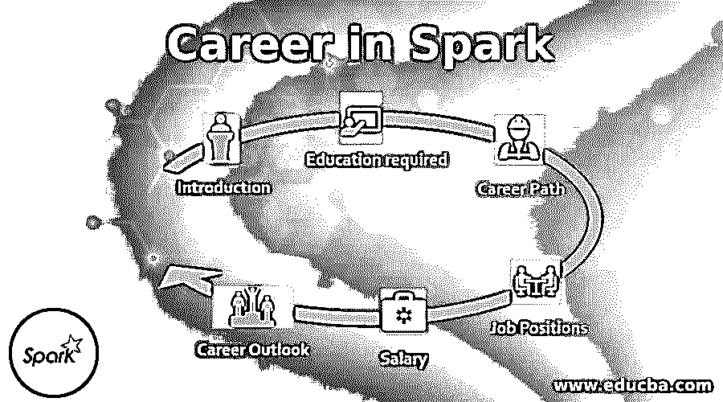

# 火花职业

> 原文：<https://www.educba.com/career-in-spark/>

## Spark 职业介绍

在本主题中，我们将了解 Spark 中的职业。Spark 在这里被称为 Apache Spark。它是一个开源软件。它是由 apache 软件基金会 AMP 实验室开发的。它是由 Mateizaharia 设计的。它最初于 2014 年发布。它是用 Scala、Java、 [R 和 Python 编写的。](https://www.educba.com/r-vs-python/)它支持不同的操作系统，如 Microsoft Windows、macOS 和 Linux。它基于类型是数据分析和[机器学习算法](https://www.educba.com/machine-learning-algorithms/)。

Spark 是一个计算框架，它为编程提供了一个接口。它可用于执行批处理和流处理。Spark 可以与大数据工具集成。Spark 还可以访问 Hadoop 数据源和其他特性或工具。Apache Spark 有不同的组件，如 Spark core、 [Spark SQL](https://www.educba.com/spark-sql-dataframe/) 、 [Spark Streaming](https://www.educba.com/spark-streaming/) 、Spark MLlib、Spark GraphX 和 SparkR。Spark 有许多特性，如快速处理、可重用性、动态性和成本效益等。

<small>Hadoop、数据科学、统计学&其他</small>

### Spark 职业生涯所需的教育

学习 apache spark 所需的教育应该是拥有计算机编程学士学位。个人应该知道编程语言的基本概念。在开始使用 spark system 之前，Java 编程基础知识是非常值得推荐的。可以通过网络门户和网络视频学习 Spark。

Spark 用于世界顶级组织。它被认为是大数据世界的第三代。因此，学习 Spark 开启了新的职业机会。是的，这需要时间来学习，因为它有一个很大的学习曲线，并且有许多组件需要实际操作。微软正在使用 Spark 来实现 Azure cloud。亚马逊使用 apache spark 来运行应用程序。IBM 使用 spark 来管理系统机器学习语言。雅虎的一个火花是用来分析大数据的。

### Spark 的职业道路

Apache spark 的职业道路是基于使用 spark 框架或正在向 spark 框架发展的行业和组织的。像阿里巴巴、日立等顶级公司。正在以严肃的态度采用 spark，并主要致力于这个框架。批处理作业主要处理在 spark 中开发的数据和正在处理的大型数据集。

不同的部门或行业主要雇佣 spark 开发人员，如零售、金融、电信/网络、银行、软件或 IT、媒体和娱乐、咨询、医疗保健、制造、专业和技术服务。超过 50%的数据主要使用 spark 框架，流处理需要良好的支持。在上述行业中已经有一些非常好的机会，在未来，它将会越来越多，因为一个火花正在提高生产力，时间和努力。

### Spark 职业生涯的工作职位或应用领域

Spark 开发人员有许多工作岗位或应用领域。根据技能和经验水平，你可以申请这个职位。不同的工作岗位有软件开发人员、系统工程师、系统架构师、系统分析师、大数据开发人员、大数据首席软件工程师、数据科学家、数据工程师、IT 项目管理、管理分析师等。

最近一段时间工作机会增加了很多，其中一些机会也在研发领域。组织中提供的其他工作机会或角色，如研究分析、数据可视化等。

### 薪水

spark skill 计算机程序员的工资与大数据开发人员或工程师的工资结构相同。根据技能和经验的不同，spark 开发人员的平均年薪从 9.5 万美元到 10 万美元不等。这项技术的高级工程师的年薪大约在 135，000 美元到 145，000 美元之间。大数据专业人员的年薪主要是 12 万美元。

spark 开发人员或程序员的工资远远高于其他程序员或专业人士。数据工程师的年薪预计约为 10.5 万美元，数据科学家的年薪约为 11.5 万美元。工资数据是工程师或组织所做调查的主要依据。spark 开发人员的工资预计会增加，因为它相对较新，人员较少，这些开发人员的需求不断增加。

### 星火中的职业前景

spark 开发人员的职业前景很好。据观察，像软件开发人员这样的入门级[职位在全球组织中的需求增长迅速。中级职位或开发人员对工作机会的需求也在快速增长，这有助于个人实现财务增长，并在相同的技术中安顿他们的职业生涯。](https://www.educba.com/career-as-a-software-developers/)

对于这种技能，自由职业项目可以在不同的网站上获得，帮助个人开始并能够在家里或舒适的地方工作时获得良好的收入。这些自由职业的工作确实给 spark 开发者带来了不错的薪水，因为开发者社区很少，而对这些开发者有很多需求。最好了解这一点，并在 Spark 开始您的职业生涯，因为这将是未来不同组织所需的趋势技能之一。

### 结论

apache spark 提供了很多特性，并且主要兼容所有平台，所以 Apache Spark 框架可以用于不同的操作系统。它是一种先进的产品，有助于提供数据流功能。它可以用于机器学习，并且可以轻松地处理结构化数据和非结构化数据。它还涉及地图、图形、数据框和数据集等。

Apache spark 提供了代码的可重用性，支持多种语言，主要是成本较低。它还简化了图形分析任务。一个社区中的开发人员越来越少，但是他们是积极进取的。没错，刚开始学习框架或技术会很困难，但在未来，spark 的职业生涯在工资和工作机会方面都很棒。

### 推荐文章

这是 Spark 的职业指南。在这里，我们讨论了 Spark 中的简介、教育、职业道路以及 Spark 中的工资和职业前景。您也可以阅读以下文章，了解更多信息——

1.  [人工智能职业](https://www.educba.com/careers-in-artificial-intelligence/)
2.  [Linux 管理职业](https://www.educba.com/careers-in-linux-administration/)
3.  [R 编程职业](https://www.educba.com/careers-in-r-programming/)
4.  [Spark SQL 中的连接类型(示例)](https://www.educba.com/join-in-spark-sql/)
5.  [Spark 的概述和前 6 个组件](https://www.educba.com/spark-components/)

