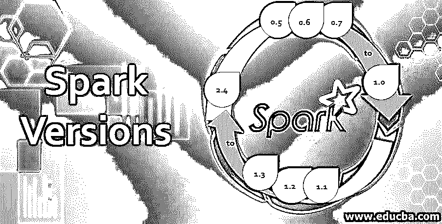

# Spark 版本

> 原文：<https://www.educba.com/spark-versions/>

## Spark 版本概述

Spark 版本是 2009 年开始的集群数据处理和计算框架。它在 2010 年成为了一个开源软件。之后，它通过 Apache 软件基金会获得了许可。Spark 框架在获得开源后逐渐发展，并随着其发布进行了一些转换和增强，例如，v0.5 版、v0.6 版、v0.7 版、v0.8 版、v0.9 版、v1.0 版、v1.1 版、v1.2 版、v1.3 版、v1.4 版、v1.5 版、v1.6 版、v2.0 版、v2.1 版、v2.2 版、v2.3 版和 v2.4 版

### 各种版本的 Spark

让我们检查一下发布的 spark 版本:

<small>Hadoop、数据科学、统计学&其他</small>

#### 1.版本 0.5

这是 2012 年 6 月发布的 spark 的初始版本。它运行在包含可用性和稳定性改进的 Mesos 0.9 上。访问旧作业和维护日志很容易。引入了许多新的操作符，如 sortBykey，以添加了新的 Hadoop API 支持为例。

可用的最新版本是 0.5.1。

#### 2.版本 0.6

在 2012 年 10 月发布了 0.5 之后，spark 发布了一个新版本，带来了几个新功能、架构变化和性能增强。引入了独立部署模式，使得无需安装外部集群管理器即可轻松启动集群。在 RDD 上使用了 Persist()方法，并引入了更多的连接操作符。它部署在 Maven central 上，现在可以在 Maven 项目上使用。

可用的最新版本是 0.6.2。

#### 3.版本 0.7

0.7 版本于 2013 年初推出。这是一个重要的版本，因为 python API py spark 的引入使得 spark 可以与 python 一起使用。一些本地库被引入 NumPy，SciPy。引入了 EC2，它从 AWS_ACCESS_KEY 和 AWS_SECRET_KEY 读取 s3 凭证，这使得访问 s3 变得容易。引入了混洗操作和性能改进。

可用的最新版本是 0.7.3。

#### 4.版本 0.8

这个版本的 spark 于 2013 年 9 月发布。默认端口 4040 引入了监视 UI 和仪表板。它包含有关正在运行、已完成和失败的作业的所有信息。引入了机器学习库，现在我们可以在纱线集群上运行我们的 spark 作业。这个版本引入了对纱线的支持。通过扩展 EC2 功能，应用程序的部署变得很容易。

可用的最新版本是 0.8.1。

#### 5.版本 0.9

这是 2014 年初的一个主要版本。它更新了 spark over scala2.10，增加和改进了各种库。它包括 GraphX 的第一个版本，这是一个强大的图形处理工具。Spark Conf 类现在是在我们的 Spark 上下文中配置高级设置的首选方式。Windows 操作系统的速度提高了 50%。我们可以使用图形库从 RDD 构建图形，然后我们可以转换图形和提取子图。

Spark streaming 得到了改进，引入了流监听器。这是 Spark 随 Scala 2.10 更新后的一个重要版本。

可用的最新版本是 0.9.2

#### 6.版本 1.0

Spark 1.0 是 1 的开端。x 线。它于 2014 年发布，是一个重要的版本，因为它添加了一个主要的新组件 SPARK SQL，用于在 SPARK 中加载和处理结构化数据。随着 SPARK SQL 的引入，在那里查询和处理大型数据集以及进行操作变得很容易。java 绑定中引入了新的 lambda 语法，扩展了 JAVA 和 PYTHON 支持。

可用的最新版本是 1.0.2。

#### 7.版本 1.1

这是 1.0 上的第一个小版本。x 线。自从引入 SPARK SQL 以来，这个版本增加了 JDBC/ODBC 服务器，以便从许多不同的应用程序连接到 SPARK SQL。引入了对 JSON 的支持。性能和可用性有所改进，引入了显示在 spark UI 中的累加器。

可用的最新版本是 1.1.1。

#### 8.版本 1.2

该产品于 2014 年发布，在性能和使用方面均优于 Spark Core 发动机。批量传输期间使用的 Spark 通信管理器得到了改进，洗牌机制得到了升级。

可用的最新版本是 1.2.2。

#### 9.版本 1.3

Spark 1.3 是 1 上的第四个版本。x 线。它伴随着 DataFrame API 的引入以及 SPARK SQL API 的改进而来。引入了多级聚合树来帮助加速 spark 核心上的归约操作。引入了 SSL 加密。卡夫卡式的文献被引入。

可用的最新版本是 1.3.1。

#### 10.版本 1.4

发布于 2015 年，引入了 package sparkR，并引入了 MLib 和流的扩展。介绍了 SparkDAGs 的可视化，介绍了 Mesos 中的 Docker 支持

可用的最新版本是 1.4.1。

#### 11.版本 1.5

这个版本的 spark 主要处理 API 的改进，如 RDD、数据帧和数据集。改进了数据帧上的连接执行，并处理了内存管理。

可用的最新版本是 1.5.2。

#### 12.版本 1.6

2016 年推出了 1.6 版，这是 spark 1 的最后一次更新。x 框架。

数据集引入了新的 spark API，它有助于处理自定义对象。介绍了非标准 JSON 文件的读取。通过使用列数据方法处理 parquet 文件，添加了空安全连接。

可用的最新版本是 1.6.3。

#### 13.版本 2.0

这是第一个超过 2 的版本。x 线。2016 年中期发布了 spark 的 2.0 版本，该版本中增加了 [Hive style bucketing](https://www.educba.com/bucketing-in-hive/) 、性能改进和 SQL 改进。引入了一个本地 SQL 解析器。r 增加了许多新功能，如 dapply、gapply 和 lapply。

可用的最新版本是 2.0.2。

#### 14.版本 2.1

这是第二次发布超过 2。x 系列在 Kafka 支持下对 spark 流进行了重点改进。API 的更新使得数据类型 API 成为稳定的 API，引入了 json 解析，在 r。

除此之外，性能和内存管理类似于随机森林，并且引入了更快的回归特性。

可用的最新版本是 2.1.3。

#### 15.版本 2.2

2 的第三个版本。x 系列于 2017 年推出，支持使用数据框编写器和目录创建配置单元表。SQL 查询引入了广播连接和映射连接。解析多个 json，csv 文件介绍。

可用的最新版本是 2.2.3。

#### 16.版本 2.3

这是第四次发布超过 2。x 家族引入了 Spark over Kubernetes，它支持提交由 Kubernetes 管理的作业。引入了历史服务器，性能比 pyspark 有所提高，改进了配置单元分区，引入了动态分区。

可用的最新版本是 2.3.3。

#### 17.版本 2.4

这是 spark 应用程序的最新稳定版本。

为 Scala 2.12 增加了实验性支持，它让应用程序所有者可以用 Scala 2.12 编写他们的程序。引入了内置 Avro 数据源以获得更好的性能和可用性。为 Pivot 引入了 SQL 语法，为 SQL 查询引入了联合和重新分区。这是 spark 上最稳定的版本，它被广泛用于创建某些 SPARK 级别的应用程序

可用的最新版本是 2.4.4。

### 结论

在这篇博客中，我们看到了迄今为止发布的各种 spark 版本，以及这些版本中的一些变化。随着这种不断变化的数据模式和数据量，我们将随着时间的推移推出新的版本，以获得更好的 spark 应用程序功能。

### 推荐文章

这是一个关于 Spark 版本的指南。在这里，我们讨论了 17 个不同版本的 Spark 的基本概念和详细的解释。您也可以浏览我们的其他相关文章，了解更多信息——

1.  [火花元件](https://www.educba.com/spark-components/)
2.  [火花命令](https://www.educba.com/spark-commands/)
3.  [火花数据帧](https://www.educba.com/spark-dataframe/)
4.  [Python 读取 CSV 文件指南](https://www.educba.com/python-read-csv-file/)
5.  [星火广播完整指南](https://www.educba.com/spark-broadcast/)

