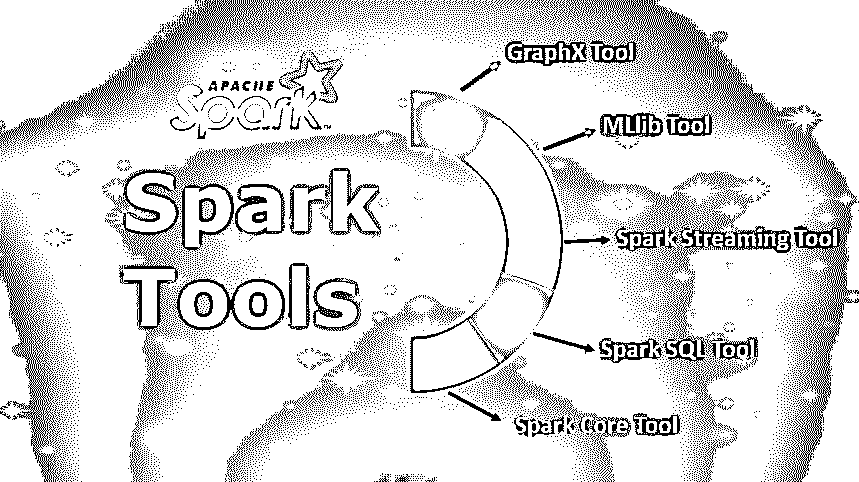

# 火花工具

> 原文：<https://www.educba.com/spark-tools/>

## Spark 工具简介

Spark 工具是 spark 框架的主要软件功能，用于大数据分析的高效和可扩展数据处理。Spark 框架是通过 Apache 许可开源的。它包括 5 个重要的数据处理工具，如 GraphX、MLlib、Spark Streaming、Spark SQL 和 Spark Core。GraphX 是用于处理和管理图形数据分析的工具。MLlib Spark 工具用于分布式数据集上的机器学习实现。而火花流用于流数据处理。Spark SQL 是最常用于结构化数据分析的工具。Spark 核心工具管理称为 RDD 的弹性数据分布。

### 火花工具

有 5 个 spark 工具，即 GraphX、MLlib、Spark Streaming、Spark SQL 和 Spark Core。下面我们详细检查每个工具。

<small>Hadoop、数据科学、统计学&其他</small>

#### 1.GraphX 工具

*   这是与图形以及图形并行计算相关的 Spark API。GraphX 提供了一个弹性分布式属性图，它是 Spark RDD 的扩展。
*   为了使图形分析活动变得简单，表单拥有大量的图形算法和构建器。
*   这一重要工具用于开发和处理图表数据，以便进行比较分析。前者以非常高的速度转换以及合并结构化数据，消耗最少的时间资源。
*   使用用户友好的[图形用户界面](https://www.educba.com/what-is-gui/)从快速增长的算法集合中进行挑选。您甚至可以开发定制算法来监控 ETL 洞察。
*   GraphFrames 包允许您对数据框执行图形操作。这包括利用 Catalyst 优化器进行图形查询。这个关键工具拥有一系列分布式算法。
*   后者的目的是处理图形结构，其中包括 Google 广受好评的 PageRank 算法的实现。这些特殊算法采用 Spark Core 的 RDD 方法来模拟重要数据。

#### 2.MLlib 工具

*   MLlib 是一个包含基本机器学习服务的库。该库提供了各种类型的[机器学习算法](https://www.educba.com/machine-learning-algorithms/)，使得对数据的许多操作成为可能，目的是获得有意义的见解。
*   spark 平台捆绑了库，以便将图形分析技术以及机器学习应用于大规模数据。
*   MLlib 工具具有用于开发机器学习管道的框架，能够简单地实现转换、特征提取以及对任何特定结构化数据集的选择。前者包括基本的机器学习，包括过滤、回归、分类以及聚类。
*   然而，用于训练深度神经网络以及建模的设施是不可用的。MLlib 提供强大的算法和闪电般的速度，以构建和维护驱动商业智能的机器学习库。
*   它还在 Apache spark 之上本机运行，提供快速且极其可扩展的机器学习。

#### 3.火花流动工具

*   这个工具的目的是处理实时数据流。对不同来源产生的数据进行实时处理。这类数据的实例有访问者发布的状态更新消息、日志文件和其他。
*   该工具还利用 Spark Core 的快速调度功能来执行流分析。数据是以小批量的方式接收的。
*   随后，对小批量数据执行 RDD(弹性分布式数据集)变换。Spark Streaming 支持容错流处理以及实时数据流的高吞吐量。核心流单元是数据流。
*   后者简单地说就是一系列弹性分布式数据集，其功能是处理实时数据。这个有用的工具将 Apache Spark 的批处理范式扩展到了流中。这是通过将液流分解成一系列微量批次来实现的。
*   然后通过使用 Apache Spark API 来操纵后者。Spark Streaming 是需要实时数据的强大应用的引擎。
*   前者拥有 [bigdata 平台的](https://www.educba.com/what-is-big-data/)可靠容错能力，对于开发来说极具吸引力。Spark Streaming 为来自几乎任何通用存储库的实时数据引入了交互式分析功能。

#### 4.Spark SQL 工具

这是 Spark 中新引入的模块，它将关系处理与平台的函数式编程接口结合起来。存在通过 Hive 查询语言以及通过标准 SQL 查询数据的支持。Spark SQL 由 4 个库组成:

*   sql server
*   解释程序和优化程序
*   数据框 API
*   数据源 API

该工具的功能是处理结构化数据。前者提供了对最常见数据源的集成访问。这包括 JDBC，JSON，Hive，Avro 等等。该工具将数据分类为带标签的列和行，非常适合发送高速查询的结果。Spark SQL 可以与新推出的和现有的 Spark 程序顺利集成，从而实现最小的计算开销和卓越的性能。Apache Spark 使用一个名为 Catalyst 的查询优化器来研究数据和查询，目的是为计算和数据局部性创建一个有效的查询计划。该计划将跨集群执行必要的计算。目前，建议使用数据集的 Spark SQL 接口以及数据框进行开发。

#### 5.火花取芯工具

*   这是平台的基本构件。其中，它由运行内存操作、任务调度等组件组成。核心托管包含 RDD 的 API。前者提供用于在 RDD 中构建和操作数据的 API。
*   核心还提供分布式任务分派以及基本的 I/O 功能。当针对 Apache Hadoop 组件进行基准测试时，Spark 应用程序编程接口对于开发人员来说非常简单易用。
*   API 将分布式处理引擎中涉及的大部分复杂性隐藏在相对简单的方法调用之后。
*   Spark 通过合并一个驱动程序核心进程以分布式方式运行，该驱动程序核心进程将一个特定的 Spark 应用程序拆分成多个任务，并将它们分配给执行该工作的多个进程。这些特定的执行可以根据应用程序的需求进行放大或缩小。
*   所有属于 Spark 生态系统的工具在消耗最少开销的同时，交互顺畅，运行良好。这使得 Spark 成为一个极具可扩展性和非常强大的平台。正在努力改进这些工具的性能和易用性。

### 推荐文章

这是一个火花工具的指南。这里我们讨论 Spark 工具的基本概念和前 5 种类型，即 GraphX、MLlib、Streaming、SQL 和 Core。你也可以看看下面的文章来了解更多-

1.  [火花顶部组件](https://www.educba.com/spark-components/)
2.  [Apache Spark 架构](https://www.educba.com/apache-spark-architecture/)
3.  C#中 Continue 语句是如何工作的？
4.  [TensorFlow vs Spark](https://www.educba.com/tensorflow-vs-spark/)
5.  [星火广播|如何工作？](https://www.educba.com/spark-broadcast/)

