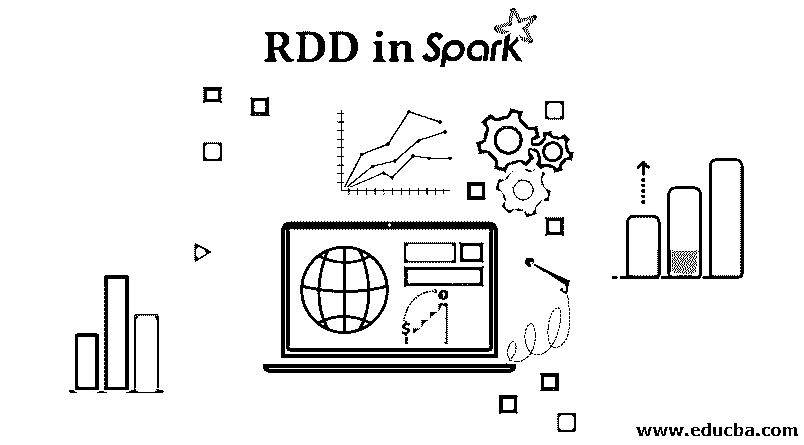
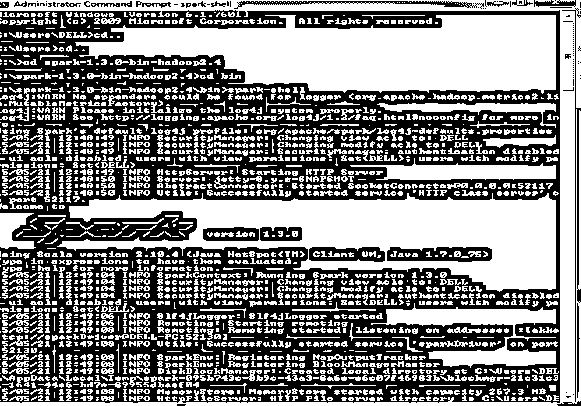

# 火花中的 RDD

> 原文：<https://www.educba.com/rdd-in-spark/>

## 星火中的 RDD 简介

RDD 代表弹性分布式数据集，是 Spark 中最重要的概念之一。它是一个只读的记录集合，被分区并分布在集群中的节点上。可以通过运算转化成其他一些 RDD，一个 [RDD 一旦被创造](https://www.educba.com/what-is-rdd/)，就无法改变；相反，一个新的 RDD 将会诞生。

Spark 克服 Hadoop 局限性的一个重要功能是通过 RDD，因为弹性分布式数据集(RDD)不是复制数据，而是跨集群中的节点维护数据，并将在谱系图的帮助下恢复数据。在 Hadoop 中，数据被冗余地存储在机器之间，这提供了容错的特性。因此，RDD 是 Spark 为分布式数据和计算提供的基本抽象。

<small>Hadoop、数据科学、统计学&其他</small>

创建 RDD 的不同方法有

*   加载外部数据集
*   通过并行化方法传递数据
*   通过改造现有的 RDD

让我们详细讨论它们，但是在此之前，我们需要建立一个 spark-shell，它是 spark 的驱动程序。在本文中，我们包含了 scala 中的代码行。RDD 可以有任何类型的 Python、Java 或 Scala 对象，包括用户定义的类。因此，以下是启动 spark-shell 应遵循的步骤。

### 发射火花壳

**第一步:**下载&解压 spark。从官网下载当前版本的 spark。将下载的文件解压缩到系统中的任何位置。

**第二步:**设置 Scala

*   从 scala lang.org 下载 Scala
*   安装 scala
*   Set SCALA_HOME 环境变量&将 PATH 变量设置为 SCALA 的 bin 目录。

**第三步:**启动火花壳。打开命令提示符，导航到 spark 的 bin 文件夹。执行-火花-外壳。

### 在星火中创造 RDD 的方法

以下是在 Spark 中创建 RDD 的不同方法:

#### 1.加载外部数据集

SparkContext 的 textFile 方法用于从任何来源加载数据，从而创建一个 RDD。Spark 支持广泛的数据源，如 Hadoop、HBase、亚马逊 S3 等。一个数据源是我们在这里讨论过的文本文件。除了文本文件，spark 的 scala API 还支持其他数据格式，如 wholeTextFiles、序列文件、Hadoop RDF 等等。

**例子**

`val file = sc.textFile("https://cdn.educba.com/path/textFile.txt"")    // relative path`

名为 file 的变量是一个 RDD，由本地系统上的文本文件创建。在 spark-shell 中，已经创建了 spark 上下文对象(sc ),用于访问 spark。TextFile 是 org.apache.spark.SparkContext 类的方法，它从 HDFS、本地文件系统或任何 Hadoop 支持的文件系统 URI 中读取文本文件，并将其作为字符串的 RDD 返回。因此，该方法的输入是一个 URI，并在节点间划分数据。

#### 2.通过并行化方法传递数据

创建 rdd 的另一种方式是获取一个现有的内存集合，并将其传递给并行化的 SparkContext 方法。在学习 spark 时，这种创建 rdd 的方式非常有用，因为我们可以在 shell 中创建 rdd 并执行操作。它很少在测试和原型开发之外使用，因为它要求整个数据在本地机器上可用。关于并行化的一个要点是集合被分成的分区的数量。我们可以将数量(分区)作为并行化方法中的第二个参数传递，如果没有指定数量，Spark 将根据集群做出决定。

*   没有许多分区:

`val sample = sc.parallelize(Array(1,2,3,4,5))`

*   有许多分区:

`val sample = sc.parallelize(List(1,2,3,4,5),3)`

#### 3.通过改造现有的 RDD

在 RDD 有两种操作。

1.  转换
2.  行动

转换是对 RDD 的操作，会导致创建另一个 RDD，而动作是将最终值返回到驱动程序或将数据写入外部存储系统的操作。映射和过滤是一些转换操作。考虑一个从文本文件中过滤掉一些行的例子。最初，通过加载文本文件来创建 RDD。然后我们应用一个过滤函数，从文本文件中过滤出一组行。结果也将是一个 RDD。过滤操作不会改变现有的输入 RDD。相反，它返回一个指向全新 RDD 的指针，这个指针是红色的错误。我们仍然可以使用输入 RDD 进行其他计算。

`val inputRDD = sc.textFile("log.txt")val errorsRDD = inputRDD.filter(line => line.contains("error"))`

下面的例子展示了映射函数的相同转换概念。结果是由于地图功能而生成的 RDD。在映射操作中，将定义逻辑，并且该特定逻辑将应用于数据集的所有元素。

`val inputRDD = sc.parallelize(List(10,9,8,7,6,5))val resultRDD = inputRDD.map(y => y * y)println(resultRDD.collect().mkString(","))`

### 需要记住的要点

*   在目前可用的所有框架中， [Apache spark 是最新的一个](https://www.educba.com/what-is-apache-spark/)，由于其独特的特性和简单的方法而越来越受欢迎。它消除了 Hadoop 带来的所有缺点，同时保持了 MapReduce 的容错和可伸缩性[属性。为了实现这些目标，spark 平台引入了 RDD 的概念。](https://www.educba.com/what-is-mapreduce/)
*   创建 RDD 主要有三种方式，其中:最基本的一个是当我们加载数据集时。
*   并行化方法广泛地仅用于测试和学习目的。
*   变换操作会产生 RDD。

### 推荐文章

这是一本关于 RDD 的星火指南。在这里，我们也讨论了创建 RDD 的不同方法，以及如何启动 Spark-Shell 的要点。你也可以浏览我们的文章来了解更多-

1.  什么是 RDD？
2.  [如何安装 Spark](https://www.educba.com/how-to-install-spark/)
3.  [火花流](https://www.educba.com/spark-streaming/)
4.  [火花数据帧](https://www.educba.com/spark-dataframe/)

