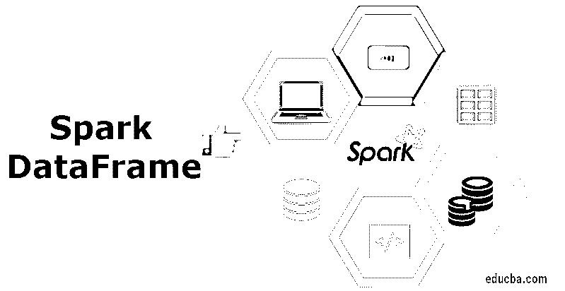

# 踢数据帧

> 原文：<https://www.educba.com/spark-dataframe/>

## 火花数据帧简介

spark 数据框可以说是组织成命名列的分布式数据集合，也用于提供过滤、聚合计算、分组等操作，并可与 Spark SQL 一起使用。可以使用结构化数据文件、现有 rdd、外部数据库和配置单元表来创建数据框。它基本上被称为抽象层，构建在 RDD 之上，之后是数据集 API，这是在 Spark (2.0 以上)的后续版本中引入的。此外，数据集不是在 Pyspark 中引入的，而是在 Scala 和 spark 中引入的，但 Dataframes 的情况并非如此。数据帧，通常称为 DFs，是一种逻辑列格式，它使 rdd 的使用更加容易和方便，并且以同样的方式使用与 rdd 相同的功能。如果您更多地在概念层面上谈论，它相当于关系表以及良好的优化特性和技术。

### 如何创建数据框架？

数据帧通常由上述任何一种方法创建。它可以通过使用配置单元表、外部数据库、结构化数据文件甚至现有的 rdd 来创建。所有这些方法都可以创建这些命名的列，称为数据帧，用于 Apache Spark 中的[处理。通过利用 SQLContext 或 SparkSession，应用程序可以用来创建数据帧。](https://www.educba.com/what-is-apache-spark/)

<small>Hadoop、数据科学、统计学&其他</small>

### 火花数据帧操作

在 Spark 中，数据帧是将有组织形式的数据分布和收集到命名列中，这相当于关系数据库或模式或语言(如 [R 或 python](https://www.educba.com/r-vs-python/) )中的数据帧，但使用了更丰富的优化级别。它用于提供一种特定领域的语言，可用于结构化数据操作。

下面提到的是利用数据帧进行结构化数据处理的一些基本操作。

**1。** **读取 JSON 类型的文档:**我们将使用命令 sqlContext.read.json

**例如:**让我们假设我们的文件名是 student.json，那么我们的这段代码将看起来像:
`val dfs= sqlContext.read.json(“student.json”)`

**Output:** 在这种情况下，输出将是字段名将自动取自文件 student.json。

**2。数据显示:**为了查看 Spark 数据帧中的数据，您需要使用命令:
dfs.show()

**例如:**让我们假设我们的文件名是 student.json，那么我们的这段代码将看起来像:
`val dfs= sqlContext.read.json(“student.json”)
dfs.show()`

**输出:**学生数据将以表格的形式呈现给你。

**3。使用 printSchema 方法:**如果您有兴趣查看结构，即数据帧的模式，那么使用以下命令:dfs.printSchema()

**示例:**假设我们的文件名是 student.json，那么我们的代码看起来应该是:

`val dfs= sqlContext.read.json(“student.json”)
dfs. printSchema ()`

**输出:**结构或模式将呈现给你

**4。使用选择方法:**为了使用选择方法，下面的命令将用于从数据框列表中提取名称和列。
dfs.select("列名")。显示()

**例如:**让我们假设我们的文件名是 student.json，那么我们的这段代码将看起来像:
`val dfs= sqlContext.read.json(“student.json”)
dfs.select(“name”).show()`

**输出:**可以看到 name 列的值。

**5。使用年龄过滤器:**以下命令可用于查找年龄超过 23 岁的学生范围。
dfs.filter(dfs("列名")>值)。显示()

**例如:**让我们假设我们的文件名是 student.json，那么我们的这段代码将看起来像:
`val dfs= sqlContext.read.json(“student.json”)
dfs.filter(dfs(“age”)>23).show()`

**输出:**大于 23 的过滤年龄将出现在结果中。

**6。使用 groupBy 方法:**下面的方法可以用来计算同龄学生的数量。
dfs.groupBy("列名")。计数()。显示()

**例如:**让我们假设我们的文件名是 student.json，那么我们的这段代码将看起来像:
`val dfs= sqlContext.read.json(“student.json”)
dfs.groupBy(“age”).count().show()`

**7。在 SparkSession 上使用 SQL 函数:**它使应用程序能够以编程方式执行 SQL 类型的查询，从而以数据框的形式返回结果。
spark.sql(查询)

**示例:**假设我们必须将 SQL 数据帧注册为临时视图，那么:
`df.createOrReplaceTempView(“student”)
sqlDF=spark.sql(“select * from student”)
sqlDF.show()`

**输出:**会以学生的名字创建一个临时视图，并在其上应用 spark.sql 将其转换为数据框。

**8。对全局临时视图的 Spark 会话使用 SQL 函数:**这使得应用程序能够以编程方式执行 SQL 类型的查询，并因此以数据帧的形式返回结果。
spark.sql(查询)

**示例:**假设我们必须将 SQL 数据帧注册为临时视图，那么:
`df.createGlobalTempView(“student”)
park.sql(“select * from global_temp.student”).show()
spark.newSession().sql(“Select * from global_temp.student”).show()`

**输出:**会以学生的名字创建一个临时视图，并在其上应用 spark.sql 将其转换为数据框。

### Spark 数据帧的优势

1.  数据框是数据的分布式集合，因此数据以命名列的方式组织。
2.  它们或多或少类似于关系数据库中的表，并且有丰富的优化集。
3.  数据帧用于支持 SQL 中编写的查询[以及数据帧 API](https://www.educba.com/what-is-sql/)
4.  它可用于处理结构化和非结构化数据。
5.  催化剂优化器的使用使优化变得简单而有效。
6.  这些库存在于许多语言中，比如 Python、Scala、Java 和 r。
7.  这用于提供与配置单元的强[兼容性，并用于在已经存在的配置单元仓库上运行未修改的配置单元查询。](https://www.educba.com/what-is-a-hive/)
8.  它可以很好地扩展，从个人系统上的几千字节到大型集群上的几千兆字节。
9.  它用于提供与其他大数据技术和框架的简单集成。
10.  它们提供给 rdd 的抽象是有效的，并使处理更快。

### 结论-火花数据框

在本文中，您了解了 Apache Spark 的一个非常重要的特性，即数据帧及其在当前运行的应用程序中的用法，以及操作和优点。我希望你喜欢我们的文章。请继续关注更多类似的内容。

### 推荐文章

这是一个引导火花数据框架。这里我们讨论如何创建一个数据帧？它的优点，数据帧的不同操作以及相应的示例代码。您也可以浏览我们推荐的其他文章，了解更多信息——

1.  [火花流](https://www.educba.com/spark-streaming/)
2.  [如何安装 Spark](https://www.educba.com/how-to-install-spark/)
3.  [星火生涯](https://www.educba.com/career-in-spark/)
4.  [星火面试试题](https://www.educba.com/spark-interview-questions/)
5.  [R 中的数据帧](https://www.educba.com/data-frames-in-r/)
6.  [Spark SQL 中 7 种不同类型的连接(示例)](https://www.educba.com/join-in-spark-sql/)
7.  [PySpark SQL | PySpark SQL 的模块和方法](https://www.educba.com/pyspark-sql/)
8.  [火花部件|火花部件概述](https://www.educba.com/spark-components/)
9.  [Top Spark 工具完整指南](https://www.educba.com/spark-tools/)

