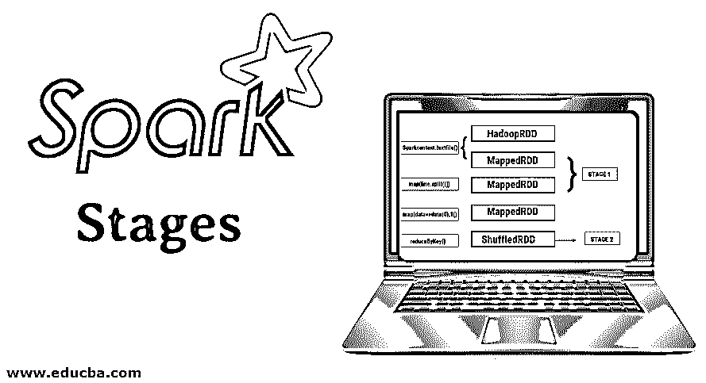
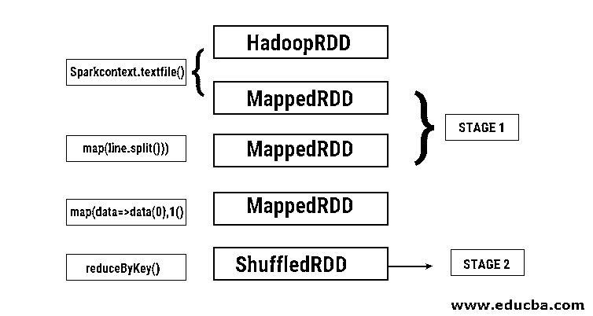
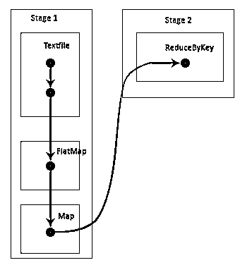
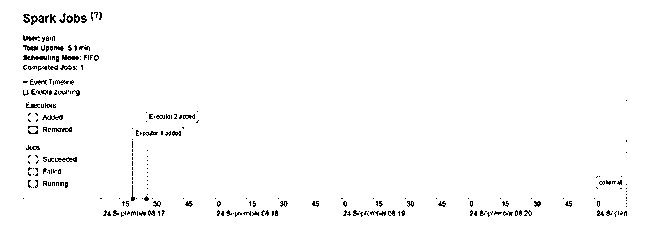

# 火花阶段

> 原文：<https://www.educba.com/spark-stages/>

## 火花阶段概述

火花阶段是计算多个任务的物理执行单元。Spark 阶段由有向无环图(DAG)控制，用于弹性分布式数据集(RDD)上的任何数据处理和转换。与 Spark 框架相关的主要有两个阶段，如 ShuffleMapStage 和 ResultStage。Shuffle MapStage 是为后续阶段准备数据的任务的中间阶段，而 resultStage 是 spark 作业中特定任务集的 spark 函数的最后一步。ResultSet 与 Spark 中参数、计数器和注册表值的初始化相关联。

DAG 的含义如下:

<small>Hadoop、数据科学、统计学&其他</small>

*   **有向:**所有的节点相互连接，形成一个无环图。其顺序由 RDD 上调用的操作决定。
*   **非循环:**节点没有连接成一个循环回路，也就是说，如果一个动作或转换一旦完成，就不能恢复到其原始值。
*   **图:**以特定模式排列在一起的边和顶点所形成的整个模式称为图。顶点是 RDD，而边是在 RDD 上调用的动作。

DAGScheduler 是一个将阶段分成许多任务的工具。然后 DAGScheduler 将阶段信息传递给集群管理器(YARN/Spark standalone ),后者触发任务调度器运行任务。Spark driver 将逻辑计划转换为物理执行计划。Spark 作业在流水线方法中执行，其中所有转换任务被组合到一个阶段中。

### 转换

有两种类型的转换发生:

**1。窄转换**:这些转换不需要洗牌的过程。这些操作可以在单个阶段中执行。

**举例:**贴图()和滤镜()

**2。大范围转换**:这些转换需要在不同的分区间移动。因此，需要为跨不同分区的通信创建不同的阶段。

**举例:** ReduceByKey

让我们举一个例子来更好地理解这是如何工作的。

**示例:**在这个示例中，我们将了解如何使用 Spark DAGScheduler 进行简单的字数统计。

*   val data = sc.textFile(“data.txt”)

**结果:**data:org . Apache . spark . rdd . rdd[String]= data . txt MapPartitionsRDD[46]at textFile at<控制台> :24

首先，执行 textFile 操作，从 HDFS 位置读取给定的输入文本文件。

*   data.flatMap(_。拆分(" ")。map(i=>(i，1))。reduceByKey(_ + _)。收集

**结果:** res21: Array[(String，Int)] = Array()

接下来，执行平面映射操作，将整个输入文件中的行分割成不同的单词。然后进行映射操作，为每个单词形成(键，值)对，如(单词，1)。并调用 reduceByKey 函数来查找每个单词的总计数。最后，集体行动将通过收集所有数据给出最终结果。

在这个程序中，Spark 创建了两个阶段，因为这里执行了一个转换。当转换操作完成时，需要执行混洗，因为数据需要在 2 个或更多不同分区之间混洗。因此，为此创建一个阶段，然后为转换任务创建另一个阶段。

在内部，这些阶段也将被划分为任务。在本例中，每个阶段被分成 2 个任务，因为存在 2 个分区。每个分区运行一个单独的任务。

### 火花阶段的类型

下面详细介绍两种类型。

#### 1.洗牌阶段

这基本上是 DAG 执行过程中的一个中间阶段。这一级的输出用作下一级的输入。其输出是地图输出文件的形式，以后可以通过减少任务来使用。当 ShuffleMapStage 的所有映射输出都可用时，它被认为是就绪的。有时，在分区丢失或不可用的情况下，输出位置可能会丢失。

在执行混洗之前，这个阶段可能包含许多流水线操作，例如 map()和 filter()。ShuffleMapStage 使用内部注册表 outputLocs 和 _numAvailableOutputs 来跟踪洗牌图输出的数量。单个 ShuffleMapStage 可以在各种作业中通用。

#### 2.结果阶段

顾名思义，这是 Spark 作业的最后一个阶段，它在 RDD 的一个或多个分区上执行操作以计算结果。内部注册表和计数器的初始化由 ResultStage 完成。

DAGScheduler 将丢失的任务(如果有的话)提交给 ResultStage 进行计算。对于计算，它需要各种强制参数，如 stageId、stageAttempId、序列化任务的广播变量、分区、首选任务位置、outputId、某些本地属性、特定阶段的任务度量。一些必需的可选参数是作业 Id、应用程序 Id 和应用程序尝试 Id。

### 火花阶段的优势

以下是火花阶段的不同优势:

#### 1.执行者的动态分配

通过查看 Spark 作业事件时间线，我们可以看到执行器的分配是动态完成的。这意味着在任务执行过程中，根据工作负载从集群中调用执行器。一旦任务完成，它就会被释放回集群。这节省了资源分配内存，并允许在同一集群上运行的其他应用程序重用执行器。因此，总体集群利用率将会提高并达到最佳状态。

#### 2.贮藏

在每个阶段对 RDD 执行操作期间，它们会被缓存并存储在内存中。当最终结果需要从 HDFS 再次读取相同的 RDD 时，这有助于节省计算时间。

#### 3.并行执行

彼此独立的 Spark 作业被并行执行，除非并且直到需要洗牌或者一个阶段的输入依赖于其先前的输出。

#### 4.DAG 可视化

这在涉及大量操作及其依赖关系的复杂计算中非常有用。看到这个 DAG 可视化，人们可以很容易地跟踪流程并确定性能障碍。此外，通过单击该可视化视图中显示的阶段，可以看到每个阶段运行的每个任务。在这个扩展视图中，显示了属于这个阶段的 RDD 的所有细节。

#### 5.容错

由于在 RDD 上执行的缓存操作，DAG 将记录对其执行的每个操作。因此，假设在任何情况下一个 RDD 丢失，在 DAG 的帮助下可以很容易地找回它。集群管理器可用于识别其丢失的分区，并且相同的 RDD 可被再次放置在相同的分区用于数据丢失恢复。

由于上述好处，Apache Spark 正在被广泛使用，而不是以前使用的 MapReduce。它只不过是 MapReduce 的扩展版本。由于 MapReduce 需要多次从 HDFS 中读取数据和将数据写入其中，因此引入了 Spark，它会在其内存中执行这些操作。

### 结论

因此，我们可以得出结论，这是更有效的，因为他们的内存计算，提高了处理速度，甚至迭代处理。

### 推荐文章

这是一个星火阶段的指南。这里我们分别讨论基本概念、转换类型和火花阶段的优点。您也可以看看以下文章，了解更多信息–

1.  [如何安装 Spark](https://www.educba.com/how-to-install-spark/)
2.  [火花流](https://www.educba.com/spark-streaming/)
3.  [星火生涯](https://www.educba.com/career-in-spark/)
4.  [星火面试试题](https://www.educba.com/spark-interview-questions/)

