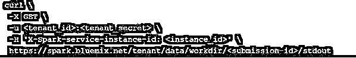
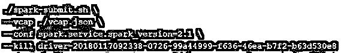

# 火花提交

> 原文：<https://www.educba.com/spark-submit/>

## Spark 提交简介

Apache Spark Web UI 用于提供关于您的应用程序的必要信息，以及了解应用程序如何在 Hadoop 集群上执行。Apache Spark 将提供一套 web 用户界面(UI)。这将有助于监控 Spark 集群的资源消耗和状态。Spark Submit 的用户界面网页提供了关于调度程序阶段和任务列表、环境信息、内存和 RDD 大小摘要、运行执行者信息的信息。
让我们逐一详细了解这一切。

**语法**

<small>Hadoop、数据科学、统计学&其他</small>

Apache Spark 提交的语法(如何提交 Spark 应用程序):

`spark - submit - option value \ application jar | python file (application arguments)`

### Apache Spark Web 用户界面是如何工作的？

当 SparkPi 在 YARN 上运行时，它演示了如何使用 Spark 和 SparkPi 运行示例应用程序，并且可以看到 Pi 近似计算的值。

使用下标= spark-submit 提交 Python 或打包 java 或编译或 Spark JAR 文件的应用程序。

**Spark 提交上的命令选项如下:**

| **选项** | **描述** |
| 班级 | main 方法在所有 scala 和 java 应用程序的完全分类的类名中。 |
| 会议 | key = value 是 spark 配置属性的格式。包含值的空格用引号括起来，如“值键” |
| 驱动程序类别路径 | 要传递给驱动程序的类路径和配置条目。–添加到 jar 中的 jar 会自动包含在类路径中。 |
| 驱动核心 | 描述模式–集群中使用的核心数量。1-默认 |
| 驾驶员记忆 | 堆的最大大小，用字符串表示，例如–2g 等。，并分配给驱动程序。spark.driver.memory 属性也可以用来代替 |
| 文件 | 文件列表由逗号分隔，放在 executor 的每个工作目录中。对于客户端部署模式，该路径必须指向本地文件。并且在部署模式中可以看到集群内部的本地或 URL 全局可见文件。 |
| 震动 | 在 drovers 的类路径中，在集群模式或执行器类路径的客户端模式中，可以看到附加的 jar 和执行器。 |
| 掌握 | 应用程序运行位置。 |
| 包装 | 可以看到 Maven 坐标列表，由逗号分隔的 jar 包含在执行器和驱动程序类路径中。相同文件中指定的 maven central、local maven 和 remote repositories 将按此顺序进行搜索。 |
| 复制文件 | .py，。zip，。要放在 PYTHONPATH 上的由逗号分隔的列表组成的 egg 文件。对于部署客户端模式，该路径必须指向本地文件。对于集群部署模式，该路径可以指向集群内部的全局可见文件，也可以指向本地文件。 |
| 仓库 | 在包中指定的 Maven 坐标中搜索以逗号分隔的远程存储库列表。 |

**主值:**

| **主人** | **描述** |
| 当地的 | 如果没有并行性，那么在本地运行 park，其中一个工作线程的数量为 1。 |
| 本地[K] | 在主机上设置了理想的内核数量后，使用 k 个工作线程在本地运行 spark。 |
| 本地[*] | 在主机上使用尽可能多的本地线程作为逻辑核心，并在本地运行 spark。 |
| 故事 | 使用纱线簇管理器来运行。集群 I 的位置由 Hadoop 配置目录–Hadoop _ CONF _ 目录或 yarn 配置目录–YARN _ CONF _ 目录决定 |

### 实现 Spark 提交的示例

下面是提到的例子:

#### 示例#1

在任何本地 shells 中运行 spark-submit.sh crit 中的 spark-submit 应用程序。生成的日志文件列表给出了 spark-submit.sh 脚本采取的步骤，并且位于脚本运行的位置。(尝试使用状态参数运行下面相同的脚本)

**代码:**

`./spark-submit.sh \
--vcap ./vcap.json \
--deploy-mode cluster \
--conf spark.service.spark_version=2.1 \
--class org.apache.spark.examples.SparkPi \
sparkpi_2.10-1.0.jar`

使用 status 参数运行 spark-submit.sh 中的 spark-submit 应用程序。消息完成、失败或出现错误，然后状态停止运行或继续查询。ctrl-c 可用于停止运行应用程序或轮询状态。Yes 表示取消作业，no 表示停止轮询(相当肯定),或者继续作业运行和状态轮询，直到完成。

`./spark-submit.sh \
--vcap ./vcap.json \
--conf spark.service.spark_version=2.1 \
--status driver-20180117092338-0726-99a44999-f636-46ea-b7f2-b63d530e89e0`

Kill 参数用于取消 spark-submit.sh 应用程序正在运行的作业。

`./spark-submit.sh \
--vcap ./vcap.json \
--conf spark.service.spark_version=2.1 \
--kill driver-20180117092338-0726-99a44999-f636-46ea-b7f2-b63d530e89e0`

**输出:**

### 结论

我们已经看到了 Apache Spark 提交的概念。利用这一点，您将获得强大的按需云处理优势。一种经济高效、快速的方式，将数据加载到 IBM cloud 中的对象存储中。

### 推荐文章

这是一个火花提交指南。在这里，我们讨论 Spark 提交的介绍，语法，它是如何工作的，更好地理解例子。您也可以浏览我们的其他相关文章，了解更多信息——

1.  [什么是阿帕奇 Spark？](https://www.educba.com/what-is-apache-spark/)
2.  [如何安装 Spark](https://www.educba.com/how-to-install-spark/)
3.  [火花广播](https://www.educba.com/spark-broadcast/)
4.  [火花阶段](https://www.educba.com/spark-stages/)

