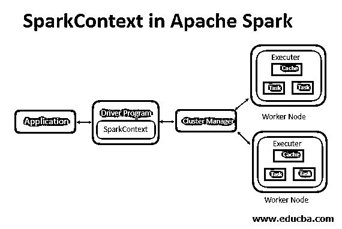
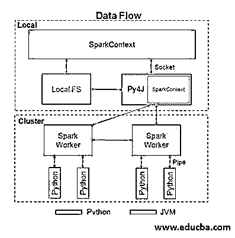
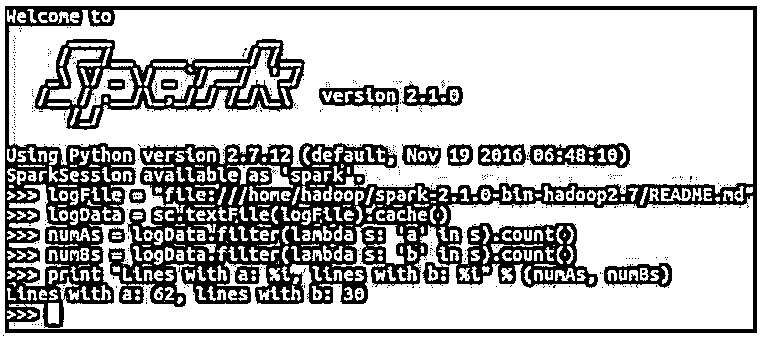

# sparks context(储蓄上下文)

> 原文：<https://www.educba.com/sparkcontext/>

## SparkContext 简介

对于 Spark 驱动程序来说，生成 SparkContext 是任何 Spark context 中主要且必要的步骤。在 worker 节点上，执行器内部的操作由驱动程序运行。Apache 功能中 Spark 的入口点是 Spark 上下文。通过 spark 上下文，Spark 的驱动程序应用程序将被传递，它们有参数。当我们运行任何 Spark 应用程序时，一个驱动程序初始化，它具有 main 函数，SparkContext 在这里被初始化和生成。对 Spark 集群的访问和允许是在资源管理器的帮助下完成的，资源管理器主要有两种类型。最初，应该使用 SparkConf ( spark 配置)来创建 SparkContext。

**Apache spark context 的语法:**

<small>Hadoop、数据科学、统计学&其他</small>

`from pyspark import SparkContext
sc = SparkContext("local", "First App")`

### Apache SparkContext 是如何创建的？

最初，如果必须创建 SparkContext，应该创建 SparkConf。Sparkconf 的配置参数是我们的 Spark 驱动程序应用程序将传递给 SparkContext。其中一些参数用于定义 Spark 中驱动程序的属性。

其他几个用于分配集群资源，即内存大小、工作节点上的内核数量，由 Spark 运行的执行器使用。简单地说，Spark 上下文有助于指导 Spark 集群的加入。在创建 SparkContext 对象之后，可以调用文本文件–textFile、文件排序–sequence file、parallelize 和其他一些文件。

**参数:**

| Profiler_cls | 用于进行称为自定义分析器的分析，默认值为 pyspark.profiler.BasicProfiler。 |
| JSC | Java Spark 上下文的实例。 |
| 门 | 安装一个新的 JVM 或者使用现有的 JVM。 |
| 连载 | RDD 的连续剧。 |
| 批量大小 | Python 对象的数量在 Java 中显示为单个对象。要禁用批处理，请设置 1。要根据对象大小自动选择批次大小，请设置 0。或者使用无限制的批量大小，设置为-1。 |
| 环境 | 工作节点环境变量。 |
| 轮廓 | PythonPath 有一个。拉链还是。要发送到群集的 py 文件。 |
| 飞奔回家 | Spark 安装目录。 |
| appName | 详细信息的作业名称。 |
| 掌握 | 它连接集群 URL。 |
| 会议 | 为了设置所有的火花属性，使用了 L 的一个对象，即 Sparkconf，spark configuration。 |

下面显示了 Spark 上下文的数据流:

Spark 上下文使用 Py4J 并启动一个 Java 虚拟机，该虚拟机进一步创建一个 Java Spark 上下文。PySpark 将 Spark 中的上下文作为 sc 提供，这是默认的。这就是为什么创建一个新的 Spark 环境是行不通的。

**代码:**

`class pyspark.SparkContext (
master = None,
appName = None,
sparkHome = None,
pyFiles = None,
environment = None,
batchSize = 0,
serializer = PickleSerializer(),
conf = None,
gateway = None,
jsc = None,
profiler_cls = <class 'pyspark.profiler.BasicProfiler'>
)`

**举例:**

**代码:**

`package com.dataflair.spark
import org.apache.spark.SparkContext
import org.apache.spark.SparkConf
object Word_Count {
def main(args: Array[String]) {
//Configuration for spark context is set and created
val conf = new SparkConf()
.setAppName("WordCount")
// An object for Spark context is created
val sc = new SparkContext(conf)
//Check whether sufficient params are supplied
if (args.length < 2) {
println("Usage: ScalaWordCount <input> <output>")
System.exit(1)
}
//Read file and create RDD
val rawData = sc.textFile(args(0))
//Using flatMap operation, convert the lines into words
val words = rawData.flatMap(line => line.split(" "))
//Using map and reduceByKey operation, count the individual words
val wordCount = words.map(word => (word, 1)).reduceByKey(_ + _)
// result is saved
wordCount.saveAsTextFile(args(1))
// spark context is stopped
sc.stop
}}`

**输出:**

### 结论

总而言之，Spark 有助于简化处理大量实时或归档数据(包括结构化和非结构化数据)的挑战性和计算密集型任务，无缝集成相关的复杂功能，如机器学习和图形算法。Spark 为大众带来大数据处理。因此，SparkContext 在 Spark 中提供了各种功能，比如获取 Spark 应用程序的当前状态、设置配置、取消作业、取消阶段等等。它是 Spark 功能的入口点。因此，它起着骨干的作用。

### 推荐文章

这是一个 SparkContext 的指南。这里我们讨论 SparkContext 的介绍，以及 apache SparkContext 是如何创建的，并给出了相应的例子。您也可以看看以下文章，了解更多信息–

1.  [火花累加器](https://www.educba.com/spark-accumulator/)
2.  [火花并行化](https://www.educba.com/spark-parallelize/)
3.  [火花功能](https://www.educba.com/spark-functions/)
4.  [火花版本](https://www.educba.com/spark-versions/)

