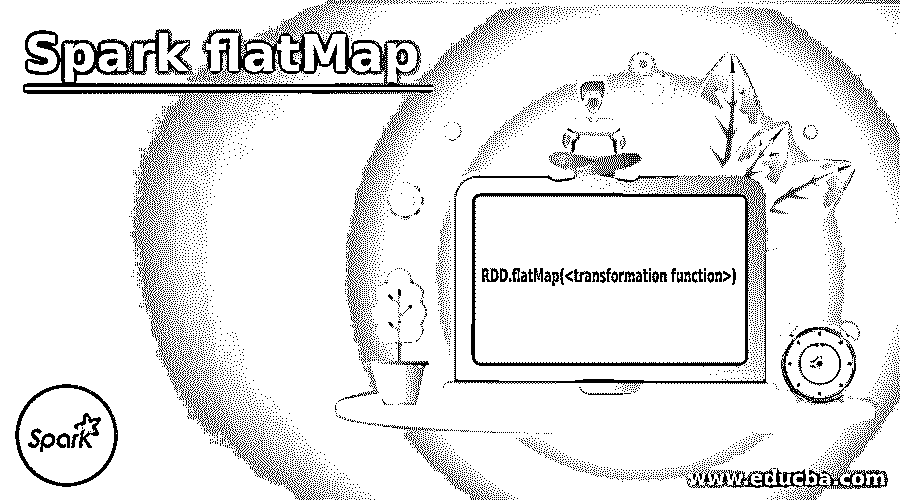
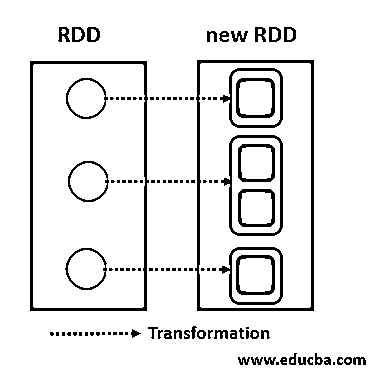
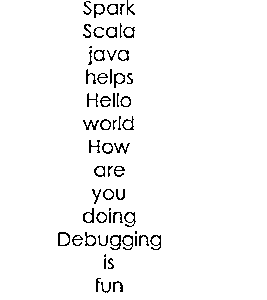
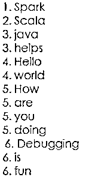
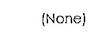
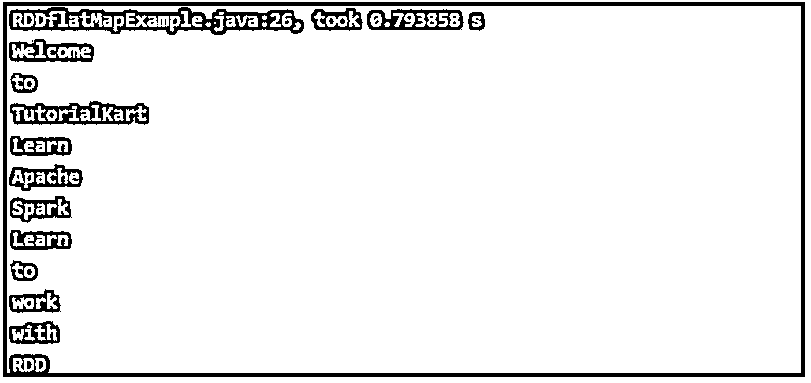
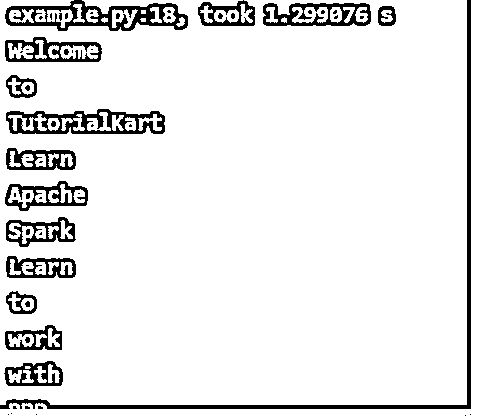

# 火花平面图

> 原文：<https://www.educba.com/spark-flatmap/>

## Spark flatMap 简介

在 Apache spark 中，Spark flatMap 是转换操作之一。映射函数的 Tr 操作应用于 RDD 的所有元素，这意味着弹性分布式数据集。这些是不可变的记录集合，它们被分区，并且只能通过操作(应用于数据集的所有元素的操作)来创建，如过滤和映射。Map 中的操作开发人员可以创建自己的定制逻辑业务。Map()与 flatMap()非常相似，只能从函数 Map()返回 0 或 1 或更多元素。

**Spark 中平面图的语法:**

<small>Hadoop、数据科学、统计学&其他</small>

`RDD.flatMap(<transformation function>)`

对于 RDD 的每个元素源，上述语法代码中的转换函数可以返回 RDD 的多个元素。

### Spark flatMap 如何工作？

平面图是一种转换操作。作为结果，返回新的 RDD 及其在 RDD 的每个元素上的应用。这给出了许多结果，这意味着我们可以从平面图操作应用程序中获得一个、两个、零个和其他许多元素。地图操作比平面地图操作技术落后一步，并且大部分是相似的。

**举例:**

Spark
Scala
Java 助力
Hello world
你好
调试很好玩

**代码:**

`flatMap(a => a.split(‘ ‘))`

**输出:**

变换的平面图操作是从一个到多个完成的。

让我们考虑一个调用 lines.flatMap(a => a.split('))的示例，这是一个 flatMap，它将在 RDD 创建包含 6 个数字的记录的新文件，如下图所示，因为它将记录拆分为单独的单词，单词之间有空格。

拆分 RDD 键值也可以使用 flatMap 操作转换来完成。

就像上面的例子一样，如果我们考虑将它们与键值进行映射，那么它们将被赋予相同的数字键，用于标识每个键值对。

1.火花
2。Scala
3。Java 帮助了
4。Hello world
5。你好吗
6。调试很有趣

**代码:**

`flatMap(a => a.split(‘ ‘))`

**输出:**

一对一也可以用在平面映射中。lines.flatMap(a => None)用于返回空 RDD，因为 flatMap 无助于在结果 RDD.flatMap(a => a.split('))中为 None 值创建记录

Spark
Scala
Java 助力
Hello world
你好
调试很好玩

**代码:**

`flatMap(a => None)`

**输出:**

### 火花平面图示例

下面是提到的例子:

#### 示例#1

字符串到单词——RDD Spark flat map 使用 Java 的一个例子。

**代码:**

`import java.util.Arrays;
import org.apache.spark.SparkConf;
import org.apache.spark.api.java.JavaRDD;
import org.apache.spark.api.java.JavaSparkContext;
public class flatMapEx{
public static void main(String[] args) {
// Spark configuration is done according to below code
SparkConf sparkConf = new SparkConf().setAppName("Text Reading")
.setMaster("local[2]").set("spark.executor.memory","2g");
// A context of Spark being started
JavaSparkContext sc = new JavaSparkContext(sparkConf);
// A path for input text file is being provided
String path = "data/stringToWords/input_rdd/sample1.txt";
// A text file is read into RDD
JavaRDD<String> lines = sc.textFile(path);
JavaRDD<String> words = lines.flatMap(s -> Arrays.asList(s.split(" ")).iterator());
// RDD being collected for printing
for(String word:words.collect()){
System.out.println(word);
}
}
}`

**sample 1–sample 1 . txt:**

欢迎来到 TutorialKart

学习 Apache Spark

学会和 RDD 一起工作

**输出:**

#### 实施例 2

字符串到单词 words 使用 PYP-Python 的 Spark flatMap 示例。

**代码:**

`import sys
from pyspark import SparkContext, SparkConf
if __name__ == "__main__":
#Using Spark configuration, creating a Spark context
conf = SparkConf().setAppName("Read Text to RDD - Python")
sc = SparkContext(conf=conf)
#Input text file is being read to the RDD
lines = sc.textFile("https://cdn.educba.com/home/tutorialeducba/heythere/spark_rdd/sample1.txt")
#Each line to words conversion using flatMap
words = lines.flatMap(lambda line: line.split(" "))
#A list is made from the collection of RDD
list1 = words.collect()
#Printing of the above list1
for line in list1:
print line`

下面给出了 spark-submit，它将为上面的 Python 代码运行。

**代码:**

`~$ spark-submit flatmap-spark-rdd-exp.py`

**sample 1–sample 1 . txt:**

欢迎来到 TutorialKart

学习 Apache Spark

学会和 RDD 一起工作

**输出:**

**关于 flatMap Spark 中的转换需要注意的要点:**

*   火花平面图转换提供平坦的输出。
*   由于 Spark 转换的操作，在该转换中进行惰性评估。
*   此参数返回一个列表、一个序列或一个数组。
*   数据的混洗不是从一个分区到另一个分区进行的，因为这是一种窄操作。

### 结论

我们已经看到了火花平面图操作的概念。Spark 平面图变换运算表示一对多的运算变换。它是每个元素从零到一、二、三或多于这些有值元素的变换。在平台地图的操作中，开发者可以设计自己的逻辑定制业务。类似的逻辑也适用于整个 RDD。

### 推荐文章

这是一个星火平面图的指南。这里我们讨论 spark 平面图是如何工作的？并分别举例说明。您也可以看看以下文章，了解更多信息–

1.  [火花版本](https://www.educba.com/spark-versions/)
2.  [火花广播](https://www.educba.com/spark-broadcast/)
3.  [Spark SQL 数据帧](https://www.educba.com/spark-sql-dataframe/)
4.  [火花流](https://www.educba.com/spark-streaming/)

