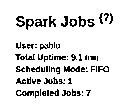
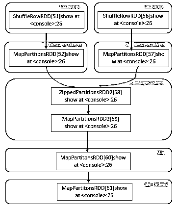
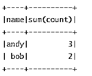
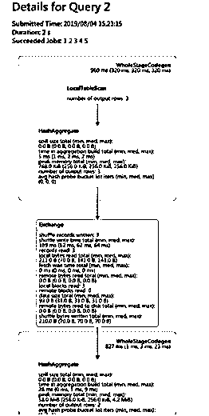

# Spark web 用户界面

> 原文：<https://www.educba.com/spark-web-ui/>

## Spark web UI 简介

Apache Spark Web UI 用于提供关于您的应用程序的必要信息，以及了解应用程序如何在 hadoop 集群上执行。Apache Spark 将提供一套 web 用户界面(UI)。这将有助于监控 Spark 集群的资源消耗和状态。Spark 的用户界面 web 提供了关于调度程序阶段和任务列表、环境信息、内存和 RDD 大小摘要、运行执行器信息的信息。
让我们逐一详细了解这一切。

### Apache Spark Web 用户界面是如何工作的？

正在运行的作业由应用程序管理器或主资源管理器 web UI 作为代理来提供服务。这些是我们将要熟悉的选项卡:

<small>Hadoop、数据科学、统计学&其他</small>

*   向量
*   作业选项卡
*   阶段选项卡
*   环境信息
*   储存；储备

#### 作业选项卡

*   Spark 所有应用程序的摘要页面显示在作业选项卡中，同时还显示了每个作业的详细信息。摘要页面上会显示一些高级信息，如所有作业的持续时间、状态和进度，以及整个时间线事件。单击“summary ”(摘要)页面将带您进入有关该工作详细信息的信息。DAG 可视化、事件时间线和作业阶段进一步显示在详细方向上。

调度模式、当前 spark 用户、自应用程序启动以来的总正常运行时间、活动、已完成和失败的作业状态总数都显示在该部分中。

**作业详情:**显示由作业 id 标识的特定作业。作业详细信息，如作业的状态，如成功或失败、活动阶段的数量、SQL 查询关联、按时间顺序显示执行程序事件和作业阶段的事件时间线。非循环图的可视化 DAG 如下所示，其中顶点表示数据帧或 RDD，边表示 RDD 上的操作应用。

下面列出了所涉及的阶段，这些阶段按待定、已完成、活动或非活动、跳过或失败进行了不同的分组。阶段的 ID、阶段描述、Stamptime 提交、任务/阶段的总时间、任务的进度条、从阶段中的存储器接收字节的输入和输出以及显示为相同字节的输出、混排读取和写入，包括本地读取和远程执行器的读取和写入，以及在未来阶段写入和混排读取它们。

#### 阶段选项卡

这显示了一个摘要页面，其中所有阶段和作业的每个当前状态都显示在 spark 应用程序中。在页面的最开始按状态显示计数及其状态，包括活动、已完成、失败、跳过或挂起。

**阶段详情:**该页面描述了持续时间的含义，即所有任务跨越所需的总时间。随机读取大小或记录以及关联中的摘要位置级别和作业 id。

此阶段有向无环图的一种表示，其中顶点表示数据帧或 rdd，边表示适用的操作。

累加器是一种共享变量。它们提供了在转换池内部更新的可变变量。创建累加器不一定需要名称，但只显示那些已命名的累加器。

**存储标签:**持久化 rdd 和数据帧显示在存储标签上。

**代码:**

`import org.apache.spark.storage.StorageLevel._
import org.apache.spark.storage.StorageLevel._
val rdd = sc.range(0, 100, 1, 5).setName("rdd")
rdd: org.apache.spark.rdd.RDD[Long] = rdd MapPartitionsRDD[1] at range at <console>:27
rdd.persist(MEMORY_ONLY_SER)
res0: rdd.type = rdd MapPartitionsRDD[1] at range at <console>:27
rdd.count
res1: Long = 10
val df = Seq((1, "andy"), (2, "bob"), (2, "andy")).toDF("count", "name")
df: org.apache.spark.sql.DataFrame = [count: int, name: string] df.persist(DISK_ONLY)
res2: df.type = [count: int, name: string] df.count
res3: Long = 3`

**SQL 选项卡:** Sql 显示有关查询的作业、持续时间、逻辑和物理计划的详细信息。

**代码:**

`val df = Seq((1, "andy"), (2, "bob"), (2, "andy")).toDF("count", "name")
df**:** org.apache.spark.sql.DataFrame = [count: int, name: string] df.count
res0**:** Long = 3
df.createGlobalTempView("df")
spark.sql("select name,sum(count) from global_temp.df group by name").show`

**输出:**

### 结论

我们已经看到了 Apache Spark Web UI 的概念。这将显示有关应用程序的信息，其中包括:

*   列表形式的任务和阶段，如时间表。
*   内存使用和大小信息。
*   关于环境的信息
*   运行执行者信息。

### 推荐文章

这是一个关于 Spark web UI 的指南。在这里，我们讨论了 Spark web UI 的介绍，以及它是如何工作的，并给出了示例和代码实现。您也可以浏览我们推荐的其他文章，了解更多信息——

1.  [JavaScript 数学函数(示例)](https://www.educba.com/javascript-math-functions/)
2.  [9 大类 Java 编译器](https://www.educba.com/java-compilers/)
3.  [Android 架构|什么是 Android 架构？](https://www.educba.com/android-architecture/)
4.  [9 大安卓广告拦截器](https://www.educba.com/android-ad-blocker/)

