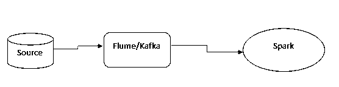

# 火花面试问题

> 原文：<https://www.educba.com/spark-interview-questions/>

## 星火面试问答介绍

以下文章提供了 Spark 面试问题的大纲。 [Apache Spark 是一个](https://www.educba.com/what-is-apache-spark/)开源框架。Spark，由于是开源平台，我们可以使用 java、python、Scala、r 等多种编程语言，与 Map-Reduce 进程性能相比，spark 有助于提高执行性能。它还提供了比 Map-Reduce 快 100 倍的内存执行。由于 spark 的处理能力，现在的工业更喜欢 spark。

所以你终于在 Spark 找到了你的梦想工作，但想知道如何破解 Spark 面试，以及 2022 年可能的 Spark 面试问题。每次面试都不一样，工作范围也不一样。牢记这一点，我们设计了 2022 年最常见的 Spark 面试问题和答案，以帮助你在面试中取得成功。

<small>网页开发、编程语言、软件测试&其他</small>

这些问题分为两部分

### 第 1 部分 Spark 面试问题(基础)

第一部分包括基本的 Spark 面试问题和答案:

#### Q1。什么是火花？

**答案:**

Apache Spark 是一个开源框架。它比 Map-Reduce 过程提高了执行性能。这是一个开放的平台，我们可以使用多种编程语言，如 Java、Python、Scala、R。Spark 提供比 Map-Reduce 快 100 倍的内存执行。

它使用了 RDD 的概念。RDD 是一个弹性分布式数据集，允许它透明地将数据存储在内存中，并仅在需要时将其持久存储到磁盘中。这将减少从内存而不是磁盘访问数据的时间。今天的行业更喜欢 Spark，因为它的处理能力。

#### Q2。Hadoop 和 Spark 的区别？

**答案:**

| **特征标准** | **阿帕奇火花** | **Hadoop** |
| **速度** | 比 Hadoop 快 10 到 100 倍。 | 正常速度。 |
| **处理** | 实时和批处理、内存、缓存。 | 仅批处理，依赖于磁盘。 |
| **难度** | 容易是因为高级模块。 | 难学。 |
| **恢复** | 允许使用 RDD 恢复分区。 | 容错。 |
| **交互性** | 有互动，互动模式。 | 除了猪&蜂房没有交互模式，没有迭代模式。 |

正常的 [Hadoop 架构](https://www.educba.com/hadoop-architecture/)遵循基本的 Map-Reduce，对于相同的进程，spark 提供内存执行。spark 提供从虚拟内存的读写，而不是从硬盘进行 Map-Reduce 的读写。

#### Q3。Spark 有什么特点？

**答案:**

*   在 HDFS 上提供与 Hadoop 和文件的集成工具。Spark 可以使用纱线资源集群运行在 Hadoop 之上。Spark 有能力取代 Hadoop 的 Map-Reduce 引擎。
*   **Polyglot:** Spark 为 Java 、Python、Scala、r 提供高级 [API，Spark 代码可以用这四种语言中的任意一种编写。它为 scale(编写 Spark 的语言)和 python 解释器提供了一个独立的 shell。这将有助于与火花发动机的互动？Scala shell 可以通过。/bin/spark-shell 和 Python shell 通过。安装目录中的/bin/pyspark。](https://www.educba.com/what-is-api-in-java/)
*   **速度:** Spark 引擎比 Hadoop Map-Reduce 快 100 倍，用于大规模数据处理。通过分区，以最小的网络流量并行处理分布式数据，从而提高速度。Spark 提供 RDD(弹性分布式数据集)，可以跨集群中的计算节点进行缓存。
*   **多种格式:** Spark 有一个数据源 API。它将提供一种通过 spark SQL 访问结构化数据的机制。数据源可以是任何东西，spark 将创建一个机制来转换数据并将其拉至 Spark。Spark 支持多种数据源，如 Hive、HBase、Cassandra、JSON、Parquet、ORC。
*   Spark 提供了一些内置的库来从同一个核心执行多个任务，如批处理、流、机器学习、交互式 SQL 查询。但是，Hadoop 只支持批处理。Spark 提供 [MLIb(机器学习库)](https://www.educba.com/machine-learning-libraries/)帮助大数据开发者处理数据。这有助于消除对用于不同目的的多个工具的依赖。Spark 为数据工程师和数据科学家提供了一个通用的强大平台，具有快速的性能和易用性。
*   Apache Spark 延迟流程的执行，直到有必要采取行动。这是 spark 的关键特性之一。Spark 会将每个转换添加到 DAG(有向无环图)中执行，当 action 想要执行时，它会实际触发 DAG 进行处理。
*   **实时流:** Apache Spark 提供实时计算和低延迟，因为它在内存中执行。Spark 是为大型可伸缩性而设计的，比如一千个集群节点和几个计算模型。

#### Q4。什么是纱线？

**答案:**

这是面试中问的基本的星火面试问题。YARN(另一个资源协商者)是资源管理器。Spark 是一个提供快速执行的平台。Spark 将使用 YARN 来执行集群的作业，而不是它自己的内置管理器。有一些运行纱线的配置。它们包括主机、部署模式、驱动程序内存、执行器内存、执行器内核和队列。这是 spark 面试中常见的问题，下面是 Spark 的优点:

**Spark 相对于 Map-Reduce 的优势:**

Spark 相对于 Map-Reduce 的优势如下:

*   由于内存过程的能力，Spark 的执行速度比 Map-Reduce 快 10 到 100 倍。其中 Map-Reduce 可用于在 Map 和 Reduce 阶段保持数据的持久性。
*   Apache Spark 提供了一个高级的内置库，可以同时处理多个任务，如批处理、实时流、Spark-SQL、结构化流、MLib 等。同时 Hadoop 只提供批处理。
*   Hadoop Map-Reduce 过程将依赖于磁盘，Spark 提供缓存和内存。
*   Spark 既有在同一数据集上执行多次计算的迭代功能，也有在 Hadoop 不支持迭代计算的不同数据集之间执行计算的交互功能。

#### Q5。Spark 支持哪种语言？

**答案:**

Spark 支持 scala、Python、R 和 Java。在市场上，大数据开发者大多偏爱 scala 和 python。为了编译代码，我们需要设置 scale/bin 目录的路径或者创建一个 jar 文件。

#### Q6。什么是 RDD？

**答案:**

[RDD 是弹性分布式数据集的抽象](https://www.educba.com/what-is-rdd/),它提供了跨集群所有节点划分的元素集合，这将有助于并行执行多个流程。使用 RDD 开发人员可以将数据存储在内存或缓存中，以便在并行执行操作时高效地重用。RDD 可以很容易地从节点故障中恢复。

### 第 2 部分 Spark 面试问题(高级)

现在让我们看看高级 Spark 面试问题:

#### Q7。负责执行 Spark 的因素有哪些？

**答案:**

*   Spark 提供内存执行，而不是像 Hadoop Map-Reduce 那样依赖于磁盘。
*   RDD 弹性分布式数据集，在集群的所有节点上负责任地并行执行多个操作。
*   Spark 为并行执行提供了共享变量特性。这些变量有助于减少节点之间的数据传输，并共享所有节点的副本。有两个变量。
*   **广播变量:**该变量可用于在所有节点的内存中缓存一个值。
*   **累加器变量:**这个变量只是“添加”到，比如计数器和总和。

#### Q8。什么是遗嘱执行人记忆？

**答案:**

这是面试中经常被问到的 Spark 面试问题。它是分配给 spark executor 的堆大小。该属性可由–executor-memory 标志的 spark.executor.memory 属性控制。每个 Spark 应用程序的每个工作节点都有一个执行器。该属性指的是将为应用程序分配多少工作节点内存。

#### Q9。你如何使用 Spark Stream？解释一个用例？

**答案:**

[Spark Stream](https://www.educba.com/spark-streaming/) 是对实时用例有用的特性之一。我们可以用《水槽》，卡夫卡用《火花》来达到这个目的。Flume 将触发来自数据源的数据。Kafka 将数据持久化到主题中。从 Kafka，Spark 将使用数据流提取数据，并对数据进行数据流处理和转换。

我们可以将此流程用于实时可疑交易、实时报价等。

#### **Q10。我们可以在 ETL 过程中使用 Spark 吗？**

**答案:**

是的，我们可以在 ETL 过程中使用 spark 平台。

#### Q11。什么是 Spark SQL？

**答案:**

它是 spark 的一个特殊组件，将支持 SQL 查询。

#### Q12。什么懒评价？

**答案:**

当我们使用 spark 时，在您执行一个动作之前，不会对转换进行评估。这有助于优化整个数据处理工作流程。当定义转换时，它将添加到 DAG(直接非循环图)中。并且在动作时间，它将开始执行逐步变换。这是面试中问到的有用的星火面试问题。

### 推荐文章

这是激发面试问题和答案的指南。在这里，我们列出了 12 个最佳面试问题，以便求职者能够轻松应对面试。你也可以看看下面的文章来了解更多-

1.  [冬眠面试问题](https://www.educba.com/hibernate-interview-questions/)
2.  [Mongo 数据库面试问题](https://www.educba.com/mongo-database-interview-questions/)
3.  [R 面试问答](https://www.educba.com/r-interview-questions/)
4.  [SAS 系统面试问题](https://www.educba.com/sas-system-interview-questions/)

