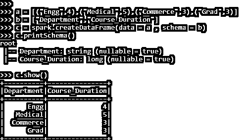
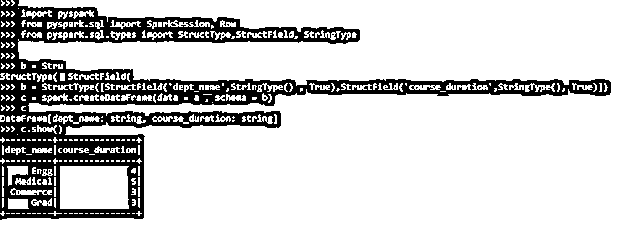
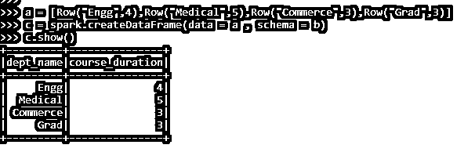

# PySpark 列表到数据帧

> 原文：<https://www.educba.com/pyspark-list-to-dataframe/>


## PySpark list to dataframe 简介

PYSPARK LIST TO DATAFRAME 是数据帧中的一种技术，将 PYSPARK 中的列表转换为数据帧。这种转换使得 PySpark 中的数据分析更加容易。PySpark 使用一个列表在一个变量中存储多个条目。它们是有序的，并且允许重复值；列表到数据框架的转换使得 PySpark 环境中的数据分析更加容易。列表到数据框架的转换使得数据优化和操作更容易。

数据框被组织到经过优化的名称列中。在 PySpark 中，可以将多种数据技术应用于转换为数据框的元素。

<small>网页开发、编程语言、软件测试&其他</small>

在本文中，我们将尝试分析使用列表来数据化框架操作 PySpark 的各种方法。

让我们试着更详细地看看列表到数据帧。

【PySpark list 到 dataframe 的语法

LIST TO DATAFRAME 函数的语法是:-

```
a = [("Engg",4),("Medical",5),("Commerce",3),("Grad",3)]
b = ["Department","Course_Duration"]
c = spark.createDataFrame(data = a , schema = b)
c.printSchema()
c.show()
```

*   **答:**包含的列表将进一步用于转换。
*   **b:** 使用的模式。
*   **c:**spark . created Dataframe 用于创建 data frame。这需要两个参数，一个是要创建的数据和模式。

**截图:-**




### PySpark 列表到数据帧的工作

让我们看看 LIST TO DATAFRAME 是如何工作的:

列表是一个有序的集合，它将多个项目存储在一个变量中。它们用于在 PySpark 中创建和存储数据。它们是有序的，并且允许重复值。一般来说，列表项处理数据，数据被迭代以进行数据分析。在处理大型数据集时，数据迭代有时会变得代价很高；为此，列表到数据框架的转换使得数据分析更加容易。

通过传递模式并使用 spark 功能创建数据帧，将列表转换为数据帧。在 PySpark 框架中，有许多方法可以从列表中创建数据框。这使得数据分析更容易，我们可以使用 PySpark 模型对数据进行一些操作。

数据帧在 PySpark 中得到了优化，迭代数据更容易，操作也更容易。一个简单的方法 spark.createdataframe 接受两个参数，即数据和模式，它对数据应用优化技术，并从中创建一个数据框。

让我们通过一些代码示例来检查 PySpark 列表到数据帧的创建和工作。

### PySpark 列表到数据帧的示例

让我们看一些 PySpark 列表到数据帧操作的例子

让我们从在 PySpark 中创建一个简单的列表开始。

```
a = [("Engg",4),("Medical",5),("Commerce",3),("Grad",3)]
```

让我们创建一个将用于创建数据框的方案。

```
b = ["Department","Course_Duration"]
```

Spark.createDataFrame 接受一个双参数，它同时接受数据和模式，并从中产生数据帧。

```
c = spark.createDataFrame(data = a , schema = b)
```

该模式就像打印传递的模式的表模式一样。

```
c.printSchema()
```

让我们使用数据框来检查数据。show()打印 PySpark 数据模型中转换后的数据框。

```
c.show()
```

**截图:-**


让我们看看在 PySpark 中创建数据框的另一种方法。

这使用结构类型来定义模式。该模式可以放入 spark.createdataframe 中，以便在 PySpark 中创建数据框。让我们导入要使用的数据框。

```
import pyspark
from pyspark.sql import SparkSession, Row
from pyspark.sql.types import StructType,StructField, StringType
b = StructType([StructField('dept_name',StringType() , True),StructField('course_duration',StringType(), True)])
c = spark.createDataFrame(data = a , schema = b)
c DataFrame[dept_name: string, course_duration: string]
c.show()
```

**截图:-**




使用行类型作为 List 也可以做到这一点。同样，列表元素作为行类型插入，这可以进一步用于在 PySpark 中创建 dataframe。

让我们举几个例子来验证一下

```
a = [Row("Engg",4),Row("Medical",5),Row("Commerce",3),Row("Grad",3)]
c = spark.createDataFrame(data = a , schema = b)
c.show()
```

**截图:-**




PySpark 中有一种为数据框创建列表的方法。

这是 PySpark 中 LIST TO DATAFRAME 的一些例子。

**注:**

1.  LIST TO DATAFRAME 用于将 PySpark 中的列表转换为数据帧。
2.  在转换成数据帧时，它使数据分析更容易。
3.  它可以处理巨大的数据负载，同时在数据帧转换。
4.  它可以在 PySpark 环境中通过多种方法进行转换。

### 结论

从上面的文章中，我们看到了 PySpark 中 LIST 到 DATAFRAME 函数的工作。通过各种例子和分类，我们试图理解这个 LIST TO DATAFRAME 函数在 PySpark 中是如何工作的，以及在编程级别使用了什么。所使用的各种方法显示了它如何简化数据分析的模式以及同样的成本效益模型。

我们还看到了 PySpark 数据框架中 LIST TO DATAFRAME 的内部工作和优点，以及它在各种编程目的中的使用。此外，语法和例子帮助我们更准确地理解函数。

### 推荐文章

这是一个 PySpark list 到 dataframe 的指南。这里我们讨论 PySpark 中数据帧列表的内部工作和优点，以及它在各种编程中的使用。您也可以看看以下文章，了解更多信息–

1.  [PySpark 并行化](https://www.educba.com/pyspark-parallelize/)
2.  [PySpark 回合](https://www.educba.com/pyspark-round/)
3.  [PySpark 联盟](https://www.educba.com/pyspark-union/)
4.  [PySpark 降序排列](https://www.educba.com/pyspark-orderby-descending/)


