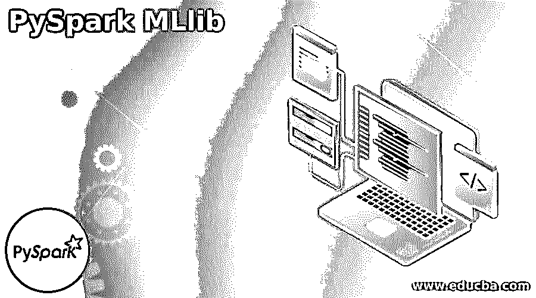
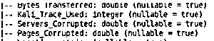
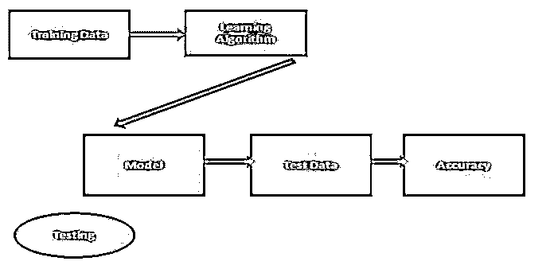

# PySpark MLlib

> 原文：<https://www.educba.com/pyspark-mllib/>




## PySpark MLlib 简介

PySpark 不过是 Spark 的机器学习库；它为用户提供了不同的功能。例如，在 pyspark MLlib 的帮助下，我们可以创建一个具有可扩展和简单模式的机器学习算法。换句话说，我们可以说它提供了不同的通用机器学习算法，如回归、聚类、过滤、分类等。通常 Apache Spark 会根据我们的要求提供我们用 Python 实现的机器学习算法 API。

### 关键要点

*   它提供了一种简单易行的实现方式。
*   支持 R 和 Python 编程，意为数据科学家。
*   它是可扩展的，我们可以轻松扩展。
*   同步和错误处理都很容易。
*   Mllib 提供了许多我们可以轻松实现的有用算法。

### PySpark MLlib 是什么？

我们知道 PySpark Mllib 是一个机器学习库，它是一个单一来源的平台，使用不同的机器学习算法在分布式和可扩展的平台上分析数据，具有不同类型的算法，如下所示:

<small>网页开发、编程语言、软件测试&其他</small>

*   **ml lib . classification:**ml lib 包支持不同类型的回归分析和多类分类方法。存在许多不同的分类算法，如随机森林、朴素贝叶斯、决策树等。
*   **mllib.clustering:** 这是一个无监督的学习问题；这里，我们需要根据另一个类对实体的子集进行分组。
*   **mllib.fpm:** 模式匹配是频繁挖掘的项目之一，子集，或者我们可以说子结构。这是分析大规模数据集的第一步。
*   **mllib.linalg:** 我们也可以用 millib 来解决线性代数问题。
*   **mllib.recommendation:** 协同过滤是 mllib 中使用最多的技术之一，是一种推荐算法。通过使用这种技术，我们可以很容易地识别丢失的条目。
*   **mllib.spark:** 支持协同过滤，利用用户和产品端的一小组数据来识别缺失条目。通常它使用交替最小二乘算法。
*   **mllib.regression:** 利用线性回归，我们可以找到变量之间的依赖关系，类似于 logistic 回归。还有许多其他算法、类和函数来实现 pyspark.mllib。

### PySpark MLlib 寻找黑客

让我们假设组织数据遭到黑客攻击，它访问大量信息，黑客使用这些信息来访问元数据。黑客有三种类型。通常一般实践是工作的折衷；让我们看一个集群的例子，如下所示。

首先，我们需要如下初始化 Spark 会话:

**代码:**

```
from pyspark.sql import SparkSession
spark_variable = SparkSession.builder.appName('find_hacker').getOrCreate()
```

在第二步中，我们必须导入 KMeans 库并加载数据集。这里我们用 Kmeans 算法做分析，所以首先需要导入 K Means 库，用 spark.read 方法加载数据集。

**代码:**

```
from pyspark.ml.clustering import KMeans
dataset = spark.read.csv("specified path of file", header, inferSchema)
```

现在我们需要检索数据，所以打印 dataSchema()。结果如下图所示。

**输出:**




### PySpark MLlib 算法和 API

让我们看看 mllib 中有哪些算法和 API，如下所示:

*   **ML 算法:**机器学习是 Mllib 的一个核心算法；包括 mllib 的命令和基本算法，如聚类、分类、回归等。
*   **Transformer:** 这是另一种用于将一个数据帧转换为另一个数据帧的算法，它使用了一个 Transformer()。
*   **Estimator:** 在这个算法的帮助下，我们可以生成 Transformer，它使用的方法是 fit()。
*   **特征化:**用于变换、选择、维数等特征提取。换句话说，我们可以说它是用来从原始数据中提取所需数据的。
*   **流水线:**一条流水线将众多的变压器和估值器链接在一起，确定一个 ML 工作流程。它同样提供了构建、评估和调整 ML 管道的工具。
*   **持久化:**用于保存和加载算法管道和模型。通过使用这种算法，我们可以减少时间和精力。
*   **实用程序**:通过使用这种算法，我们可以实现统计、代数和数据处理。

有如下两种查找 API:

Spark.ml 是 Spark 中必不可少的 ml 库。spark.mllib 处于维护模式。这意味着它会被利用，会有错误修正，但不会有任何新的亮点。

从 Spark 2.0 开始，Spark.mllib 包中基于 RDD 的 API 进入了维护模式。Spark 的基本机器学习 API 目前是 Spark.ml 包中基于 DataFrame 的 API。

数据帧比 rdd 提供了一个额外的易于使用的 API。DataFrame 的许多优点包括 Spark 数据源、SQL/DataFrame 问题、钨和 Catalyst 改进以及跨方言的统一 API。

### PySpark MLlib 生命周期

下面我们来看看 mllib 的生命周期。基本上有两大部分，如下图所示:




*   培养
*   测试

我们知道在 ML 中，我们创建一个模型来预测原始数据，所以我们使用训练数据并测试这些数据。之后，模型生成预测结果，我们称之为测试集，我们将按如下方式将其分为两组。

*   **训练集:**这是一个训练数据集，用于从我们需要的任何数据中提取数据。
*   **测试集:**模型生成后，我们可以通过训练集来预测结果。

### PySpark MLlib 包

让我们描述一下我们需要的包如下:

*   **类 pyspark.ml.Transformer:** 用于将一个数据集转换成另一个数据集，而这个无非就是抽象类。
*   **class py spark . ml . unary transformer:**这也是一个抽象类，用于将单个输入列转换为新列。
*   **class py spark . ml . estimator:**用于将数据拟合到模型中。

我们还需要如下不同的包装:

pyspark.ml.Model 类、pyspark.ml.Pipeline 类、pyspark.ml.PipelineModel 类等。我们还需要 pysark.ml.param 模块

### 常见问题解答

下面是提到的常见问题:

#### Q1。spark ml 和 spark MLlib 有什么区别吗？

**答案:**

是的，基本上，spark ml 包含高级 API，spark MLlib 包含两个 API。

#### Q2。Spark MLlib 已弃用？

**答案:**

不，基本上，它包括基于 RDD 和数据框架的 API。

#### Q3。有哪些不同类型的工具可用？

**答案:**

它有不同的工具，如特征，管道，实用程序等。

### 结论

在本文中，我们试图探索 PySpark MLlib。我们看到了不同类型的 PySpark MLlib 以及这些 PySpark MLlib 的用途和特性。本文的另一点是我们如何执行和设置 PySpark MLlib。

### 推荐文章

这是 PySpark MLlib 的指南。这里讨论入门，PySpark MLlib 找黑客，算法和 API，生命周期和包。您也可以看看以下文章，了解更多信息–

1.  [PySpark Orderby](https://www.educba.com/pyspark-orderby/)
2.  [PySpark 将函数应用于列](https://www.educba.com/pyspark-apply-function-to-column/)
3.  [PySpark 计数](https://www.educba.com/pyspark-count/)
4.  [将火花列表复制到数据帧](https://www.educba.com/pyspark-list-to-dataframe/)


