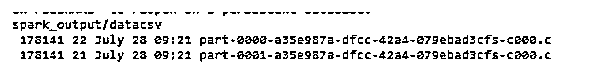
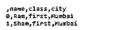
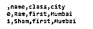

# PySpark 写 CSV

> 原文：<https://www.educba.com/pyspark-write-csv/>


## PySpark 编写 CSV 简介

PySpark 提供了不同的特性；写 CSV 是 PySpark 提供的特性之一。在 PySpark 中，我们可以将 CSV 文件写入 Spark 数据帧并读取 CSV 文件。此外，PySpark 还提供了 option()函数来定制读写操作的行为，如 CSV 文件的字符集、头和分隔符。

### 关键要点

*   PySpark CSV 帮助我们最小化输入和输出操作。
*   支持读写不同分隔符的 CSV 文件。
*   它为用户提供了不同的保存选项。
*   按照我们的要求，CSV 文件导入和表达数据的速度很慢。

**代码:**

<small>网页开发、编程语言、软件测试&其他</small>

```
df.write.CSV ("specified path ")
```

在这里，我们试图将数据帧写入带有头部的 CSV，因此我们需要使用 option()，如下所示。

**代码:**

```
df.write.option("header", true).CSV ("C:/result/output/data")
```

在这种情况下，我们有 2 个 DataFrame 分区，因此它创建了 3 个文件部分，上面实现的最终结果显示在下面的屏幕截图中。

**输出:**




在上面的例子中，我们可以看到 CSV 文件。通常，根据数据帧的零件数量，它在一个确定为一种方式的目录中组成类似数量的零件记录。你可以利用下面的位来得到包裹的大小。

让我们看看如何使用 CSV 文件的选项，如下所示:

我们知道 Spark DataFrameWriter 提供了选项()来将数据帧保存到 CSV 文件中，并且我们还能够根据我们的要求设置多个选项。

**代码:**

```
df.write.option("header",True)
  .option("delimiter","||")
  .CSV ("specified path of CSV ")
df.write.options(Map("header"->"true", "delimiter"->","))
  .CSV ("specified path of CSV ")
```

**说明:**

在上面的代码中，我们有不同的参数，如下所示:

*   **表头:** 借助表头选项，我们可以将 Spark 数据帧保存到带列标题的 CSV 中。默认情况下，此选项为 false。
*   **分隔符:** 使用分隔符，我们可以区分输出文件中的字段；最常用的分隔符是逗号。
*   **引号:** 如果我们想把值分开，我们可以用引号。
*   **压缩:** PySpark 向用户提供压缩功能；如果我们想要压缩 CSV 文件，那么我们可以在编写 CSV 的同时轻松地压缩 CSV 文件。根据我们的要求，我们还可以使用其他选项。

### PySpark 写入 CSV–导出文件

让我们看看如何导出 CSV 文件，如下所示:

我们知道 PySpark 是一个开源工具，用于在 Python 编程的帮助下处理数据。因此，首先，我们需要创建一个 Spark 会话的对象，还需要提供应用程序的名称，如下所示。

**代码:**

```
SparkSession.builder.appName(sampledemo).getOrCreate()
```

现在在下一步中，我们需要在 createDataFrame()方法的帮助下创建 DataFrame，如下所示。

**代码:**

```
spark.createDataFrame(provide specified data)
```

接下来，我们需要借助下面的方法显示数据，如下所示。

**代码:**

```
dataframe.show()
```

让我们看看如何创建数据集，如下所示:

**代码:**

```
import pyspark
from pyspark.sql import SparkSession
spark=SparkSession.builder.appName('sampledemo'). getOrCreate()
data=[{'name':'Ram', 'class':'first', 'city':'Mumbai'},
  {'name':'Sham', 'class':'first', 'city':'Mumbai'}]
dataf = spark.createDataFrame(data)
dataf.show()
```

**输出:**




让我们看看如何将数据导出到 CSV 文件中，如下所示:

**代码:**

```
import pyspark
from pyspark.sql import SparkSession
spark=SparkSession.builder.appName('sampledemo'). getOrCreate()
data=[{'name':'Ram', 'class':'first', 'city':'Mumbai'},
  {'name':'Sham', 'class':'first', 'city':'Mumbai'}]
dataf = spark.createDataFrame(data)
dataf.write.CSV ("sampledata")
```

**说明:**

*   如上例所示，我们只是多添加了一个 write 方法，将数据添加到 CSV 文件中。上面实现的结果显示在下面的截图中。

**输出:**




### PySpark 保存 CSV 文件选项

让我们看看 pyspark 中有哪些不同的保存选项:

*   **使用 CSV 文件保存:** Spark 提供单个选项，并根据需要设置多个选项，如下面的代码所示。

**代码:**

```
df.write.option("header",True)
  .option("delimiter","||")
  .CSV ("specified path of CSV ")
df.write.options(Map("header"->"true", "delimiter"->","))
  .CSV ("specified path of CSV ")
```

*   **将数据帧保存为 CSV:** 我们可以将数据帧保存到亚马逊 S3，所以我们需要一个 S3 桶和带密钥的 AWS 访问。
*   **保存 CSV 到 HDFS:** 如果我们运行在 YARN 上，我们可以把 CSV 文件写到 HDFS 本地磁盘上。
*   **保存模式:** Spark 也提供了 mode()方法，即使用常量或字符串。

### 常见问题解答

下面是提到的常见问题:

#### Q1。spark 是否支持 CSV 文件格式？

**答案:**

是的，它支持 CSV 文件格式以及 JSON、文本和许多其他格式。

#### Q2。星火中的 CSV 是什么意思？

**答案:**

CSV 意味着我们可以从 CSV 文件中读取数据并将其写入数据帧。

#### Q3。我们可以从 Pyspark 数据帧创建一个 CSV 文件吗？

**答案:**

是的，我们可以借助 dataframe.write.CSV(“文件的指定路径”)进行创建。

### 结论

在这篇文章中，我们试图探索 PySpark 写 CSV。在本文中，我们看到了不同类型的 Pyspark 写 CSV 以及这些 Pyspark 写 CSV 的用途和特性。本文的另一点是我们如何执行和设置 Pyspark write CSV。

### 推荐文章

这是一个 PySpark 写 CSV 的指南。这里我们讨论一下 dataframe 的介绍以及如何使用 PySpark 编写 CSV 文件。导出文件和常见问题。您也可以看看以下文章，了解更多信息–

1.  [PySpark Orderby](https://www.educba.com/pyspark-orderby/)
2.  [PySpark 将函数应用于列](https://www.educba.com/pyspark-apply-function-to-column/)
3.  [PySpark 计数](https://www.educba.com/pyspark-count/)
4.  [PySpark 列表到数据帧](https://www.educba.com/pyspark-list-to-dataframe/)


