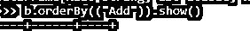
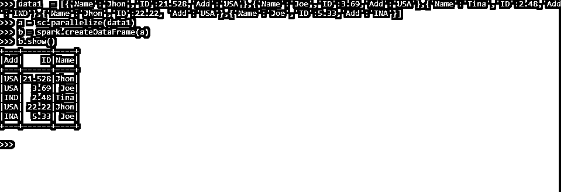
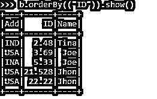
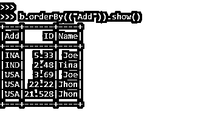
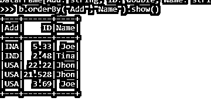

# PySpark Orderby

> 原文：<https://www.educba.com/pyspark-orderby/>


## PySpark Orderby 简介

PYSPARK orderby 是一个 SPARK 排序函数，用于在 PYSPARK 框架中对数据帧/ RDD 进行排序。它用于对 PySpark 数据框中的多一列进行排序…默认情况下，所使用的排序技术是升序排序。orderBy 子句以保证输出总顺序的排序方式返回行。order by 函数既可以用于单个列，也可以用于多个列。它有两个参数，Asc 代表升序，Desc 代表降序。

本文将尝试分析使用 MAP PARTITIONS 操作 PySpark 的各种方法。但是，首先，让我们更详细地了解一下 PYSPARK 映射分区。

<small>网页开发、编程语言、软件测试&其他</small>

【Pyspark Orderby 的语法

PYSPARK ORDERBY 函数的语法是:

```
b.orderBy(("col_Name")).show()
```

*   **OrderBy:**PySpark 中的 Order By 函数接受列名作为输入。
*   **B:** 需要进行操作的数据帧。

截图:




### Orderby 在 PySpark 的工作

让我们看看 ORDERBY 函数在 PySpark 中是如何工作的:

PySpark Order By 是 PySpark 数据模型中的一种排序技术，用于对 PySpark 中的列进行排序。数据框的排序可确保高效、省时地处理数据模型。这是因为它节省了大量的迭代时间，并且数据在功能上得到了更好的优化。

order by 不会改变数据帧的物理表，或者不会发生任何进一步的改变；它只是把工作放在数据上，数据是根据列和所需的标准排序的。

它创建一个带有排序键的全局标志，通过将数据与列中的数据元素进行比较来对数据进行排序。order by 列占用单个列以及多个列，在这些列中可以进行排序。默认的排序函数，可以用作升序排序，我们可以导入函数 desc，排序可以按降序进行。

它将参数作为列名，该列名决定需要在其下进行排序的列名。

这就是 ORDERBY 在 PySpark 中的用法。

### PySpark Orderby 示例

让我们看一些 PYSPARK ORDERBY 函数如何工作的例子

让我们从创建 PySpark 数据框开始。

考虑具有相关 ID 和 Add 的名称的数据帧，并在此基础上制作数据帧。

**代码:**

```
data1  = [{'Name':'Jhon','ID':21.528,'Add':'USA'},{'Name':'Joe','ID':3.69,'Add':'USA'},{'Name':'Tina','ID':2.48,'Add':'IND'},{'Name':'Jhon','ID':22.22, 'Add':'USA'},{'Name':'Joe','ID':5.33,'Add':'INA'}]
```

sc.parallelize 方法用于从数据创建 RDD。

```
a = sc.parallelize(data1)
```

然后，spark.createDataFrame 方法用于创建 DataFrame。

```
b = spark.createDataFrame(a)
b.show()
```

**输出:**




我们试试按操作顺序做。

数据帧中的输出首先是 Add now 我们将尝试使用 order by 操作对元素进行排序。

```
b.orderBy(("Add")).show()
```

该列以可用于进一步分析的方式按升序排序。其他列也可以这样做，比如 ID 和 Name。

```
b.orderBy(("ID")).show()
```

**输出:**




```
b.orderBy(("Add")).show()
```

**输出:**




对多列也可以这样做，我们可以将多列作为参数传递，并对其进行 orderBy 操作。

**代码片段:**

```
b.orderBy("Add","Name").show()
```

**输出:**




通过创建数据帧的临时表，orderBy 函数也可以与 Spark SQL 函数一起使用。临时表可以与 SPARK 一起使用。SQL 函数，在这里我们可以使用 Order By 函数。

我们可以将 order by 函数中的各种聚合方法用于有序数据。order by defaults 按升序排列元素，可以使用 DESC 关键字进一步按降序排列。在多列顺序的情况下，列根据第一列值排序，第二列值排序。我们还可以根据数据框中的所有列对数据进行排序。从上面的例子中，我们看到了 orderBy 函数在 PySpark 中的使用。

### 结论

从上面的文章中，我们看到了 ORDERBY 在 PySpark 中的工作情况。从各种例子和分类中，我们试图理解这个 ORDER BY 函数在 PySpark 中是如何工作的，以及在编程级别使用了什么。所使用的各种方法显示了它如何简化数据分析的模式以及同样的成本效益模型。我们还看到了 PySpark 数据框架中 ORDER BY 的内部工作原理和优点，以及它在各种编程目的中的使用。此外，语法和示例帮助我们更精确地理解了这个函数。

### 推荐文章

这是 PySpark Orderby 的指南。在这里，我们还将讨论 pyspark 中 orderby 函数的介绍和工作原理、示例和代码实现。您也可以看看以下文章，了解更多信息–

1.  [PySpark 逻辑回归](https://www.educba.com/pyspark-logistic-regression/)
2.  [pypark 队](https://www.educba.com/pyspark-lag/)的比赛
3.  [PySpark read 拼花地板](https://www.educba.com/pyspark-read-parquet/)
4.  [PySpark 结构类型](https://www.educba.com/pyspark-structtype/)


