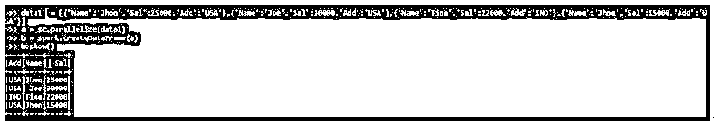
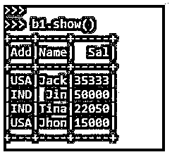
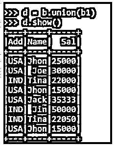

# PySpark 联合数据框架

> 原文：<https://www.educba.com/pyspark-union-dataframe/>


## PySpark 联合数据框架简介

下面的文章提供了 PySpark 联合数据框架的概要。它是一个转换函数，用于合并具有相同模式结构的数据帧；union 方法是一种合并操作，用于在 PySpark 中合并两个或两个以上的数据帧。这种联合是一种通过不同的数据结构连接和获取数据的简单方法。这是一个基于模式的操作，通过模式合并数据，如果模式不同，将返回一个错误。它返回一个新的数据帧作为输出，该数据帧包含所用数据帧中的所有行。在将数据合并在一起时，它还会占用重复值。

**py spark 联合数据帧的语法**

<small>网页开发、编程语言、软件测试&其他</small>

下面给出了提到的语法:

```
b1 = spark.createDataFrame(a1)
b = spark.createDataFrame(a)
d = b.union(b1)
```

返回类型具有包含来自两个数据框的数据的联合函数。

**输出:**


### PySpark 中联合数据框架的工作

下面给出了在 PySpark 中 Union DataFrame 的工作方式:

*   PySpark 联合函数是一种变换操作，它将数据框中的所有数据合并，并将数据框元素存储到新的数据框中。
*   这种基于模式的数据操作仅在操作的模式在整个数据框中相同时才会合并数据。因此，它将两个或多个数据框的结果组合成一个数据框模型。
*   Union 操作首先检查模式，并相应地合并数据；如果方案不同，数据框联合操作将不会合并数据。这是因为在操作和合并数据时，union 操作包含重复数据。因此，不存在发生在数据联合上的洗牌操作。

### PySpark 联合数据框架示例

下面提到了不同的例子:

首先，让我们从在 PySpark 中创建一个样本数据框开始。

```
data1 = [{'Name':'Jhon','Sal':25000,'Add':'USA'},{'Name':'Joe','Sal':30000,'Add':'USA'},{'Name':'Tina','Sal':22000,'Add':'IND'},{'Name':'Jhon','Sal':15000,'Add':'USA'}]
```

该数据包含姓名、工资和地址，将用作创建数据框的样本数据。

```
a = sc.parallelize(data1)
```

sc.parallelize 将用于使用给定数据创建 RDD。

```
b = spark.createDataFrame(a)
```

创建后，我们将使用 createDataFrame 方法来创建数据框。

这是数据框的外观。

```
b.show()
```

**输出:**




```
Data2 = [{'Name':'Jack','Sal':35333,'Add':'USA'},{'Name':'Jin','Sal':50000,'Add':'IND'},{'Name':'Tina','Sal':22050,'Add':'IND'},{'Name':'Jhon','Sal':15000,'Add':'USA'}]
```

该数据包含姓名、工资和地址，将用作创建数据框的样本数据。

```
a1 = sc.parallelize(data1)
```

sc.parallelize 将用于使用给定数据创建 RDD。

```
b1 = spark.createDataFrame(a)
b1.show()
```

**输出:**




那里的 union 操作，看看我们在执行 Union 操作后得到的数据类型。

**代码:**

```
d = b.union(b1)
d.show()
```

**输出:**




在这里，我们可以看到 union 操作将数据与数据框合并，并通过新的数据框返回数据。正如我们所看到的，我们还可以通过执行 union 操作来获得重复数据，该操作可以通过使用 drop duplicate 函数或使用 PySpark distinct 来删除。创建后，我们将使用 createDataFrame 方法来创建数据框。

**Note:** PySpark Union DataFrame is a transformation function that is used to merge data frame operation over PySpark. PySpark Union DataFrame can have duplicate data also. It works only when the schema of data is same. It doesn’t allow the movement of data. It is similar to union All() after Spark 2.0.0.

### 结论

从上面的文章中，我们看到了 PySpark 中 Union DataFrame 的工作原理。从各种示例和分类中，我们试图了解这个 Union DataFrame 函数是如何在 PySpark 中使用的，以及它在编程级别的用途。所使用的各种方法显示了它如何简化数据分析的模式以及同样的成本效益模型。我们还看到了 PySpark 数据框架中 Union 的内部工作和优势，以及它在各种编程目的中的使用。此外，语法和例子帮助我们更精确地理解了函数。

### 推荐文章

这是 PySpark 联合数据框架的指南。这里我们讨论 PySpark 中联合数据框架的介绍、工作原理和实例。您也可以看看以下文章，了解更多信息–

1.  [PySpark 回合](https://www.educba.com/pyspark-round/)
2.  [PySpark 列到列表](https://www.educba.com/pyspark-column-to-list/)
3.  [PySpark 选择列](https://www.educba.com/pyspark-select-columns/)
4.  [PySpark 加入](https://www.educba.com/pyspark-join/)


