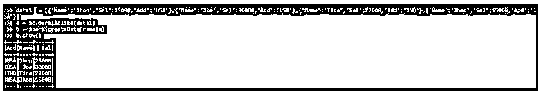
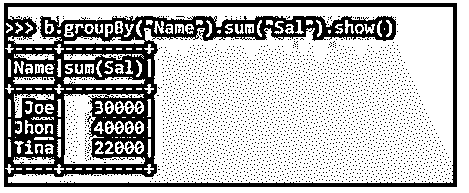
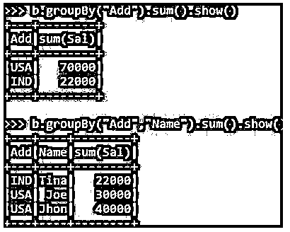

# pyspark groupby sum

> 原文：<https://www.educba.com/pyspark-groupby-sum/>


## PySpark GroupBy Sum 简介

下面的文章提供了 PySpark GroupBy Sum 的概要。PySpark GroupBy 是 PySpark 数据模型中的一个分组函数，它使用一些列值将行分组在一起。这基于基于一些列条件对数据进行分组并聚合数据作为最终结果的模型。它是一个 GroupBy 函数，具有聚合函数 Sum，根据一些列数据值对数据进行分组和求和。这通过将数据分组在一起，将结果作为列的总和返回；这是 PySpark 中的一个重要函数，用于数据分析所需的数据求和。

**py spark group by Sum 的语法**

<small>网页开发、编程语言、软件测试&其他</small>

下面给出了提到的语法:

```
Df2 = b.groupBy("Name").sum("Sal")
```

*   **b:** 为 PySpark 创建的数据帧。
*   **groupBy():** 需要用聚合函数调用的 groupBy 函数为 Sum()。

Sum 函数可以通过将列名作为参数传递来实现。

*   **Df2:** 转换后选择的新数据帧。

**输出:**


### 在 PySpark 中使用 GroupBy 处理 Sum

*   GroupBy 函数遵循基于 py spark RDD/数据框模型的键值方法。使用分区混洗相同的密钥数据，并在一个分区上组合在一起。
*   混洗操作用于分组数据的移动。相同的键元素被分组，并返回值。聚合函数 sum 用于对列值上的分组函数求和，然后返回结果。
*   该函数将所有分组的列数据相加，并返回结果。

### PySpark GroupBy Sum 示例

下面提到了不同的例子:

让我们从在 PySpark 中创建一个样本数据框开始。

**代码:**

```
data1 = [{'Name':'Jhon','Sal':25000,'Add':'USA'},{'Name':'Joe','Sal':30000,'Add':'USA'},{'Name':'Tina','Sal':22000,'Add':'IND'},{'Name':'Jhon','Sal':15000,'Add':'USA'}]
```

该数据包含姓名、工资和地址，将用作创建数据框的样本数据。

**代码:**

```
a = sc.parallelize(data1)
```

sc.parallelize 将用于使用给定数据创建 RDD。

**代码:**

```
b = spark.createDataFrame(a)
```

创建后，我们将使用 createDataFrame 方法来创建数据框。

这是数据框的外观。

**代码:**

```
b.show()
```

**输出:**




让我们用一个聚合函数 sum 来应用 Group By 函数。

**代码:**

```
b.groupBy("Name")
```

**输出:**


这将根据名称将数据分组为 sql.group.groupedData。

我们将使用聚合函数 sum 对按姓名列分组的 salary 列求和。

**代码:**

```
b.groupBy("Name").sum("Sal").show()
```

这将返回按姓名列分组的薪金列的总和。

Jhon 的工资被分组，工资的总和作为总和返回。

**输出:**




group 列也可以覆盖 PySpark 中的其他列，这些列可以是单列数据或多列数据。

**代码:**

```
b.groupBy("Add").sum().show()
```

这将基于列值对数据进行分组，并返回分组后的列的总和。

使用多列进行分组和求和。

**代码:**

```
b.groupBy("Add","Name").sum().show()
```

**输出:**




**Note:** PySpark GroupBy Sum is used to group data based on the sum as the aggregate function. It takes the column name as the input parameter on which the grouping needs to be done. Then, it takes Sum as an aggregate function post grouping the data. Finally, it shuffles the data while grouping the data element.

### 结论

从上面的文章中，我们看到了 PySpark 中 GroupBy Sum 的工作原理。从各种例子和分类中，我们看到了这个 GroupBy Sum 是如何在 PySpark 中使用的，以及在编程级别上的用途。所使用的各种方法显示了它如何简化数据分析的模式以及同样的成本效益模型。我们还看到了 PySpark 数据框架中 GroupBy Sum 的内部工作方式和优点，以及它在各种编程目的中的用法。此外，语法和例子帮助我们更精确地理解了函数。

### 推荐文章

这是 PySpark GroupBy Sum 的指南。在这里，我们讨论了在 PySpark 中 sum 和 GroupBy 的使用，以及一些例子。您也可以看看以下文章，了解更多信息–

1.  [PySpark 回合](https://www.educba.com/pyspark-round/)
2.  [PySpark 列到列表](https://www.educba.com/pyspark-column-to-list/)
3.  [PySpark 选择列](https://www.educba.com/pyspark-select-columns/)
4.  [PySpark 加入](https://www.educba.com/pyspark-join/)


