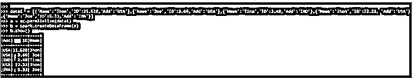
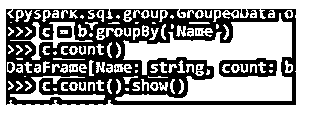
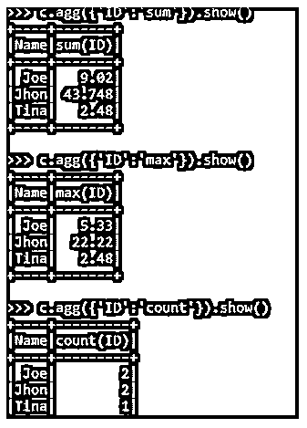
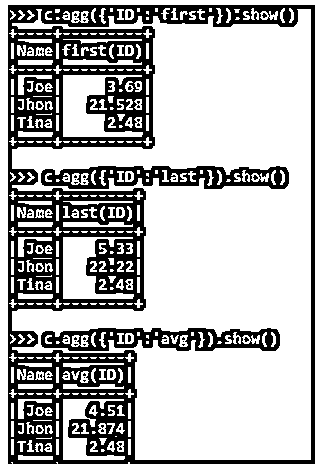
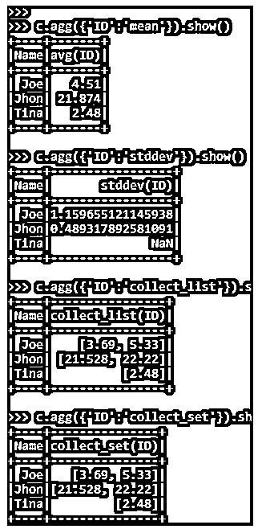

# PySpark AGG

> 原文：<https://www.educba.com/pyspark-agg/>


## PySpark AGG 简介

PYSPARK AGG 是一个聚合函数，是 PYSPARK 中提供的用于操作的功能。聚合操作对 PySpark 的数据帧进行操作，并生成相同的结果。它对一组行进行操作，然后为每组计算返回值。该函数处理计算出的某些列值，结果显示在 PySpark 操作中。

PySpark 中有一些聚合函数用于 Python PySpark 模型中的操作。其中一些包括计数、最大值、最小值和平均值，用于对数据框中的列进行操作。该函数对给定的一组值进行计算，并返回单个值。

<small>网页开发、编程语言、软件测试&其他</small>

在本文中，我们将尝试分析 PySpark 中用于数据聚合的各种方法。

【PySpark Agg 的语法

语法如下所示:

```
c.agg({'ID':'sum'}).show()
```

*   **c:** 新的数据帧 post 分组依据。
*   **agg:** 基于列值使用的聚合函数。
*   **sum:** 聚合值为 sum。

**输出:**


### PySpark 中的 AGG 操作是如何工作的？

聚合是基于 PySpark 数据帧上的几个逻辑规则来聚合数据的功能。它对一组行进行操作，并基于每个组计算单个返回值。每次调用聚合函数时，它们都返回相同的值。我们在 PySpark 中定义了一组聚合函数，对一组数据进行操作，然后将结果返回到内存中。

我们有几个已定义的聚合函数，这些函数具有为几个函数定义的功能，一些聚合函数包括 avg、max、min、count、sum，它们用于各种数据级操作。

让我们通过一些代码示例来检查聚合函数的创建和工作。

### PySpark AGG 示例

让我们看一些 PYSPARK AGG 操作如何工作的例子。让我们从在 PySpark 中创建简单数据开始。

```
data1  = [{'Name':'Jhon','ID':21.528,'Add':'USA'},{'Name':'Joe','ID':3.69,'Add':'USA'},{'Name':'Tina','ID':2.48,'Add':'IND'},{'Name':'Jhon','ID':22.22, 'Add':'USA'},{'Name':'Joe','ID':5.33,'Add':'INA'}]
```

创建一个示例数据，字段为 Name、ID 和 ADD。

```
a = sc.parallelize(data1)
```

RDD 是使用 sc.parallelize 创建的

```
b = spark.createDataFrame(a)
b.show()
```

使用 Spark.createDataFrame 创建了数据框。

**输出:**




让我们尝试聚合这个 PySpark 数据框架的数据。

首先，我们将使用 data.groupBy()和需要分组的列名对数据进行分组。

```
c = b.groupBy('Name')
```

这将根据 PySpark 数据框的名称对列进行分组。我们可以使用聚合函数。

```
c.count()
c.count().show()
```

**输出:**




dataframe.agg 函数占用要使用的列名和聚合函数。让我们用例子来验证一下。SUM 函数根据列值对分组数据求和。

```
c.agg({'ID':'sum'}).show()
```

MAX 函数根据提供的列名检查函数的最大值。

```
c.agg({'ID':'max'}).show()
```

计数功能包括总分组数据的计数。

```
c.agg({'ID':'count'}).show()
```

**输出:**




第一个函数聚合数据并从 PySpark 数据帧中收集第一个元素。

```
c.agg({'ID':'first'}).show()
```

最后一个函数聚集数据并取出最后一个值。

```
c.agg({'ID':'last'}).show()
```

AVG 函数根据提供的列值对数据进行平均。

```
c.agg({'ID':'avg'}).show()
```

**输出:**




MEAN 函数计算 PySpark 中列的平均值。这是一个集合函数。

```
c.agg({'ID':'mean'}).show()
```

STDDEV 函数计算给定列的标准偏差。

```
c.agg({'ID':'stddev'}).show()
```

collect_list 函数收集数据框的列作为列表元素。

```
c.agg({'ID':'collect_list'}).show()
```

collect_set 函数将数据框的数据收集到集合中，并显示结果。

```
c.agg({'ID':'collect_set'}).show()
```

**输出:**




**注:**

1.  PySpark AGG 是一个函数，用于使用多个列值聚合 PySpark 中的数据。
2.  PySpark AGG 函数在聚合后返回单个值。
3.  PySpark 中的列分组后使用 PySpark AGG 函数。
4.  PySpark AGG 函数为传递给它们的列列表定义了一组操作。
5.  PySpark AGG 涉及数据洗牌和移动。

### 结论

从上面的文章中，我们看到了 AGG 在 PySpark 的工作。通过各种例子和分类，我们试图理解 PySpark AGG 中的 AGG 操作是如何发生的，以及在编程级别使用了什么。我们还看到了 PySpark 数据框架中 AGG 的内部工作方式和优势，以及它在各种编程目的中的使用。此外，语法和例子帮助我们更准确地理解函数。

### 推荐文章

这是 PySpark AGG 的指南。在这里，我们还将讨论 PySpark 中 AGG 操作的介绍和工作原理，以及不同的示例和代码实现。您也可以看看以下文章，了解更多信息–

1.  [PySpark 回合](https://www.educba.com/pyspark-round/)
2.  [pypark 交换机列](https://www.educba.com/pyspark-withcolumn/)
3.  [py 帕克集团](https://www.educba.com/pyspark-groupby/)
4.  [PySpark foreach](https://www.educba.com/pyspark-foreach/)


