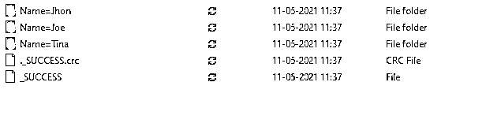
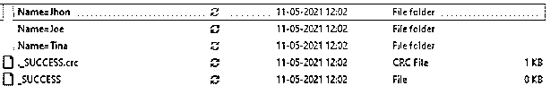
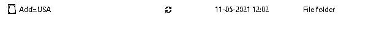

# PySpark partitionBy

> 原文：<https://www.educba.com/pyspark-partitionby/>


## PySpark 分区简介

PYSPARK partitionBy 是 PYSPARK 中的一个函数，用于根据某些值将大块数据分割成较小的单元。这个 partitionBy 函数将数据分成更小的块，这些块将进一步用于 PySpark 中的数据处理。例如，PySpark 中的 DataFrameWriter 类函数基于一个或多个列函数对数据进行分区。

使用 partitionBy 可以提高数据处理的性能，并使数据分析更加容易。根据我们对数据的需求，数据可以在内存或磁盘中进行分区。本文将尝试用 PySpark 中的数据来分析 PARTITIONBY 中使用的各种方法。但是，首先，让我们更详细地看看 PARTITIONBY。

<small>网页开发、编程语言、软件测试&其他</small>

**语法**

PYSPARK partitionBy 函数的语法是:-

```
b.write.option("header",True).partitionBy("Name").mode("overwrite").csv("path")
```

*   **b:** 使用的数据帧。
*   **write.option:** 写头为真的数据帧的方法。
*   **partitionBy:** 基于所需列值使用的 partitionBy 函数。
*   **模式:**书写选项模式。
*   **csv:** 这些分区数据需要放入的文件类型和路径。

**截图:**


### PySpark 分区的工作原理

让我们看看分区操作在 PySpark 中是如何工作的

partitionBy 操作对 PySpark 中的数据进行操作，将数据分割成更小的块，并以 PySpark 数据帧的形式保存在内存或磁盘中。这种分区有助于更好地分类，并提高集群中数据的性能。分区基于决定需要分区的块的数量的列值。

在 PySpark 中，创建保存数据的部件文件，并以分区列名作为文件夹名。分区允许数据访问更快，因为它将数据组织起来，即在单独的文件夹和文件中，通过它遍历将相对更容易。

所有数据都被隔离在一个公共文件夹中，列所需的相同数据位于相同的文件位置；该分区可以对 PySpark 数据帧的单个列和多个列进行数据分区。因此，在 PySpark 中处理大量数据时，通过使用 PySpark 分区可以提高查询的性能。

创建成功文件和 crc 文件，以成功执行给定文件夹中的文件。

让我们通过一些代码示例来检查 partitionBy 函数的创建和工作。

### PySpark 分区示例

让我们看看 partitionBy 操作如何工作的一些例子

让我们从在 PySpark 中创建简单数据开始。

```
data1  = [{'Name':'Jhon','ID':21.528,'Add':'USA'},{'Name':'Joe','ID':3.69,'Add':'USA'},{'Name':'Tina','ID':2.48,'Add':'IND'},{'Name':'Jhon','ID':22.22, 'Add':'USA'},{'Name':'Joe','ID':5.33,'Add':'INA'}]
```

创建一个示例数据，字段为 Name、ID 和 ADD。

```
a = sc.parallelize(data1)
```

RDD 是使用 sc.parallelize 创建的

```
b = spark.createDataFrame(a)
b.show()
```

使用 Spark.createDataFrame 创建了数据框。

**截图:**


这将创建列名为 name、Add 和 ID 的数据框。

让我们尝试根据名称对数据进行分区，并将其存储回文件夹中的 csv 文件中。

```
b.write.option("header",True).partitionBy("Name").mode("overwrite").csv("\tmp")
```

这将根据名称对数据进行分区，并将数据划分到文件夹中。成功和成功。crc 文件夹是用文件夹名和文件夹中的数据创建的。

选项 header true 用它保持了 header 函数，并且 header 就在其中。模式定义了需要写入数据的模式。它可以被覆盖、附加等。列名写在需要进行分区的列上。

这将创建一个与该文件夹同名的文件夹，数据位于该文件夹中。

**截图:**


**截图:**




对于多列，可以使用 partition By 在文件夹中创建文件夹，并将数据存储在该文件夹中。

```
b.write.option("header",True).partitionBy("Name","Add").mode("overwrite").csv("/tmp/")
```

这将在文件夹内创建一个文件夹，其名称后跟添加文件夹。

**截图:-**








这些文件被写回到文件夹中，然后可用于进一步的数据分析。

这些是 PySpark 中 PARTITIONBY 函数的一些例子。

**注:**

1.  partitionBy 是一个函数，用于根据 PySpark 数据框中的列对数据进行分区。
2.  PySpark partitionBy 将查询固定在数据模型中。
3.  在 PySpark 中，partitionBy 既可以用于单列，也可以用于多列。
4.  partitionBy 将值以文件夹中零件文件的形式存储在磁盘中。
5.  partitionBy 允许数据在网络中移动和洗牌。

### 结论

从上面的文章中，我们看到了 PySpark 中 PARTITIONBY 的工作原理。然后，通过各种例子和分类，我们试图理解这种 PARTITIONBY 操作在 PySpark 中是如何发生的，以及在编程级别使用了什么。

我们还看到了 PySpark 数据框架中 PARTITIONBY 的内部工作和优点，以及它在各种编程目的中的使用。此外，语法和例子帮助我们更准确地理解函数。

### 推荐文章

这是 PySpark 分区指南。在这里，我们通过各种例子和分类来讨论 PySpark 中 PARTITIONBY 的工作方式。您也可以看看以下文章，了解更多信息–

1.  [PySpark 回合](https://www.educba.com/pyspark-round/)
2.  [PySpark 选择列](https://www.educba.com/pyspark-select-columns/)
3.  [PySpark 地图](https://www.educba.com/pyspark-map/)
4.  [PySpark 滤波器](https://www.educba.com/pyspark-filter/)


