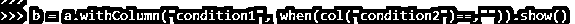
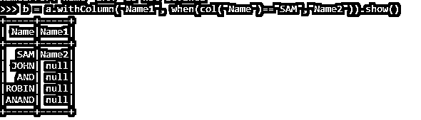
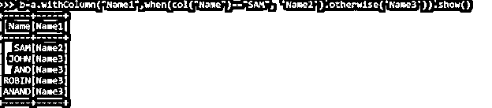
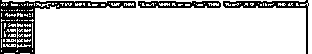
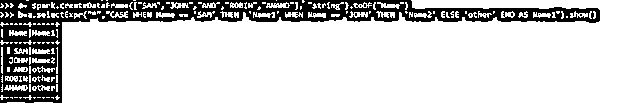

# PySpark 何时

> 原文：<https://www.educba.com/pyspark-when/>

## PySpark 简介 when

PYSPARK 当函数在数据帧中与 PySPARK 一起使用时，在 Spark 数据帧中导出一列。它还用于更新 DataFrame 中的现有列。DataFrame 中的任何现有列都可以根据需要使用 when 函数进行更新。

PySpark DataFrame 使用 SQL 语句来处理数据。以及什么时候使用 SQL 函数来重构 spark 中的数据帧。我们可以在 PySpark 中添加自己的条件，并使用 when 语句来进一步使用。

<small>网页开发、编程语言、软件测试&其他</small>

什么时候是以列为返回类型的 SQL 函数？

**当**时 PySpark 的语法

PYSPARK WHEN 函数的语法是:-

`Dataframe.select(“condition”).when(“condition”)
Dataframe.withColumn(“condition”).when(“condition”)`

**代码:**

`b = a.withColumn("condition1", when(col("condition2")==,"")).show()`

**截图:**

### PySpark 的工作时间

让我们看看 PySpark 中的 When 函数是如何工作的

什么时候是火花函数，所以要借助导入函数来使用:

`Import org.apache.spark.sql.function.when`

当函数首先检查数据帧的条件，然后相应地分离数据时，我们可以改变数据帧中的现有列，或者借助 When 函数添加新列。

我们也可以使用 case 语句以及 SQL 函数，否则当不满足条件时。

数据也可以根据 case 语句进行分离，case 语句在筛选出数据时使用。

当取值时，根据条件检查它们，然后根据满足的值输出新列。它类似于 SQL 中的 if then 子句。我们可以用 PySpark DataFrame 创建多个 when 语句。

我们可以根据需要的条件改变或更新任何列 PySpark 数据框架。条件语句无论满足与否都会相应地作用于数据框。

### 例子

让我们看一些 PYSPARK WHEN 函数如何工作的例子:

在 PYSPARK 中创建一个数据框架:-

让我们首先用 Python 创建一个 DataFrame。

CreateDataFrame 用于在 Python 中创建 DF。

`a= spark.createDataFrame(["SAM","JOHN","AND","ROBIN","ANAND"], "string").toDF("Name").show()`

让我们检查并引入一个新列，该列满足 DataFrame 的条件。

With 列用于在 DataFrame 中引入一个新列，when 子句满足的条件相应地工作。

`b = a.withColumn("Name1", when(col("Name")=="SAM","Name2")).show()`

满足条件，在 PySpark 中引入该列。

`b = a.withColumn("Name1", when(col("Name")=="SAM","Name2")).show()`

**截图:**

我们还可以使用 otherwise 函数来填充不满足条件的列。

**代码:**

`b=a.withColumn("Name1",when(col("Name")=="SAM", 'Name2').otherwise('Name3')).show()`

**代码片段:**

我们还可以使用 selectEpxr 来选择 DataFrame 中的列，也可以使用多个 case 语句，并且可以将值放在相同的位置。

让我们看一个例子:

让我们创建一个与上述值相同的 DataFrame。

**代码:**

`a= spark.createDataFrame(["SAM","JOHN","AND","ROBIN","ANAND"], "string").toDF("Name").show()`

selectExpr 将选择数据框中的元素，当检查条件并提供值时，我们可以使用多个 case 语句。

**代码:**

`b=a.selectExpr("*","CASE WHEN Name == 'SAM' THEN  'Name1' WHEN Name == 'JOHN' THEN  'Name2' ELSE 'other' END AS Name1").show()`

#### 实施例 2

满足多个语句并不一定重要。它只能评估正确的陈述，然后可以将错误的陈述分开。

`b=a.selectExpr("*","CASE WHEN Name == 'SAM' THEN  'Name1' WHEN Name == 'sam' THEN  'Name2' ELSE 'other' END AS Name1`

这里，满足的条件被放置，而不满足的条件被留下。

**代码快照:**

因此，输出仅适用于真实条件。

这将检查数据帧上的条件，然后分配与之相关的值。

满足的值放上去，不满足的则填满。

**代码快照:**

我们还可以在 When 语句中使用运算符，并在数据帧中创建一个条件。

从上面的例子中，我们看到了 Pyspark 的 When 函数的用法

**注:**

1.  什么时候可以用在 select 操作中以及 withColumn 函数中？
2.  SQL 函数的操作类似于 SQL。
3.  什么时候可以用 Spark 数据框？
4.  什么时候可以与多个 case 语句一起使用？

### 结论

从上面的文章中，我们看到了 PySpark 中 From 的使用。通过各种示例和分类，我们试图理解 WHEN 方法在 PySpark 中是如何工作的，以及在编程级别使用了什么。

我们还看到了 Spark Data Frame 的内部工作原理和优势，以及它在各种编程目的中的用途。此外，语法和例子帮助我们更准确地理解函数。

### 推荐文章

这是一个 PySpark 时的指南。在这里，我们讨论在 PySpark 中使用 FROM 以及各种示例和分类。您也可以看看以下文章，了解更多信息–

1.  [火花簇](https://www.educba.com/spark-cluster/)
2.  [Spark web UI](https://www.educba.com/spark-web-ui/)
3.  [火花累加器](https://www.educba.com/spark-accumulator/)
4.  [火花平面图](https://www.educba.com/spark-flatmap/)

