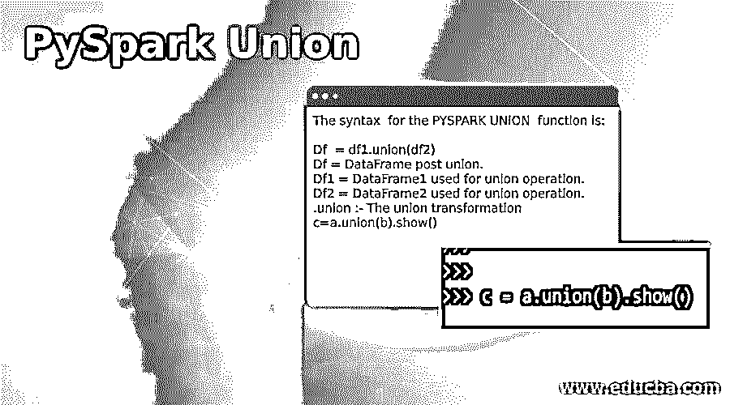
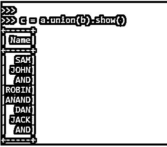
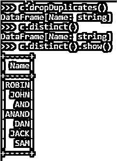
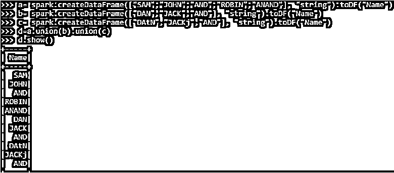
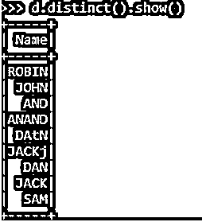
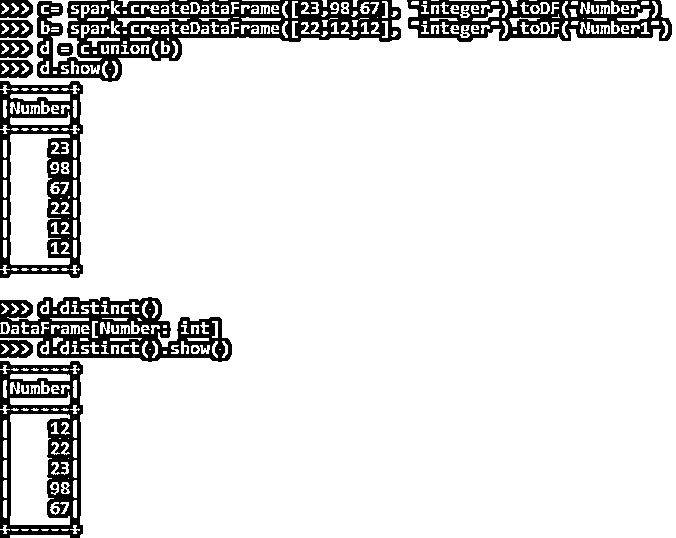
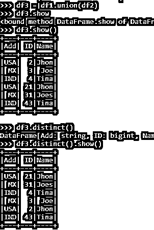

# PySpark 联盟

> 原文：<https://www.educba.com/pyspark-union/>

## PySpark 联盟简介

PySpark UNION 是 PySpark 中的一种转换，用于在 PySpark 应用程序中合并两个或多个数据帧。union 操作适用于具有相同方案和结构的 spark 数据框。这是在任何 PySpark 应用程序中执行联合操作的一个非常重要的条件。union 操作可对两个或更多数据帧执行，并可用于组合数据帧以获得定义的结果。它返回一个新的 Spark 数据帧，其中包含所用数据帧行的并集。

**语法:**

<small>网页开发、编程语言、软件测试&其他</small>

PYSPARK 联合函数的语法是:

`Df  = df1.union(df2)
Df = DataFrame post union.
Df1 = DataFrame1 used for union operation.
Df2 = DataFrame2 used for union operation.
.union :- The union transformation
c=a.union(b).show()`

**输出:**

### 工会工作

让我们看看 PySpark 中的 UNION 函数是如何工作的:

*   该联合是 Spark 中的一种转换，用于处理 Spark 中的多个数据框。它将数据帧作为输入，返回类型是包含数据帧 1 和数据帧 2 中的元素的新数据帧。
*   这种转换会取出所有元素(无论是否重复),并将它们附加到单个数据帧中，以便进一步操作。
*   我们还可以在 spark 应用程序中对多个数据帧应用 union 操作。该联合的物理计划显示，shuffle 阶段由联合中涉及的所有列的交换节点表示，并应用于数据帧中的每个元素。

### PySpark 联盟示例

让我们看一些 PYSPARK 联合函数如何工作的例子:

#### 示例#1

让我们首先创建一个简单的数据框，我们希望使用过滤操作。

**代码:**

数据帧的创建:

`a= spark.createDataFrame(["SAM","JOHN","AND","ROBIN","ANAND"], "string").toDF("Name")`

让我们在 union 操作上再创建一个数据帧 b。

`b= spark.createDataFrame(["DAN","JACK","AND"], "string").toDF("Name")`

让我们开始一个基本的联合行动。

`c = a.union(b).show()`

输出会将两个数据帧附加在一起，结果会将两个数据帧放在一起。

**输出:**

#### 实施例 2

union 操作处理所有数据，但不处理其中的重复数据。要从数据帧中删除重复项，我们需要从数据帧中执行 distinct 操作。Distinct 或 Drop Duplicate 操作用于从数据框中移除重复项。

**代码:**

`c.dropDuplicates()
c.distinct()
c.distinct().show()`

**输出:**

#### 实施例 3

我们还可以在 PySpark 数据帧上执行多个 union 操作。相同的联合操作可应用于所有数据帧。

`a= spark.createDataFrame(["SAM","JOHN","AND","ROBIN","ANAND"], "string").toDF("Name")
b= spark.createDataFrame(["DAN","JACK","AND"], "string").toDF("Name")
c= spark.createDataFrame(["DAtN","JACKj","AND"], "string").toDF("Name")
d=a.union(b).union(c)
d.show`()

这将合并所有三个数据框。

**输出:**

`d.distinct().show()`

distinct 将从创建的数据框中移除所有重复项。

#### 实施例 4

同样的 union 操作也可以对数据类型为 Integer 类型的数据帧进行。

`c= spark.createDataFrame([23,98,67], "integer").toDF("Number")
b= spark.createDataFrame([22,12,12], "integer").toDF("Number1")
d = c.union(b)
d.show()`

这是整数类型，后应用联合会将所有数据帧追加在一起。

`d.distinct()
d.distinct().show()`

**输出:**

#### 实施例 5

让我们再看一些关于数据帧的联合运算的例子。

`data1  = [{'Name':'Jhon','ID':2,'Add':'USA'},{'Name':'Joe','ID':3,'Add':'MX'},{'Name':'Tina','ID':4,'Add':'IND'}] data2  = [{'Name':'Jhon','ID':21,'Add':'USA'},{'Name':'Joes','ID':31,'Add':'MX'},{'Name':'Tina','ID':43,'Add':'IND'}] rd1 = sc.parallelize(data1)
rd2 = sc.parallelize(data2)
df1 = spark.createDataFrame(rd1)
df2 = spark.createDataFrame(rd2)
df1.show()`

让我们对数据帧进行联合运算并进行分析。

`df3 = df1.union(df2)
df3.show()
df3.distinct()
df3.distinct().show()`

**输出:**

这些是 PySpark 中联合转换的一些例子。

### 结论

从上面的文章中，我们看到了联合行动在 PySpark 中的使用。从各种例子和分类中，我们试图理解 UNION 方法在 PySpark 中是如何工作的，以及在编程级别使用了什么。我们也看到了火花数据框架中联合的内部工作和优势，以及它在各种编程目的中的使用。此外，语法和例子帮助我们更准确地理解函数。

### 推荐文章

这是 PySpark 联盟的指南。这里我们讨论 PySpark Union 的介绍，它的语法和 Union 操作的使用，以及工作和代码实现。您也可以看看以下文章，了解更多信息–

1.  [PySpark 加入](https://www.educba.com/pyspark-join/)
2.  [PySpark SQL](https://www.educba.com/pyspark-sql/)
3.  [火花版本](https://www.educba.com/spark-versions/)
4.  [火花平面图](https://www.educba.com/spark-flatmap/)

