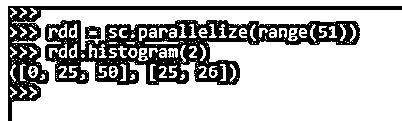
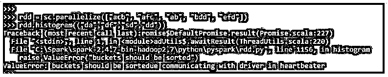

# PySpark 直方图

> 原文：<https://www.educba.com/pyspark-histogram/>

## PySpark 直方图简介

PySpark 直方图是 PySpark 中的一种方法，通过将数据与可能的聚合函数绑定，将数据帧表示为数字数据。它是一种可视化技术，用于可视化变量的分布。PySpark 直方图易于使用，可视化效果非常清晰，数据点多于所需数据点。

这种带直方图的数据可视化有助于将数据与数据框进行比较，并基于该数据立即分析报告。条形图可用于创建 spark 数据框的可视化模式，通过绘制它们，我们可以清楚地了解数据及其信息。因此，通过 PySpark 直方图，我们可以找到一种工作和分析数据帧的方法，PySpark 中的 RDD。

<small>网页开发、编程语言、软件测试&其他</small>

### PySpark 直方图的语法

PySpark 直方图函数的语法是:

`rdd.histogram(("a", "b", "c"))`

**输出:**

**说明:**

*   PySpark RDD 号。
*   **直方图:**可视化功能。

### PySpark 中直方图的处理

让我们看看直方图在 PySpark 中是如何工作的:

1.直方图是使用提供的桶在 PySpark 中计算 RDD。这里的桶指的是我们需要计算直方图值的范围。

2.除了关闭的最后一个桶之外，桶通常都向右打开。

3.例如，我们需要计算 RDD 的任何 RDD 都将创建一个桶，除了最后一个桶之外，其他桶的右开口都是打开的。

4.[11，20，34，67]将桶表示为[11，20]打开，[20，34]打开，[34，67]关闭。

5.开放时段意味着数据不能等于该值，它将始终小于开放值。

这意味着上述存储桶的值将位于如下位置:

*   11 < = y < 20
*   20 < = y < 34
*   34<=y<=67

6.应该有排序的桶，不包含任何重复的值。

7.存储桶必须至少为 1。如果存储桶是均匀分布的数字，那么结果值也将均匀分布在直方图中。

8.如果 RDD 范围为无穷大，则结果返回 NAN。

9.如果我们试图了解直方图的定义，它在文档中是这样表述的:

**方法定义:**

**def 直方图(bucketount: Int): (Array[Double]，Array[Long])**

10.它用于使用 PySpark 中最大和最小 RDD 之间的存储桶的存储桶计数来计算数据的直方图。

11.我们也可以定义自己的存储桶。

### PySpark 直方图示例

让我们看一些如何计算直方图的例子。

#### 示例#1

让我们创造一个 PySpark RDD。

**代码:**

`rdd = sc.parallelize(["ab", "ac", "b", "bd", "ef"])
rdd = sc.parallelize(range(51))
Lets plot the histogram for the made RDD.
rdd.histogram(2)`

这将创建一个桶 2 的直方图。结果将创建直方图。

**输出:**

#### 实施例 2

让我们试着创建一个 PySpark RDD，并试着用均匀间隔桶计算直方图。

**代码:**

`rdd.histogram([0, 15, 30, 45, 60])`

这将创建一个桶间距均匀的 RDD。

**输出:**

#### 实施例 3

让我们尝试使用 RDD 作为字符串数据类型来绘制直方图。

**代码:**

`rdd = sc.parallelize(["acb", "afc", "ab", "bdd", "efd"])`

这将创建一个类型为字符串的 RDD。

`rdd.histogram(("a", "b", "c"))`

用 RDD 创建一个直方图。这将计算给定 RDD 的直方图。

`(('a', 'b', 'c'), [3, 1])`

有必要成为分类上的桶。绘制直方图时，未排序的存储桶会产生错误。

#### 实施例 4

让我们尝试传递一个未排序的桶并绘制直方图。

使用未排序的存储桶创建直方图时，我们得到以下错误:

**值错误:铲斗应在与 heartbeater 中的驱动程序通信时分类**

**rdd . histogram((“da”、“df”、“sd”、“DD”))**

这里我们试图创建一个未排序的存储桶。在绘制直方图时，我们在与驱动程序通信时得到对桶进行排序的错误。

**输出:**

如果我们只是在 RDD 上传递一个排序的桶，同样可以成功地创建。

**代码:**

`rdd.histogram(("da","df","dy","dz"))`

这同样会绘制给定 RDD 的直方图。

**输出:**

我们还可以使用 Python 库从直方图中绘制数据，该库可以导入并用于计算和可视化所需的数据。
可以使用 PySpark 中的数据框绘制用于分析和数据可视化的统计图。

### 结论

从上面的文章中我们看到了 PySpark 中直方图操作的使用。从各种例子和分类中，我们试图了解直方图方法在 PySpark 中是如何工作的，以及在编程级别使用了什么。我们还看到了 Spark 数据框架中直方图的内部工作和优势，以及它在各种编程目的中的用途。语法和例子也帮助我们更精确地理解这个函数。

### 推荐文章

这是 PySpark 直方图指南。这里我们分别讨论 PySpark 中直方图的介绍、工作原理和实例。您也可以看看以下文章，了解更多信息–

1.  [星火中的 RDD](https://www.educba.com/rdd-in-spark/)
2.  [火花广播](https://www.educba.com/spark-broadcast/)
3.  [火花上下文](https://www.educba.com/sparkcontext/)
4.  [PySpark 加入](https://www.educba.com/pyspark-join/)

