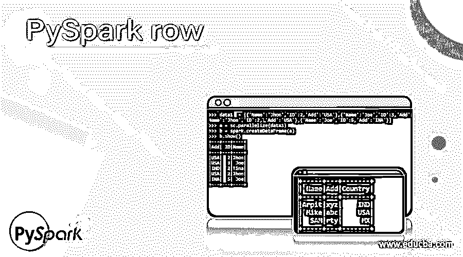
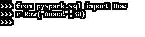
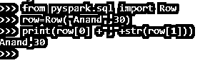
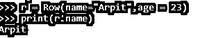
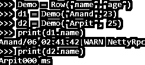
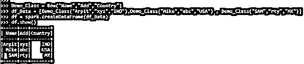
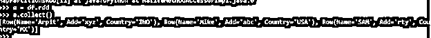

# PySpark 行

> 原文：<https://www.educba.com/pyspark-row/>




## PySpark row 简介

PYSPARK ROW 是一个将数据帧表示为记录的类。我们可以通过 PySpark 中的某些参数在 PySpark 中创建行对象。row 类扩展了 tuple，因此在创建 row 类时变量参数是开放的。我们可以创建一个行对象，并从行中检索数据。

可以将行理解为可以通过索引或名称访问的字段的有序集合。它们可以有一个可选的模式。Row 对象创建一个实例。我们可以将行实例合并到其他行对象中。通过使用参数，可以使用行来创建行的对象。

<small>网页开发、编程语言、软件测试&其他</small>

【Pyspark 行的语法

ROW 函数的语法是:-

```
from pyspark.sql import Row
r=Row("Anand",30)
```

PYSPARK SQL 中要使用的导入函数。

用所用参数创建的行对象。

**截图:**




### Pyspark 中的 Row 工作

让我们看看 PySpark 中的行操作是如何工作的

行类扩展了元组，因此它占用可变数量的参数，因为元组展示了的属性。创建了一个行对象，我们可以从中导出行数据；有了 Row 对象，我们就有了一个可以通过名称或索引访问的字段集合。

Row()方法创建一个 Row 对象并将值存储在其中。它们也可以有一个可选的模式。一旦创建了行，就使用基于索引导出值的方法。一旦创建了对象，就使用 GetAs 方法来导出带有索引的行。

它有一个行编码器，当从 row 对象创建数据框时，它负责为模式分配行元素。

提供了用于创建行对象的工厂方法，例如 apply 从元素集合、从 SEQ、从元素序列等创建行对象。这样就创建了一个 ROW 对象，并将数据存储在 PySpark 中。

让我们用一些代码示例来检查创建和使用。

### 例子

让我们看一些 PYSPARK 行操作如何工作的例子

让我们从在 PySpark 中创建简单数据开始。

```
data1  = [{'Name':'Jhon','ID':2,'Add':'USA'},{'Name':'Joe','ID':3,'Add':'USA'},{'Name':'Tina','ID':2,'Add':'IND'},{'Name':'Jhon','ID':2, 'Add':'USA'},{'Name':'Joe','ID':5,'Add':'INA'}]
```

创建一个示例数据，字段为 Name、ID 和 ADD。

```
a = sc.parallelize(data1)
```

RDD 是使用 sc.parallelize 创建的

```
b = spark.createDataFrame(a)
b.show()
```

使用 Spark.createDataFrame 创建了数据框。

**截图:**


现在让我们用 ROW 对象来尝试一下:

让我们创建一个行对象。这可以通过使用接受参数的 ROW 方法来完成，ROW 对象就是从该方法创建的。

```
from pyspark.sql import Row
row=Row("Anand",30)
print(row[0] +","+str(row[1]))
```

PySpark 的导入行。SQL 用于导入 Row 方法，该方法接受创建 ROW 对象的参数。

这是一个创建行对象的简单方法。

**截图:**




同样，也可以使用命名参数来完成，例如:-

```
r = Row(name="Arpit",age = 23)
print(r.name)
```

这可以用来通过命名的参数类型调用它。

**截图:**




创建 ROW 对象的另一种方法是使用 custom class 方法。我们只需要定义自定义类，这同样可以用于调用 row 对象。

**代码:**

```
Demo = Row("name","age")
d1 = Demo("Anand",23)
d2 = Demo("Arpit", 25)
print(d1.name)
print(d2.name)
```

**截图:**




我们还可以用 Row 对象制作一个数据框 RDD，它可以进一步用于 PySpark 操作。

让我们尝试用 Row 对象制作数据框。

我们将尝试通过创建类对象来做到这一点。

**代码:**

```
from pyspark.sql import Row
Demo_Class = Row("Name","Add","Country")
df_Data = [Demo_Class("Arpit","xyz","IND"),Demo_Class("Mike","abc","USA") , Demo_Class("SAM","rty","MX")]
df = spark.createDataFrame(df_Data)
df.show()
```

**截图:**




这将从 ROW 对象创建一个数据框。

**Note:-** The Data Frame by default represents the Data as ROW.

列名取自行对象

```
df.printSchema()
```

这是为数据框定义的方案。

我们也可以从这个数据框制作 RDD，并在那里使用 RDD 运算，或者简单地从行对象制作 RDD。

**代码:**

```
a = df.rdd
a.collect()
[Row(Name='Arpit', Add='xyz', Country='IND'), Row(Name='Mike', Add='abc', Country='USA'), Row(Name='SAM', Add='rty', Country='MX')]
```

这将从数据帧中生成一个 RDD，我们可以在那里进行操作。

**截图:**




使用火花也可以做到这一点。sparkcontext。使用其中的行对象并行化方法。

```
rdd1 = spark.sparkContext.parallelize(df_Data)
rdd1.collect()
[Row(Name='Arpit', Add='xyz', Country='IND'), Row(Name='Mike', Add='abc', Country='USA'), Row(Name='SAM', Add='rty', Country='MX')]
```

在这里，我们可以分析出 RDD 的结果是一样的。

**截图:**


这是 PySpark 中行函数的一些例子。

**注:**

1.  PySpark ROW 扩展了元组，允许可变数量的参数。
2.  Row 使用 Row()方法创建 ROW 对象。
3.  行可以有一个可选的模式。
4.  行对象可以转换成 RDD、数据框、数据集，可进一步用于 PySpark 数据操作。
5.  如上所述，可以通过许多方法来创建行。

### 结论

从上面的文章中，我们看到了行操作在 PySpark 中的使用。我们试图从各种例子和分类中理解 ROW 方法在 PySpark 中是如何工作的，以及在编程级别使用了什么。

我们还看到了 PySpark 数据框架中的行的内部工作和优点，以及它在各种编程目的中的使用。此外，语法和例子帮助我们更准确地理解函数。

### 推荐文章

这是去派斯帕克街的指南。这里我们用各种例子和分类来讨论 PySpark 中行操作的使用。您也可以看看以下文章，了解更多信息–

1.  [PySpark 联盟](https://www.educba.com/pyspark-union/)
2.  [PySpark 地图](https://www.educba.com/pyspark-map/)
3.  [PySpark SQL](https://www.educba.com/pyspark-sql/)
4.  [火花上下文](https://www.educba.com/sparkcontext/)


