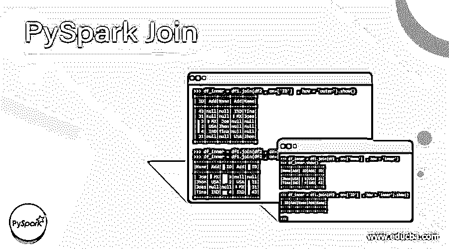
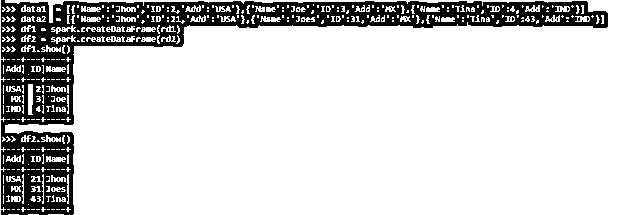
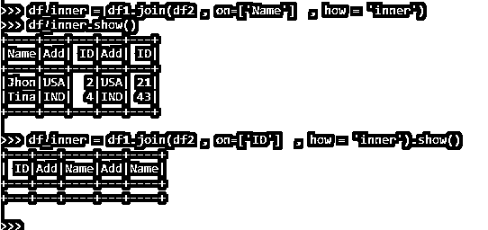
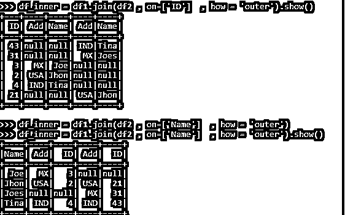
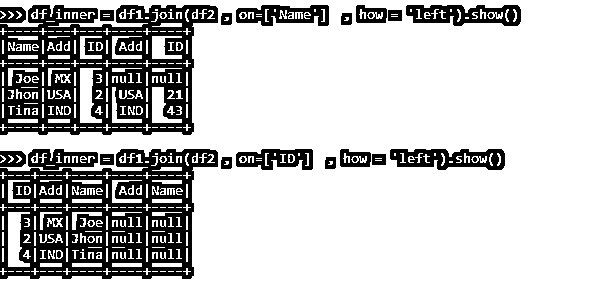
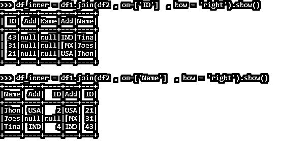
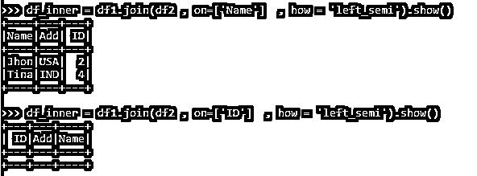
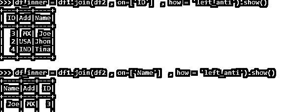

# PySpark 连接

> 原文：<https://www.educba.com/pyspark-join/>

## PySpark Join 简介

PYSPARK JOIN 操作是在 SPARK 应用程序中组合数据帧的一种方式。

连接操作的基本概念是从两个不同的数据框或数据源中连接、合并或提取数据。它用于在 Spark 中根据特定的关系列组合数据框中的行。满足该关系的数据进入该范围，而另一个被消除。PySpark JOIN 对于处理 Spark 中来自两个数据框架的批量数据或嵌套数据非常重要。在 PySpark 应用程序中，连接操作能够连接多个数据帧或处理数据帧的多行。

<small>网页开发、编程语言、软件测试&其他</small>

PySpark 连接有多种类型，我们可以使用它们来连接数据框，并根据需要处理数据。一些连接操作是:-

**内联接、外联接、右联接、左联接、右半联接、左半联接等。**

Spark 应用程序上的数据操作需要这些操作。让我们通过 PySpark 应用程序检查一些这种操作的例子。

### PySpark 联接示例

让我们看一些 PySpark Join 操作如何工作的例子:

在开始操作之前，让我们在 PySpark 中创建两个数据框，join 操作示例将从这两个数据框开始。创建一个名为 Data1 的数据框和另一个名为 Data2 的数据框。Pyspark 中使用 createDataframe 函数来创建数据帧。

**代码:**

`data1  = [{'Name':'Jhon','ID':2,'Add':'USA'},{'Name':'Joe','ID':3,'Add':'MX'},{'Name':'Tina','ID':4,'Add':'IND'}] data2  = [{'Name':'Jhon','ID':21,'Add':'USA'},{'Name':'Joes','ID':31,'Add':'MX'},{'Name':'Tina','ID':43,'Add':'IND'}]`

**创建一个 RDD**

`rd1 = sc.parallelize(data1)
rd2 = sc.parallelize(data2)`

**从 RDD 创建数据帧**

`df1 = spark.createDataFrame(rd1)
df2 = spark.createDataFrame(rd2)
df1.show()
df2.show()`

**代码快照:**

示例数据框已创建，现在让我们看看连接操作及其用法。

#### 内部连接

在内部连接中选择两个数据框中的匹配记录。

该操作在列上执行，具有相同值的列与显示为输出的结果相联接。

**代码:**

`df_inner = df1.join(df2 , on=['Name']  , how = 'inner')
df_inner.show()
df_inner = df1.join(df2 , on=['ID']  , how = 'inner').show()`

结果符合条件的会出现，不符合条件的不会出现。

不满意的条件产生了，却没有结果。

**代码快照:**

#### 外部连接

两个数据框中的所有数据都在外部连接中被选中。

该操作在列上执行，匹配的列作为结果返回。缺少的列用 Null 填充。

**代码:**

`df_inner = df1.join(df2 , on=['ID']  , how = 'outer').show()
df_inner = df1.join(df2 , on=['Name']  , how = 'outer').show()`

结果符合条件的会出现，不符合条件的不会出现。

不满足的条件用 null 填充，并显示结果。

**代码快照:**

#### 左连接

左侧数据框中的所有数据都将被选中，符合条件的数据将填充左连接中匹配案例中的记录。该操作在列上执行，匹配的列作为结果返回。缺少的列用 Null 填充。

**代码:**

`df_inner = df1.join(df2 , on=['Name']  , how = 'left').show()
df_inner = df1.join(df2 , on=['id']  , how = 'left').show()`

结果符合条件的会出现，不符合条件的不会出现。

不满足的条件用 null 填充，并显示结果。来自左侧数据框的所有元素将在结果中填入满足的值，否则为空。

**代码快照:**

#### 右连接

右数据框中的所有数据都将被选中，符合条件的数据将填充右连接中匹配案例中的记录。

该操作在列上执行，匹配的列作为结果返回。缺少的列用 Null 填充。

**代码:**

`df_inner = df1.join(df2 , on=['Name']  , how = 'right').show()
df_inner = df1.join(df2 , on=['id']  , how = 'right').show()`

结果符合条件的会出现，不符合条件的不会出现。

不满足的条件用 null 填充，并显示结果。来自右数据帧的所有元素将在结果中填入满足的值，否则为空。

**代码快照:**

#### 左半连接

在左侧半连接中选择左侧数据框中的匹配记录。

操作类似于内部连接，只是所选数据来自左侧数据框。

**代码:**

`df_inner = df1.join(df2 , on=['Name']  , how = ‘left_semi’).show()
df_inner = df1.join(df2 , on=['ID']  , how = 'left_semi').show()`

符合条件的将作为结果出现(仅留下数据帧数据)，不符合条件的将不会出现。

不满意的条件产生了，却没有结果。

**代码快照:**

#### 左反连接

来自两个数据帧的记录的差异。它从数据帧 1 中选择不在数据帧 2 中的行。

**代码:**

`df_inner = df1.join(df2 , on=['Name']  , how = 'left_anti').show()
df_inner = df1.join(df2 , on=['ID']  , how = 'left_anti').show()`

**代码快照:**

这些是 PYSPARK 的各种连接操作。

### 结论–py spark Join

从上面的文章中，我们看到了 PySpark 中 Join 操作的使用。从各种例子和分类中，我们试图理解 **JOIN** 操作在 **PySpark** 中是如何工作的，以及在编程级别使用了什么。我们还看到了 PySpark 数据框架的内部工作和加入的优势，以及它在各种编程目的中的使用。此外，语法和例子帮助我们更准确地理解函数。

### 推荐文章

这是 PySpark 加盟指南。这里我们讨论简介、语法、PySpark Join 操作如何与代码实现一起工作。您也可以看看以下文章，了解更多信息–

1.  [MySQL 交叉连接](https://www.educba.com/mysql-cross-join/)
2.  [Perl join](https://www.educba.com/perl-join/)
3.  [Linux 加入](https://www.educba.com/linux-join/)
4.  [MySQL 更新加入](https://www.educba.com/mysql-update-join/)

