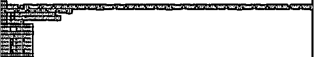
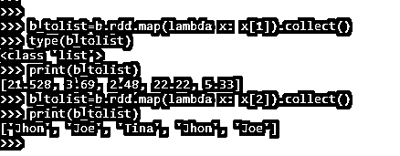
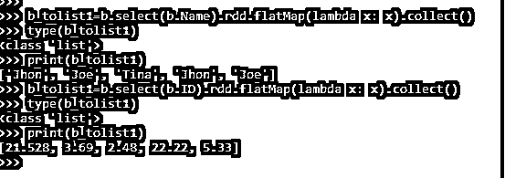
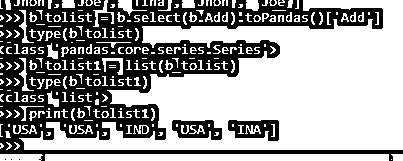

# PySpark 列到列表

> 原文：<https://www.educba.com/pyspark-column-to-list/>

## PySpark 列到列表的介绍

PySpark 列到列表是一个用于将 PYSPARK 的列转换成列表的操作。PySpark 的数据框由保存数据框中数据的列组成。PySpark to List 提供了将这些列元素转换成列表的方法和途径。

转换为列表使得列中的数据更容易分析，因为列表保存了 PySpark 中的项目集合，当使用列表的数据结构时，数据遍历更容易。在 PySpark 中有多种方法可以将列元素转换成列表。在本文中，我们将尝试详细分析用于转换的各种方法。

<small>网页开发、编程语言、软件测试&其他</small>

让我们试着看看关于 PYSPARK 列地更详细一些的清单。

【PySpark 列到列表的语法:

PYSPARK 列到列表函数的语法是:

`b_tolist=b.rdd.map(lambda x: x[1])`

*   b:用于列转换的数据框。
*   .rdd:用于转换 rdd 中的数据帧，之后。map()操作用于列表转换。
    (lambda x:x[1]):-Python lambda 函数，在 PySpark 中将列索引转换为列表。

**截图:**

### PySpark 中列到列表的工作

这是一个将 PySpark 数据帧的列元素转换为列表的转换操作。数据框的返回类型是 Row 类型，因此我们需要将特定的列数据转换成列表，以便进一步用于分析方法。有各种方法可以选择退出转换，包括循环列中的每个元素，然后将它放到 list 中。

python 中的列表表示为数组。存储在列表中的元素被存储为存储每个元素的索引类型。元素通过列中的循环进行遍历，并存储在 PySpark 中给定的列表索引中。在 PySpark 中，将列转换为列表有多种方法，所有方法都涉及到将元素标记到 python 列表中的索引。

列表操作更容易迭代、添加和删除列。因此通常优选使用相同的。
让我们用一些编码示例来检查创建和转换方法。

### 例子

让我们看一些 PYSPARK 列列表操作是如何工作的例子。让我们从在 PySpark 中创建简单数据开始。

`data1 = [{'Name':'Jhon','ID':21.528,'Add':'USA'},{'Name':'Joe','ID':3.69,'Add':'USA'},{'Name':'Tina','ID':2.48,'Add':'IND'},{'Name':'Jhon','ID':22.22, 'Add':'USA'},{'Name':'Joe','ID':5.33,'Add':'INA'}]`

创建一个示例数据，字段为 Name、ID 和 ADD。

`a = sc.parallelize(data1)`

RDD 是使用 sc.parallelize 创建的

`b = spark.createDataFrame(a)
b.show()`

使用 Spark.createDataFrame 创建了数据框。

**截图:**

让我们看看 PySpark 中列到列表转换的一些方法。

#### 1.使用 Lambda 函数进行转换。

我们可以通过 lambda 函数将 PySpark 的列转换成 list。可以对列进行迭代，值作为类型列表存储。

`b_tolist=b.rdd.map(lambda x: x[1]).collect()
type(b_tolist)
print(b_tolist)`

数据框的其他列也可以转换为列表。

`b_tolist=b.rdd.map(lambda x: x[2]).collect()
print(b_tolist)`

我们可以更改索引，然后可以转换列。

**截图:**

#### 2.使用 FlatMap 函数进行列表转换。

使用将列转换为列表的平面映射方法可以完成相同的转换。

`b_tolist1=b.select(b.Name).rdd.flatMap(lambda x: x).collect()
type(b_tolist1)
print(b_tolist1)
b_tolist1=b.select(b.ID).rdd.flatMap(lambda x: x).collect()
type(b_tolist1)
print(b_tolist1)`

这将使用平面映射操作将列转换为列表。

**截图:**

甚至我们也可以使用 python 内置的库。转换也可以通过使用。toPandas()库。熊猫的库首先将其转换为<class>类型</class>

可以使用 PySpark 的 list 函数进行转换。

让我们用一个例子来验证一下:

`b_tolist = b.select(b.Name).toPandas()['Name'] type(b_tolist)
b_tolist1 = list(b_tolist)
type(b_tolist1)
print(b_tolist1)`

这是一个通过 to Pandas 方法列出转换的列。

**截图:**

更多的列可以通过相同的。

`b_tolist = b.select(b.Add).toPandas()['Add'] type(b_tolist)
b_tolist1 = list(b_tolist)
type(b_tolist1)
print(b_tolist1)`

**截图:**

这是 PySpark 中 PYSPARK 列到列表转换的一些例子。

**注:**

1.PySpark 列到列表是一个用于列表转换的 PySpark 操作。
2。PySpark COLUMN TO LIST 将列转换为列表，可以方便地用于各种数据建模和分析目的。
3。PySpark COLUMN TO LIST 允许遍历 PySpark 数据帧中的列，然后转换为带有一些索引值的列表。
4。PySpark 列到列表使用了函数映射、平面映射、lambda 操作进行转换。
5。PySpark 列到列表的转换可以还原，数据可以推回到数据框。

### 结论

从上面的文章中，我们看到了 PySpark 中列到列表的转换。通过各种例子和分类，我们试图理解 PySpark 中从数据框列到列表的转换是如何发生的，以及在编程级别使用了什么。

我们还看到了在 PySpark 数据框架中将列转换为列表的内部工作和优点，以及它在各种编程目的中的使用。此外，语法和例子帮助我们更准确地理解函数。

### 推荐文章

这是一份 PySpark 列到列表的指南。这里我们讨论定义、语法和参数，PySpark 如何对列进行列表操作？代码实现示例。您也可以看看以下文章，了解更多信息–

1.  [py 帕克集团](https://www.educba.com/pyspark-groupby/)
2.  [pypark 群表计数](https://www.educba.com/pyspark-groupby-count/)
3.  [PySpark 降序排列](https://www.educba.com/pyspark-orderby-descending/)
4.  [PySpark 地图](https://www.educba.com/pyspark-map/)

