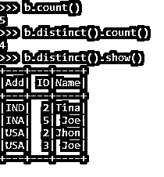
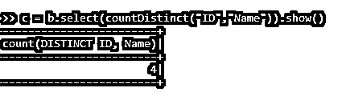
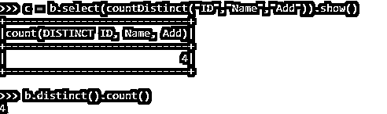

# PySpark 计数不同

> 原文：<https://www.educba.com/pyspark-count-distinct/>

## PySpark count distinct 简介

PySpark count distinct 是 PySpark 中使用的一个函数，主要用于计算 RDD py spark 数据帧中元素的不同数量。distinct 实现时的含义是唯一的。因此，我们可以使用这个函数找到 PySpark 数据帧中存在的唯一记录的数量。

distinct 函数有助于避免数据重复，使数据分析更容易。支持的 count 函数找到了计算 PySpark 数据帧中不同元素数量的方法，使其更容易修正和工作。这是 PySpark 数据分析中的一个重要功能，因为重复数据在分析中不太被接受。

<small>网页开发、编程语言、软件测试&其他</small>

**语法**

函数的语法是:-

`b.distinct().count()`

*   **b:** 使用的 PySpark 数据帧。
*   **distinct():** 用于过滤重复值的 distinct 函数。
*   **dount():** 要使用的计数操作。

**截图:**

### Pyspark 中的计数区分工作

让我们看看在 PySpark 中 COUNT DISTINCT 函数是如何工作的:

distinct 函数占用现有的 PySpark 数据帧并返回一个新的数据帧。这些新数据删除了所有重复的记录；删除重复数据后，count 函数用于计算存在的记录数。计数是启动驱动程序执行并将数据返回给驱动程序的操作。这将对当前的数据进行计数，并将计数的数据返回。Distinct 使用哈希代码，equals 方法用于对象确定，count 操作用于计算其中的项数。从数据框中移除重复项会使数据变得干净，没有重复项。

### 例子

让我们看一些 PYSPARK DISTINCT COUNT 函数如何工作的例子

让我们从在 PySpark 中创建一个简单的数据开始。

`data1 = [{'Name':'Jhon','ID':2,'Add':'USA'},{'Name':'Joe','ID':3,'Add':'USA'},{'Name':'Tina','ID':2,'Add':'IND'},{'Name':'Jhon','ID':2, 'Add':'USA'},{'Name':'Joe','ID':5,'Add':'INA'}]`

创建一个示例数据，字段为 Name、ID 和 ADD。

`a = sc.parallelize(data1)`

RDD 是使用 sc.parallelize 创建的

`b = spark.createDataFrame(a)
b.show()`

使用 Spark.createDataFrame 创建了数据框。

**截图:**

此数据框包含可使用 distinct 函数移除的重复值。

**代码:**

`b.distinct().show()`

让我们尝试使用 count()方法对数据帧进行操作来计算数据帧的数量。

`b.distinct().count()`

这将统计数据帧中不同元素的数量。

`b.count()`

如我们所见，非重复计数小于数据帧的计数，因此新数据帧已经从现有数据帧中移除了重复项，计数操作有助于计数。

**截图:**

需要进行比较的每个元素都有不同之处，即所有元素都应该相同或相等。只是特定的元素将被称为 distinct，并且可以与 distinct 操作一起使用。

我们还可以使用 countDistinct SQL 函数检查数据框中特定列的不同列。countDistinct 函数是一个 PYSPARK SQL 函数，用于返回一个组中不同元素的数量。

让我们用一个例子来验证一下:

`data1 = [{'Name':'Jhon','ID':2,'Add':'USA'},{'Name':'Joe','ID':3,'Add':'USA'},{'Name':'Tina','ID':2,'Add':'IND'},{'Name':'Jhon','ID':2, 'Add':'USA'},{'Name':'Joe','ID':5,'Add':'INA'}] a = sc.parallelize(data1)
b = spark.createDataFrame(a)`

从 pyspark.sql.functions 导入 countDistinct

`c = b.select(countDistinct("ID","Name")`

计数非重复函数用于选择数据框中的非重复列。上述代码返回数据帧中不同的 ID 和 Name 元素。

`c = b.select(countDistinct("ID","Name")).show()`

**截图:**

对所有列或单个列也可以进行同样的操作。

`c = b.select(countDistinct("ID")).show()`

有 3 个关于同一的唯一 ID，因此非重复计数返回值为 3。

**截图:**

如果我们添加所有列并尝试检查非重复计数，非重复计数函数将返回与上面遇到的相同的值。

所以功能:

`c = b.select(countDistinct("ID","Name","Add")).show()`

结果将与具有不同计数函数的结果相同。

`b.distinct().count()`

**截图:**

这些是 PySpark 中不同计数函数的一些例子。

**注:**

1.  非重复计数用于从 PySpark 数据帧中移除重复元素。
2.  该计数可用于对现有元素进行计数。
3.  它会创建一个包含不同元素的新数据框。
4.  数据不包含任何重复值，并且没有冗余数据。
5.  我们还可以在 PySpark 数据框中的选定列上使用该函数。
6.  countDistinct() PySpark SQL 函数用于处理数据框中的选定列。

### 结论

从上面的文章中，我们看到了 PySpark 中 Distinct Count 操作的使用。我们试图从各种示例和分类中理解不同计数方法在 PySpark 中是如何工作的，以及在编程级别使用了什么。

我们还看到了 PySpark 数据帧中独特计数的内部工作和优势，以及它在各种编程目的中的使用。此外，语法和例子帮助我们更准确地理解函数。

### 推荐文章

这是 PySpark count distinct 的指南。这里，我们讨论 PySpark 数据框中 DISTINCT COUNT 的内部工作和示例。您也可以阅读以下文章来了解更多信息—

1.  [PySpark 版本](https://www.educba.com/pyspark-version/)
2.  [PySpark 加入](https://www.educba.com/pyspark-join/)
3.  [火花广播](https://www.educba.com/spark-broadcast/)
4.  [火花版本](https://www.educba.com/spark-versions/)

