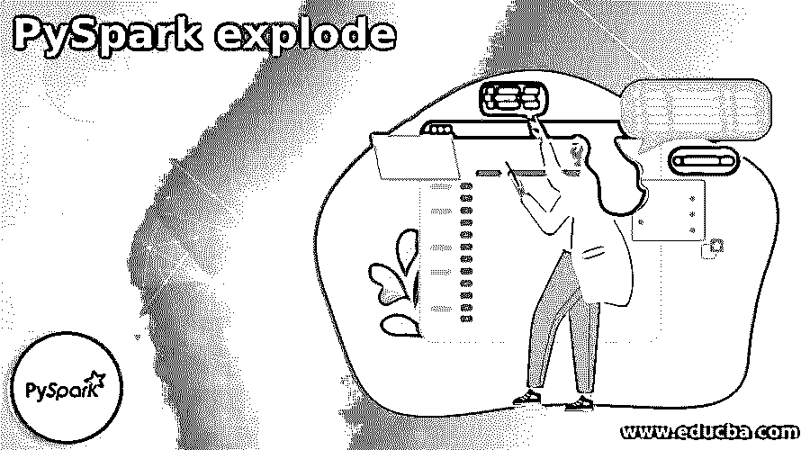
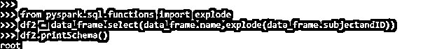
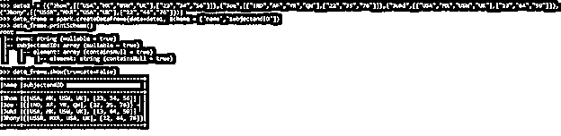
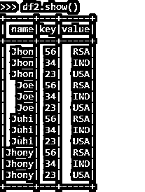
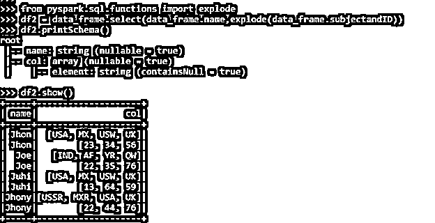

# PySpark 爆炸

> 原文：<https://www.educba.com/pyspark-explode/>

## PySpark 爆炸简介

PYSPARK EXPLODE 是一个 EXPLODE 函数，在 PYSPARK 数据模型中用于分解一个数组或者将相关的列映射到 PySpark 中的行。它分解列并将它们分开，而不是在 PySpark 中创建新的一行。它为数组或映射中的每个元素返回一个新行。

它以列为参数，对列进行分解，可以进一步用于数据建模和数据操作。展开函数可以是访问内部模式并逐步处理嵌套数据的开发人员。这种分解函数使用避免了所需的循环和复杂的数据相关查询。

<small>网页开发、编程语言、软件测试&其他</small>

在本文中，我们将尝试分析使用分解操作 PySpark 的各种方法。

让我们试着更详细地了解爆炸。

【PySpark explode 的语法

EXPLODE 函数的语法是:-

`from pyspark.sql.functions import explode
df2 = data_frame.select(data_frame.name,explode(data_frame.subjectandID))
df2.printSchema()
Df_inner:- The Final data frame formed`

**截图:**

### PySpark 爆炸加工实例

让我们看一些分解操作如何工作例子

让我们从在 PySpark 中创建简单数据开始。

`data1  = [("Jhon",[["USA","MX","USW","UK"],["23","34","56"]]),("Joe",[["IND","AF","YR","QW"],["22","35","76"]]),("Juhi",[["USA","MX","USW","UK"],["13","64","59"]]),("Jhony",[["USSR","MXR","USA","UK"],["22","44","76"]])]`

数据是用 Array 作为输入创建的。

`data_frame = spark.createDataFrame(data=data1, schema = ['name','subjectandID'])`

数据框的创建。

`data_frame.printSchema()
data_frame.show(truncate=False)`

**输出:**

在这里，我们可以看到该列属于 array 类型，其中包含嵌套元素，可以进一步用于展开。

**截图:**

从 pyspark.sql.functions 导入展开

让我们使用 explode 函数导入该函数。

`df2 = data_frame.select(data_frame.name,explode(data_frame.subjectandID))`

让我们从使用将要使用的 explode 函数开始。explode 函数使用列名作为输入，并处理列数据。

`df2.printSchema()
root
|-- name: string (nullable = true)
|-- col: array (nullable = true)
|    |-- element: string (containsNull = true)`

该模式显示了分解为行的列，输出分析显示了要在 PySpark 中更改为行的列名。这使得数据访问和处理更加容易，我们可以在那里进行与数据相关的操作。

`df2.show()`

输出将数组列分成行，我们可以根据 PySpark 中的列值分析输出。

分解阵列时创建的新列是默认的列名，包含在此处分解的阵列的所有元素。

分解功能可以和数组以及贴图功能一起使用，

exploded 函数最多创建两列，主要是一列用于键，另一列用于值和拆分成行的元素。

让我们用一些例子来验证这一点

`data1  = [("Jhon",["USA","MX","USW","UK"],{'23':'USA','34':'IND','56':'RSA'}),("Joe",["IND","AF","YR","QW"],{'23':'USA','34':'IND','56':'RSA'}),("Juhi",["USA","MX","USW","UK"],{'23':'USA','34':'IND','56':'RSA'}),("Jhony",["USSR","MXR","USA","UK"],{'23':'USA','34':'IND','56':'RSA'})] data_frame = spark.createDataFrame(data=data1, schema = ['name','subjectandID'])
data_frame.printSchema()
root
|-- name: string (nullable = true)
|-- subjectandID: array (nullable = true)
|    |-- element: string (containsNull = true)
|-- _3: map (nullable = true)
|    |-- key: string
|    |-- value: string (valueContainsNull = true)`

数据框已创建并使用键-值对映射函数，现在我们将尝试通过使用导入来使用分解函数，并查看如何使用此分解函数分解映射函数操作。

`from pyspark.sql.functions import explode
df2 = data_frame.select(data_frame.name,explode(data_frame.subjectandID))
df2.printSchema()
root
|-- name: string (nullable = true)
|-- col: string (nullable = true)
df2.show()`

输出示例显示了如何使用 Explode 函数分解映射键值对。

**截图:-**

这些是 PySpark 中 EXPLODE 的一些例子。

**注:-**

1.  EXPLODE 是一个 PySpark 函数，用于处理 PySpark 中的列。
2.  EXPLODE 用于分析嵌套的列数据。
3.  PySpark EXPLODE 将数组列转换为行。
4.  使用展平方法可以在分析后展平爆炸。
5.  对于给定的每个元素，EXPLODE returns 类型通常是一个新行。

### 结论

从上面的文章中，我们看到了 PySpark 中 EXPLODE 的工作原理。通过各种例子和分类，我们试图理解这个 EXPLODE 函数是如何工作的，以及在编程级别使用了什么。所使用的各种方法显示了它如何简化数据分析的模式以及同样的成本效益模型。

我们还看到了数据帧分解的内部工作和优点，以及它在各种编程目的中的使用。此外，语法和例子帮助我们更精确地理解了函数。

### 推荐文章

这是 PySpark 爆炸指南。这里我们讨论 PySpark 数据框架的内部工作原理和 EXPLODE 的优点。您也可以阅读以下文章，了解更多信息——

1.  [PySpark read 拼花地板](https://www.educba.com/pyspark-read-parquet/)
2.  [PySpark 并行化](https://www.educba.com/pyspark-parallelize/)
3.  [PySpark foreach](https://www.educba.com/pyspark-foreach/)
4.  [PySpark 地图](https://www.educba.com/pyspark-map/)

