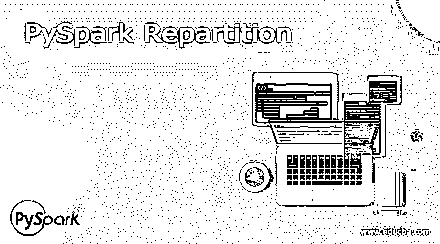
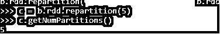
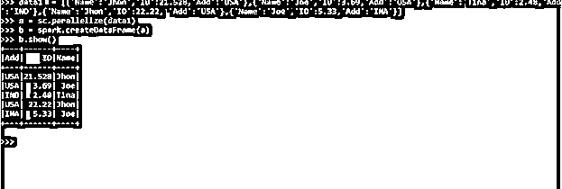
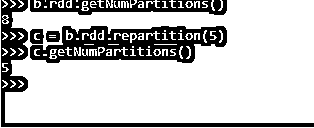
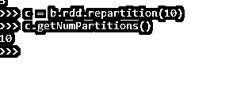
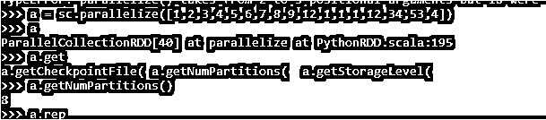
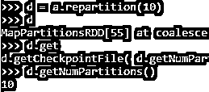

# PySpark 再分配

> 原文：<https://www.educba.com/pyspark-repartition/>

## PySpark 再分配简介

PySpark 重新分区是 PySpark 中的一个概念，用于增加或减少用于处理 PySpark 模型中的 RDD/数据帧的分区。PySpark 模型基于数据分区和在分区之间处理数据，重分区概念是用于根据需求和数据大小增加或减少这些特定分区的数据。

在进行重新分区时，会应用完全混洗模式，通过混洗其中的所有数据来重新分配数据。当数据通过整个网络传输时，这种数据的完全混洗有时会增加运营成本。
在本文中，我们将尝试分析使用 PySpark 重新分区操作的各种方法。
让我们试着更详细地了解 PYSPARK 再分配

<small>网页开发、编程语言、软件测试&其他</small>

**语法:**

语法是:

`c = b.rdd.repartition(5)
c.getNumPartitions()`

B:-要使用的数据帧。

新的重新划分的 RDD。GetNumPartitions 用于检查使用的新分区。

**截图:**

### PySpark 中再分配操作的实现

让我们看看 PySpark 中的重新分区操作是如何工作的:

PySpark 模型完全基于数据分区，将数据分布在分区中，数据模型处理在该模型上完成。数据的重新划分允许控制需要完成数据处理的数据划分。

重新分区通过允许完全混洗数据来重新分配数据。我们可以使用重新分区的概念来增加或减少分区的数量。默认情况下，有一个允许数据混洗的混洗分区，该属性用于数据的重新分区。

它控制数据在 spark 集群上的移动，在使用 spark 计划中后转换的重新分区时，增加了对逻辑 spark 计划的表达式重新分区，最终对数据进行重新分区。如果只传递一个参数，则数据是随机分布的。

这就是 PySpark 中使用重新分区的方式。

### 例子

让我们看一些 PySpark 重分配函数如何工作的例子。让我们从创建 PySpark 数据框开始。

考虑具有相关 ID 和 Add 的名称的数据帧，并在此基础上制作数据帧。

**代码:**

`data1 = [{'Name':'Jhon','ID':21.528,'Add':'USA'},{'Name':'Joe','ID':3.69,'Add':'USA'},{'Name':'Tina','ID':2.48,'Add':'IND'},{'Name':'Jhon','ID':22.22, 'Add':'USA'},{'Name':'Joe','ID':5.33,'Add':'INA'}]`

sc.parallelize 方法用于从数据创建 RDD。

`a = sc.parallelize(data1)`

然后，spark.createDataFrame 方法用于创建 DataFrame。

`b = spark.createDataFrame(a)`

**截图:**

`b.rdd.getNumPartitions()
8`

这是使用的默认分区。这相应地将数据分布到 8 个分区中。

我们将对数据进行重新分区，然后将数据转移到新的分区中，具体数量取决于数据的大小和所需的业务使用情形。

`c = b.rdd.repartition(5)
c.getNumPartitions()
5`

这将数据重新划分为 5 个分区。

**截图:**

我们还可以根据我们的要求增加分区，对数据分区没有限制，因为这是数据模型的完全洗牌。

`c = b.rdd.repartition(10)
c.getNumPartitions()
10`

这会将数据重新分区到一个大于默认分区号的新分区号。即 8。

**截图:**

通过使用 PySpark 中的 sc.parallelize 函数并在其上使用重新分区概念，也可以将相同的重新分区概念应用于 RDD。

使用 sc.parallelize 方法创建 RDD。

`a = sc.parallelize([1,2,3,4,5,6,7,8,9,12,1,1,1,12,34,53,4])
a
ParallelCollectionRDD[40] at parallelize at PythonRDD.scala:195`

Spark 使用的默认分区。

`a.getNumPartitions()
8`

数据的重新分区将分区重新定义为 2。

`c=a.repartition(2)
c
MapPartitionsRDD[50] at coalesce at NativeMethodAccessorImpl.java:0
c.getNumPartitions()
2`

这里我们将分区增加到 10，这比正常定义的分区要大。

`d = a.repartition(10)
d
MapPartitionsRDD[55] at coalesce at NativeMethodAccessorImpl.java:0
d.get
d.getCheckpointFile( d.getNumPartitions( d.getStorageLevel(
d.getNumPartitions()
10`

这定义了数据的重新分区工作，我们可以根据数据和需求增加或减少分区。有时，数据的重新分区会使数据处理更容易、更快，但由于是完全混洗，因此会增加操作成本。

**截图:**

从上面的例子中，我们看到了 PySpark 的重新分区操作的使用。

**注:**

1.PySpark 重新分区用于增加或减少 PySpark 中的分区数量。
2。PySpark 重新分区提供了完整的数据洗牌。
3。PySpark 重新分区是一项开销很大的操作，因为已分区的数据是使用混洗操作重新构造的。
4。PySpark 重新分区可用于相应地组织数据。

### 结论

从上面的文章中，我们看到了 PySpark 中再分配操作的工作原理。通过各种例子和分类，我们试图理解 PySpark 中的这个重分区函数是如何工作的，以及在编程级别使用了什么。所使用的各种方法显示了它如何简化数据分析的模式以及同样的成本效益模型。

我们还看到了 PySpark 数据框架中的内部工作和重新分区的优点，以及它在各种编程目的中的使用。此外，语法和例子帮助我们更准确地理解函数。

### 推荐文章

这是 PySpark 再分配指南。这里我们讨论一下 PySpark 重分区函数的介绍、语法、工作原理？例子。您也可以看看以下文章，了解更多信息–

1.  [PySpark 计数不同](https://www.educba.com/pyspark-count-distinct/)
2.  [PySpark 逻辑回归](https://www.educba.com/pyspark-logistic-regression/)
3.  [pypark 队](https://www.educba.com/pyspark-lag/)的比赛
4.  [PySpark 广播加入](https://www.educba.com/pyspark-broadcast-join/)

