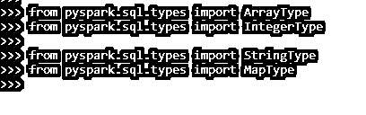
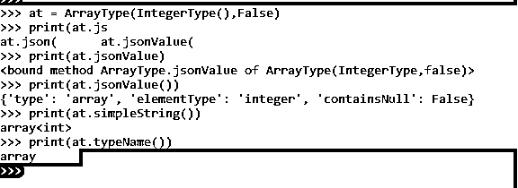
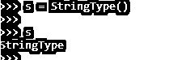
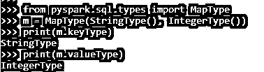
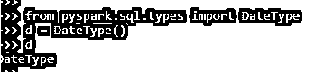

# PySpark SQL 类型

> 原文：<https://www.educba.com/pyspark-sql-types/>

## PySpark SQL 类型简介

PySpark SQL TYPES 是 PySpark 模型中的一个类，用于定义 PySpark 数据模型中使用的所有数据类型。数据框在创建时具有定义的数据类型，该数据类型负责创建时所需的数据类型。SQL 类型可以被视为在 PySpark 数据模型中定义这种数据类型的基类。pyspark 中定义了一个包 pyspark.sql.types.DataType，它负责所有需要定义和使用的数据类型模型。该包中定义了各种数据类型，如字符串类型、数字类型、字节类型，可用于定义 PySpark 上的数据模型。在本文中，我们将尝试分析使用 PYSPARK SQL 类型操作 PYSPARK 的各种方法。

**语法**

<small>网页开发、编程语言、软件测试&其他</small>

语法如下:

`from pyspark.sql.types import ArrayType
from pyspark.sql.types import IntegerType
from pyspark.sql.types import StringType
from pyspark.sql.types import MapType`

这些是 PySpark SQL 类型中使用的 SQL 的导入类型。

**截图:**

### PySpark 中 SQL 类型的使用

让我们看看 SQL 类型在 PySpark 中是如何工作的:

*   PySpark 中的 SQL 类型定义了需要存储在 PySpark 数据模型中的值的类型。每种数据类型都由某个大小范围定义，该范围定义了可以存储的元素大小。
*   导入函数 pyspark.sql.types 提供了需要导入的数据类型，并定义了与此相关的数据类型。一些数据类型是二进制数据类型、数字数据类型。
*   一旦定义了数据类型，数据分析就变得更容易了，并且可以很容易地完成某些与数据类型相关的操作。
*   每次创建变量或创建列时，该列和变量都需要一个数据类型，这是由 PySpark SQL 类型完成的。我们还可以根据我们的需求转换这些数据类型，并正确运行数据模型。

让我们通过一些编码示例来检查 PySpark SQL 类型的创建和工作。

### 例子

让我们看一些 PySpark SQL 类型操作如何工作的例子。有些类型是数据类型的子类。

**数组类型:**

这个 SQL 类型可以通过从包中导入 ArrayType 来实现

`from pyspark.sql.types import ArrayType`

还有一些方法将 ArrayType 中的元素类型定义为:

`at = ArrayType(IntegerType(),False)
print(at.jsonValue())
print(at.simpleString())
print(at.typeName())`

这个 ArrayType 有一些为 SQL 类型定义的方法。

**截图:**

`StringType()
This data type is used to represent StringValues.
s = StringType()
s`

这将类型定义为字符串类型。所有字符串类型方法都是在这个 SQL 类型上定义的。

**截图:**

#### 映射类型:

它表示数据框中的键值对。设置一个键和值对来定义映射类型。

`from pyspark.sql.types import MapType
m = MapType(StringType(), IntegerType())
print(m.keyType)
print(m.valueType)`

**截图:**

#### 日期类型

这用于表示 PySpark 数据框中的数据。所有的数据类型方法都可以转换成日期类型。

`from pyspark.sql.types import DateType
d = DateType()
d`

**截图:**

#### 时间戳

这表示时间戳类型的数据帧。

timestamp type()用于获取 SQL 类型的时间戳。

格式如下:- yyyy-mm-dd HH:mm: ss。ssss

`from pyspark.sql.types import TimestampType
t = TimestampType()
t`

**截图:**

PySpark 中有一种将 SQL 类型创建到数据框的方法。

这些是 PySpark 中 PySpark SQL 类型的一些例子。

**注:**

1.PySpark SQL 类型是 PySpark 数据模型中需要的数据类型。

2.它有一个包，可以导入所有需要的数据类型。

3.它对所需的数据类型有一个限制范围。

4.PySpark SQL 类型用于创建特定类型的数据框。

5.它具有包含所有基类 SQL 类型元素的基类数据类型。

### 结论

从上面的文章中，我们看到了 PySpark 中 SQL 类型的工作方式。从各种例子和分类中，我们试图理解这些 SQL 类型是如何在 PySpark 中使用的，以及它是如何在编程级别使用的。所使用的各种方法显示了它如何简化数据分析的模式以及同样的成本效益模型。我们还看到了 PySpark 数据框架中 SQL 类型的内部工作和优势，以及它在各种编程目的中的使用。此外，语法和例子帮助我们更准确地理解函数。

### 推荐文章

这是 PySpark SQL 类型指南。这里我们讨论 PySpark 示例中 SQL 类型的介绍、语法、工作原理和代码实现。您也可以看看以下文章，了解更多信息–

1.  [PySpark 左连接](https://www.educba.com/pyspark-left-join/)
2.  [PySpark 计数不同](https://www.educba.com/pyspark-count-distinct/)
3.  [PySpark 逻辑回归](https://www.educba.com/pyspark-logistic-regression/)
4.  [pypark 队](https://www.educba.com/pyspark-lag/)的比赛

