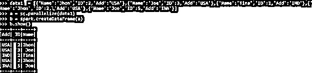
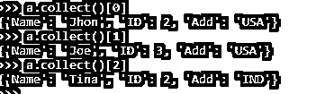
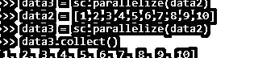

# PySpark 收集

> 原文：<https://www.educba.com/pyspark-collect/>

## PySpark collect 简介。

PYSPARK COLLECT 是 PYSPARK 中的一个操作，用于从数据框的节点检索所有元素到驱动程序节点。该操作用于从 RDD/数据帧中提取数据。该操作涉及获取数据并将其返回到驱动程序节点的数据。

收集操作将数据作为行类型的数组返回给驱动程序；为 PySpark 操作收集并进一步显示结果。数据一旦在节点上可用，就可以在循环中使用并显示。收集操作广泛用于较小的数据集，即可以放在内存中的数据，或者也可能导致某些内存异常的 post。让我们详细检查收集操作，并尝试理解其功能。

<small>网页开发、编程语言、软件测试&其他</small>

【PySpark 收集的语法

COLLECT 函数的语法是:-

`cd = spark.sparkContext.parallelize(data1)
cd.collect()`

**说明:**

**Cd** :-由数据制成的 RDD

**。collect ()** :-用于收集 RDD 的函数。

**截图:**

### 在 Pyspark 收集工作

让我们看看收集操作在 PySpark 中是如何工作的

*   Collect 是一个将数据集的所有元素(PySpark 的 RDD)返回给驱动程序的操作。它主要用于从各个节点向驱动程序收集数据，并进一步返回给用户进行分析。
*   数据后收集保存在返回的内存中，因此不建议收集大量数据。建议收集少量数据，或者可以进一步使用带有过滤器的数据。
*   检索庞大的数据集有时会导致数据收集的内存不足问题。
*   这是一个网络移动动作调用，其中来自不同节点的所有元素都被发送到收集数据的驱动程序内存，因此数据移动远远超过收集操作。因为它是 PySpark 的一个动作调用，所以每次调用它时，所有的转换都在实现它的动作之前完成。
*   它以数组[Row]的形式将元素检索到驱动程序中。

让我们用一些代码示例来检查创建和使用。

### PySpark 收集示例

让我们看一些 PYSPARK 收集操作如何工作的例子

让我们从在 PySpark 中创建简单数据开始。

`data1  = [{'Name':'Jhon','ID':2,'Add':'USA'},{'Name':'Joe','ID':3,'Add':'USA'},{'Name':'Tina','ID':2,'Add':'IND'},{'Name':'Jhon','ID':2, 'Add':'USA'},{'Name':'Joe','ID':5,'Add':'INA'}]`

创建一个示例数据，字段为 Name、ID 和 ADD。

`a = sc.parallelize(data1)`

RDD 是使用 sc 创建的。并行化。

`b = spark.createDataFrame(a)
b.show()`

使用 Spark.createDataFrame 创建了数据框。

**截图:**

现在让我们试着从 RDD 收集元素。

`a=sc.parallelize(data1)
a.collect()`

这会将所有数据收集回驱动程序节点，然后在控制台上显示结果。

**截图:**

`a.collect()[0] a.collect()[1] a.collect()[2]`

上面的代码表明，我们还可以使用 collect with index 从 RDD/数据框中选择一个选定的列号。索引用于从中检索元素。

**截图:**

收集较大的数据会导致内存异常；关键是需要收集的数据是否多于集群的内存。

让我们用更多例子来理解这一点

`data3 = sc.parallelize(data2)
data2 = [1,2,3,4,5,6,7,8,9,10] data3 = sc.parallelize(data2)
data3.collect()`

这是理解 collect 的一个非常简单的方法，这里我们做了一个简单的 Int 类型的 RDD。后收集，我们可以得到的数据回到驱动程序的内存作为一个结果。所有的数据帧都被回调到驱动程序，结果显示回来。一旦数据可用，我们就可以将数据用于我们的目的，数据分析和数据建模。

**截图:-**

这是 PySpark 中 PYSPARK 行函数的一些例子。

注意:-

1.  收集是 PySpark 中的一个操作。
2.  收集将数据收集回驱动程序节点。
3.  PySpark COLLECT 以 Array[Row]的形式返回类型。
4.  COLLECT 可以将数据返回内存，因此过多的数据收集会导致内存问题。
5.  PySpark COLLECT 导致数据在网络上移动，并将其带回驱动程序内存。
6.  COLLECTASLIST()用于收集相同但结果一样的列表。

### 结论

从上面的文章中，我们看到了收集操作在 PySpark 中的使用。我们试图通过各种例子和分类来理解在 PySpark 中 COLLECT 方法是如何工作的，以及在编程级别使用了什么。

我们还看到了 PySpark 数据框架的内部工作原理和优点，以及它在各种编程目的中的使用。此外，语法和例子帮助我们更准确地理解函数。

### 推荐文章

这是 PySpark 收藏指南。在这里，我们通过各种示例和分类来讨论 PySpark 中 collect 操作的使用。您也可以看看以下文章，了解更多信息–

1.  [PySpark 地图](https://www.educba.com/pyspark-map/)
2.  [PySpark 滤波器](https://www.educba.com/pyspark-filter/)
3.  [PySpark 加入](https://www.educba.com/pyspark-join/)
4.  [PySpark 版本](https://www.educba.com/pyspark-version/)

