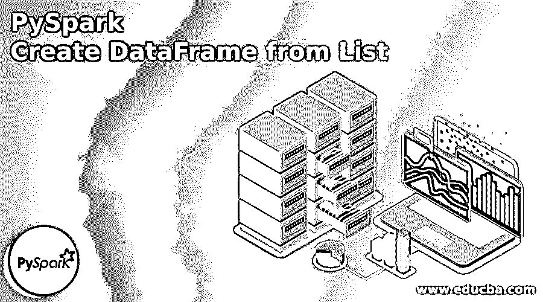
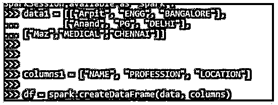
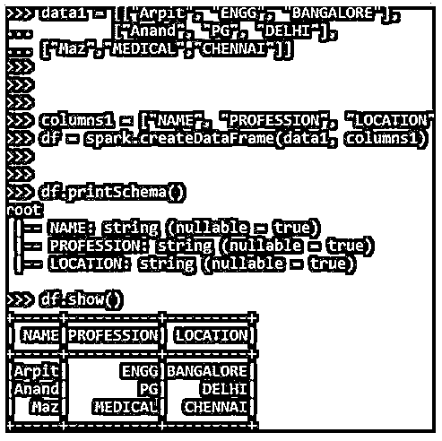
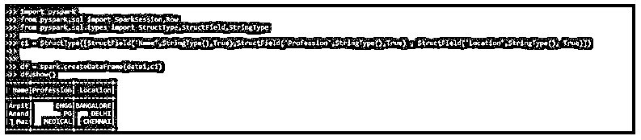
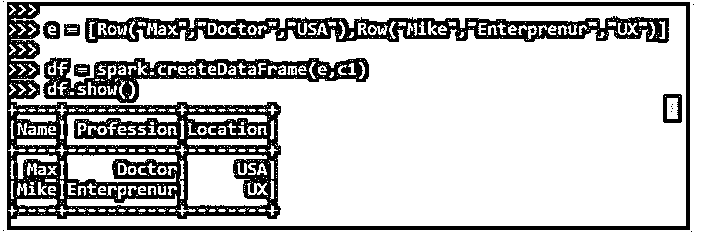

# PySpark 从列表创建数据帧

> 原文：<https://www.educba.com/pyspark-create-dataframe-from-list/>

## PySpark 简介从列表创建数据帧

PySpark 从列表中创建数据帧是一种在 PySpark 中从列表中的元素创建数据帧的方法。这种转换包括将列表中的数据转换成数据帧，数据帧进一步应用 PySpark 数据模型中的所有优化和操作。当转换为数据框时，对驻留在列表上的大量数据的迭代和数据操作很容易完成，通过将列表转换为数据框可以完成几个相关的数据操作。

使用此列表值可以允许重复值，并且可以在数据框模型中创建相同的值以用于数据分析。数据帧被优化并构造成一个命名列，这使得在 PySpark 模型上操作变得容易。这里我们将尝试分析使用从列表操作 PySpark 创建数据帧的各种方法。

<small>网页开发、编程语言、软件测试&其他</small>

### PySpark 从列表创建数据帧的语法

下面给出了提到的语法:

`data1 = [["Arpit", "ENGG", "BANGALORE"],
... ["Anand", "PG", "DELHI"],
... ["Maz","MEDICAL","CHENNAI"]] columns1 = ["NAME", "PROFESSION", "LOCATION"] df = spark.createDataFrame(data, columns)`

*   **Data1:** 被传递创建为数据帧的数据列表。
*   **Columns1:** 需要传递的列模式名。
*   **df:**spark . createdataframe，用于创建 Dataframe。这需要两个参数，一个是要创建的数据和列模式。

**输出:**

### PySpark 中列表数据帧的处理

下面给出了如何在 PySpark 中从列表创建数据帧:

*   列表是一个有序的集合，用于存储允许重复值的数据元素。数据以列表的形式存储在内存位置，用户可以逐个迭代数据，也可以遍历列表进行分析。这种数据与另一个列表的迭代或合并有时是一种开销很大的操作，因此 Spark.createdataframe 函数将列表元素作为输入，并带有一个将列表转换为数据框的模式，用户此后可以使用所有与数据框相关的操作。
*   它们在数据框中进行转换，并且数据模型在创建数据框后更加优化，这可以被视为一个表元素，其中也可以执行某些 SQL 操作。结果的数据框后分析可转换回列表，从而将数据元素创建回列表项目。

### PySpark 从列表创建数据帧的示例

下面给出了 PySpark 如何从列表操作创建数据帧的一些示例:

#### 示例#1

让我们从在 PySpark 中创建一个简单的列表开始。

列表创建:

**代码:**

`data1 = [["Arpit", "ENGG", "BANGALORE"],
... ["Anand", "PG", "DELHI"],
... ["Maz","MEDICAL","CHENNAI"]]`

让我们创建一个用于创建数据框的已定义方案。

**代码:**

`columns1 = ["NAME", "PROFESSION", "LOCATION"]`

PySpark 中的 Spark.createDataFrame 接受两个参数，它们一起接受数据和模式，并从中产生数据帧。

**代码:**

`df = spark.createDataFrame(data1, columns1)`

该模式就像打印传递的模式的表模式一样。这是为数据处理而嵌入的列的名称。

**代码:**

`df.printSchema()
root
|-- NAME: string (nullable = true)
|-- PROFESSION: string (nullable = true)
|-- LOCATION: string (nullable = true)`

让我们使用数据框来检查数据。show()在 PySpark 数据模型中打印转换后的数据框。

**代码:**

`df.show()`

**输出:**

#### 实施例 2

在 PySpark 中从列表元素创建数据框。

这里可以使用结构类型来定义模式。该模式可以放入 spark.createdataframe 中，以便在 PySpark 中创建数据框。

让我们导入要使用的数据框。

**代码:**

`import pyspark
from pyspark.sql import SparkSession, Row
from pyspark.sql.types import StructType,StructField, StringType
c1 = StructType([StructField('Name',StringType(),True),StructField('Profession',StringType(),True) , StructField('Location',StringType(), True)])
df = spark.createDataFrame(data1,c1)
df.show()`

**输出:**

#### 实施例 3

将行类型用作列表。将列表元素作为行类型插入，并将其传递给在 PySpark 中创建数据框所需的参数。

**代码:**

`e = [Row("Max","Doctor","USA"),Row("Mike","Enterprenur","UX")] df = spark.createDataFrame(e,c1)
df.show()`

**输出:**

这些是在 PySpark 中为数据框创建列表的方法。

**Note:** PySpark Create DataFrame from List is used for conversion of the list to dataframe in PySpark. It makes the data analysis easier while converting to dataframe. It can handle huge data loads also while conversion in the Data frame. It can be converted by multiple methods in the PySpark environment.

### 结论

从上面的文章中，我们看到了 PySpark 中 List 函数 DataFrame 的工作原理。通过各种例子和分类，我们试图理解这个数据帧是如何从 PySpark 中的 List 创建的，以及在编程级别使用了什么。所使用的各种方法显示了它如何简化数据分析的模式以及同样的成本效益模型。我们还看到了 PySpark 数据框架中 List to DataFrame 的内部工作和优点，以及它在各种编程目的中的使用。此外，语法和例子帮助我们更准确地理解函数。

### 推荐文章

这是 PySpark 从列表创建数据帧的指南。这里我们讨论 PySpark 从列表创建数据帧的介绍、工作和例子。您也可以看看以下文章，了解更多信息–

1.  [PySpark 回合](https://www.educba.com/pyspark-round/)
2.  [PySpark 列到列表](https://www.educba.com/pyspark-column-to-list/)
3.  [PySpark 选择列](https://www.educba.com/pyspark-select-columns/)
4.  [PySpark 加入](https://www.educba.com/pyspark-join/)

